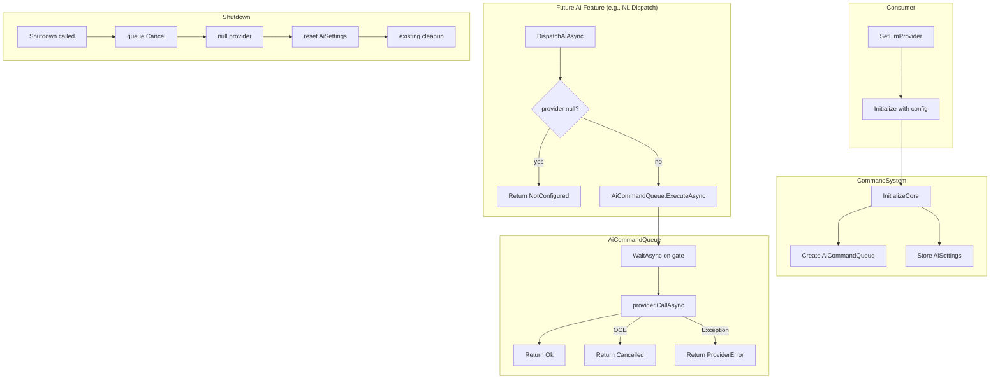

# AI Infrastructure (Dev-Only)

## Status

Draft

## Summary

Add the compile-time-gated foundation layer that all LLM-backed features build on. This includes:

- `ILlmProvider` — a single-method async provider interface the consumer implements.
- `AiSettings` — configuration for AI-specific knobs (iteration cap, context entry cap).
- `AiResult` / `AiError` — shared outcome type covering every AI call variant.
- `AiCommandQueue` — internal semaphore-based concurrency guard with linked `CancellationToken` support.
- `CommandSystem` and `CommandConfig` extensions — provider injection, queue lifecycle, config parsing.
- Documentation — Unity activation path for `KMCOMMANDS_AI`, security/threading warnings.

No public async APIs are added to `CommandSystem` in this PR. The first consumer-facing async surface (`ExecuteNaturalLanguageAsync`) arrives in a later NL Dispatch PR; this PR delivers only the internal plumbing.

## Requirements Input

- Source: `.github/tasks/ai-infrastructure/requirements.md`
- Key requirements carried into design: R1–R4 (provider interface), R5–R9 (settings), R10–R12 (result types), R13–R16 (provider injection), R17–R18 (compile-time gate), R19–R20 (runtime guard), R21–R24 (async queue), R25–R28 (shutdown), R29–R33 (documentation).

## Scope Notes

- In scope: all types, modifications, and documentation listed in the requirements.
- Out of scope: `ExecuteNaturalLanguageAsync`, Agent Loop, `IPromptFormatter`, registry-to-JSON builder, any bundled `ILlmProvider` implementation.

## Architecture Overview

All new types live behind `#if KMCOMMANDS_AI … #endif`. The compile gate ensures zero AI symbols exist in builds that do not define the symbol.

```
┌──────────────────────────────────────────────────────────────────┐
│  Consumer Code (Unity layer)                                     │
│  ┌────────────────────┐  ┌──────────────────────────────────┐    │
│  │ MyLlmProvider       │  │ Startup                          │    │
│  │ : ILlmProvider      │  │ cs.SetLlmProvider(provider)      │    │
│  └────────┬───────────┘  │ cs.Initialize(config)             │    │
│           │               └──────────────────────────────────┘    │
└───────────┼──────────────────────────────────────────────────────┘
            │
┌───────────▼──────────────────────────────────────────────────────┐
│  kmCommands (src/)                                                │
│                                                                   │
│  CommandSystem                                                    │
│  ├─ _llmProvider    : ILlmProvider       (nullable, gated)        │
│  ├─ _aiQueue        : AiCommandQueue     (gated, created at init) │
│  ├─ _aiSettings     : AiSettings         (gated, stored at init)  │
│  ├─ SetLlmProvider(provider)             (public, gated)          │
│  ├─ Shutdown() ── cancel queue → null provider → reset settings   │
│  └─ [future] DispatchAiAsync(prompt, ct) (internal, gated)        │
│                                                                   │
│  Core/AiCommandQueue (internal, gated)                            │
│  ├─ SemaphoreSlim(1,1) for serialisation                          │
│  ├─ CancellationTokenSource for shutdown                          │
│  └─ ExecuteAsync(provider, prompt, callerToken) → Task<AiResult>  │
│                                                                   │
│  ILlmProvider (public interface, gated)                           │
│  AiSettings   (public struct, gated)                              │
│  AiResult     (public readonly struct, gated)                     │
│  AiError      (public enum, gated)                                │
│  CommandConfig.AiSettings property (gated)                        │
└───────────────────────────────────────────────────────────────────┘
```

## Data Flow / Control Flow

### Provider Injection

```
Consumer calls SetLlmProvider(provider)
  → stores reference in _llmProvider (no init check)
  → null clears the reference
```

### AI Call (future feature perspective)

```
Future feature (e.g., NL dispatch) calls:
  CommandSystem.DispatchAiAsync(prompt, callerToken)
    1. Guard: _llmProvider == null → return AiResult.NotConfigured
    2. Guard: _aiQueue == null → return AiResult.NotConfigured
    3. Delegate to _aiQueue.ExecuteAsync(_llmProvider, prompt, callerToken)

AiCommandQueue.ExecuteAsync:
    1. Create linked CTS from (queue CTS token + callerToken)
    2. await _gate.WaitAsync(linkedToken) — cancel → return Cancelled
    3. await provider.CallAsync(prompt, linkedToken)
       catch OCE → return Cancelled
       catch Exception → return ProviderError
    4. return Ok(response)
    5. finally: _gate.Release()
```

### Shutdown

```
CommandSystem.Shutdown():
  #if KMCOMMANDS_AI
    _aiQueue?.Cancel()    ← cancels queue CTS; in-flight calls get OCE
    _aiQueue = null
    _llmProvider = null
    _aiSettings = default
  #endif
  ... existing cleanup ...
```

### Initialize

```
CommandSystem.InitializeCore(capacity):
  ... existing setup ...
  #if KMCOMMANDS_AI
    _aiQueue = new AiCommandQueue()
  #endif
```

## Components and Responsibilities

### `ILlmProvider` (`src/ILlmProvider.cs`)

- **Responsibility:** Minimal text-in/text-out contract for LLM backends.
- **Interactions:** Called by `AiCommandQueue.ExecuteAsync`; implemented by consumer.
- **Notes:** One method, no generics, AOT-safe.

### `AiSettings` (`src/AiSettings.cs`)

- **Responsibility:** Holds AI-specific configuration values consumed at init time.
- **Interactions:** Stored on `CommandConfig` (gated property); read by `CommandSystem` at init; read by future features at call time.
- **Notes:** Struct with default constants; zero/negative values clamped to defaults at init time (same pattern as `HistoryCapacity`).

### `AiError` + `AiResult` (`src/Results/AiResult.cs`)

- **Responsibility:** Shared outcome type for all AI operations.
- **Interactions:** Returned by `AiCommandQueue.ExecuteAsync`; consumed by future features and ultimately by consumer code.
- **Notes:** Follows the same `readonly struct + enum + internal factories` pattern as `ExecutionResult`, `ConfigResult`, etc.

### `AiCommandQueue` (`src/Core/AiCommandQueue.cs`)

- **Responsibility:** Serialises concurrent AI calls through a single gate; combines shutdown and caller cancellation tokens.
- **Interactions:** Created by `InitializeCore`, cancelled by `Shutdown`, called by future internal features via `ExecuteAsync`.
- **Notes:** `internal sealed class`; `SemaphoreSlim(1,1)` for mutual exclusion; shutdown cancels the CTS — in-flight requests catch `OperationCanceledException` and return `AiResult.Cancelled`.

### `CommandSystem` modifications

- **Responsibility:** Owns AI lifecycle fields (provider reference, queue, settings); exposes `SetLlmProvider`; extends `Shutdown` and `InitializeCore` under `#if KMCOMMANDS_AI`.
- **Interactions:** Provider stored by `SetLlmProvider`; queue and settings created/reset by lifecycle methods; future internal features receive these via constructor injection (same pattern as `_registry`, `_executionHandler`, etc.).

### `CommandConfig` modifications

- **Responsibility:** Exposes `AiSettings` property (gated); `FromJson` parses `"maxIterations"` and `"maxContextEntries"` as flat JSON keys under `#if KMCOMMANDS_AI`.
- **Interactions:** Consumed by `CommandSystem.Initialize(CommandConfig)`.

## Dependency Evaluation

- New dependencies: **None**.
- Rationale: `System.Threading.SemaphoreSlim`, `CancellationTokenSource`, `Task<T>`, and `async/await` are all available in `netstandard2.0`. No external packages needed.
- Alternatives considered: `Channel<T>` from `System.Threading.Channels` — not available in `netstandard2.0` without an extra NuGet; `SemaphoreSlim(1,1)` achieves the same serialisation with zero dependencies.

## API / Contract Sketch

### `ILlmProvider`

```csharp
#if KMCOMMANDS_AI
namespace kmCommands
{
    using System.Threading;
    using System.Threading.Tasks;

    /// <summary>
    /// Minimal async provider contract for LLM backends.
    /// The consumer implements this interface; the library never ships an implementation.
    /// </summary>
    public interface ILlmProvider
    {
        /// <summary>
        /// Sends <paramref name="prompt"/> to the LLM and returns the raw response text.
        /// </summary>
        Task<string> CallAsync(string prompt, CancellationToken cancellationToken);
    }
}
#endif
```

### `AiSettings`

```csharp
#if KMCOMMANDS_AI
namespace kmCommands
{
    /// <summary>
    /// AI-specific configuration values. Values ≤ 0 are clamped to defaults at init time.
    /// </summary>
    public struct AiSettings
    {
        /// <summary>Default upper bound for Agent Loop iterations.</summary>
        public const int DefaultMaxIterations = 10;

        /// <summary>Default maximum history entries included as LLM prompt context.</summary>
        public const int DefaultMaxContextEntries = 20;

        /// <summary>Upper bound for Agent Loop iterations. ≤ 0 → <see cref="DefaultMaxIterations"/>.</summary>
        public int MaxIterations { get; set; }

        /// <summary>Max history entries for prompt context. ≤ 0 → <see cref="DefaultMaxContextEntries"/>.</summary>
        public int MaxContextEntries { get; set; }
    }
}
#endif
```

### `AiError` + `AiResult`

```csharp
#if KMCOMMANDS_AI
namespace kmCommands
{
    /// <summary>Describes the reason an AI operation failed.</summary>
    public enum AiError
    {
        /// <summary>No error. Operation succeeded.</summary>
        None = 0,
        /// <summary>No LLM provider is configured or the system is not initialized.</summary>
        NotConfigured,
        /// <summary>The provider threw an exception during the call.</summary>
        ProviderError,
        /// <summary>The provider's response could not be parsed into the expected format.</summary>
        ParseFailure,
        /// <summary>An iteration or depth cap was reached.</summary>
        CapReached,
        /// <summary>The operation was cancelled (by the caller or by Shutdown).</summary>
        Cancelled
    }

    /// <summary>
    /// Carries the outcome of an AI operation. Follows the same readonly-struct pattern
    /// as <see cref="ExecutionResult"/> and <see cref="ConfigResult"/>.
    /// </summary>
    public readonly struct AiResult
    {
        /// <summary><c>true</c> if the operation succeeded.</summary>
        public bool Success { get; }

        /// <summary>The raw LLM response text on success; <c>null</c> on failure.</summary>
        public string Response { get; }

        /// <summary>The failure code; <see cref="AiError.None"/> on success.</summary>
        public AiError Error { get; }

        /// <summary>Human-readable failure description; <c>null</c> on success.</summary>
        public string ErrorMessage { get; }

        private AiResult(bool success, string response, AiError error, string errorMessage)
        {
            Success = success;
            Response = response;
            Error = error;
            ErrorMessage = errorMessage;
        }

        internal static AiResult Ok(string response)
        {
            return new AiResult(true, response, AiError.None, null);
        }

        internal static AiResult Fail(AiError error, string message)
        {
            return new AiResult(false, null, error, message);
        }
    }
}
#endif
```

### `AiCommandQueue`

```csharp
#if KMCOMMANDS_AI
namespace kmCommands.Core
{
    using System;
    using System.Threading;
    using System.Threading.Tasks;

    /// <summary>
    /// Serialises AI provider calls through a semaphore gate and supports
    /// cancellation from both the caller and <see cref="CommandSystem.Shutdown"/>.
    /// </summary>
    internal sealed class AiCommandQueue
    {
        private readonly SemaphoreSlim _gate = new SemaphoreSlim(1, 1);
        private readonly CancellationTokenSource _cts = new CancellationTokenSource();

        /// <summary>
        /// Executes a provider call under the serialisation gate with linked cancellation.
        /// </summary>
        internal async Task<AiResult> ExecuteAsync(
            ILlmProvider provider,
            string prompt,
            CancellationToken callerToken)
        {
            using (CancellationTokenSource linked =
                CancellationTokenSource.CreateLinkedTokenSource(_cts.Token, callerToken))
            {
                try
                {
                    await _gate.WaitAsync(linked.Token).ConfigureAwait(false);
                }
                catch (OperationCanceledException)
                {
                    return AiResult.Fail(AiError.Cancelled, "AI operation cancelled while waiting.");
                }

                try
                {
                    string response = await provider.CallAsync(prompt, linked.Token)
                        .ConfigureAwait(false);
                    return AiResult.Ok(response);
                }
                catch (OperationCanceledException)
                {
                    return AiResult.Fail(AiError.Cancelled, "AI operation cancelled during provider call.");
                }
                catch (Exception ex)
                {
                    return AiResult.Fail(AiError.ProviderError, ex.Message);
                }
                finally
                {
                    _gate.Release();
                }
            }
        }

        /// <summary>
        /// Cancels the queue's token source. All pending and future <see cref="ExecuteAsync"/>
        /// calls will observe cancellation. Called by <see cref="CommandSystem.Shutdown"/>.
        /// Does not dispose resources — the GC handles cleanup after the queue reference is nulled.
        /// </summary>
        internal void Cancel()
        {
            _cts.Cancel();
        }
    }
}
#endif
```

**Why not `Dispose`?** `Shutdown` is cancel-and-discard. Calling `_gate.Dispose()` while an `ExecuteAsync` continuation is still in-flight on a thread pool thread would cause `ObjectDisposedException`. Cancelling the CTS is sufficient to unblock all waiters; the GC collects the semaphore and CTS after the queue reference is nulled and all continuations complete.

### `CommandSystem` Modifications

Fields (gated):

```csharp
#if KMCOMMANDS_AI
        private ILlmProvider _llmProvider;
        private Core.AiCommandQueue _aiQueue;
        private AiSettings _aiSettings;
#endif
```

`SetLlmProvider` (public, gated):

```csharp
#if KMCOMMANDS_AI
        /// <summary>
        /// Sets (or clears) the LLM provider used by AI features.
        /// Safe before <see cref="Initialize"/>, after it, and after <see cref="Shutdown"/>.
        /// Pass <c>null</c> to clear the current provider.
        /// </summary>
        public void SetLlmProvider(ILlmProvider provider)
        {
            _llmProvider = provider;
        }
#endif
```

`InitializeCore` addition (inside method, after existing setup, gated):

```csharp
#if KMCOMMANDS_AI
            _aiQueue = new Core.AiCommandQueue();
            // _aiSettings resolved from config in Initialize(CommandConfig) path;
            // plain Initialize() leaves _aiSettings at default (zero → clamp at use site).
#endif
```

`Initialize(CommandConfig config)` addition (after `_nestedCommandDepth` line, gated):

```csharp
#if KMCOMMANDS_AI
            _aiSettings = config.AiSettings;
#endif
```

`Shutdown` addition (before existing cleanup, gated):

```csharp
#if KMCOMMANDS_AI
            _aiQueue?.Cancel();
            _aiQueue = null;
            _llmProvider = null;
            _aiSettings = default;
#endif
```

Internal dispatch helper (gated) — the centralised guard pattern for future features:

```csharp
#if KMCOMMANDS_AI
        /// <summary>
        /// Dispatches a prompt through the AI queue with full guard checks.
        /// Used by internal features (NL dispatch, Agent Loop) — not public API.
        /// </summary>
        internal async System.Threading.Tasks.Task<AiResult> DispatchAiAsync(
            string prompt,
            System.Threading.CancellationToken cancellationToken)
        {
            if (_llmProvider == null || _aiQueue == null)
            {
                return AiResult.Fail(AiError.NotConfigured,
                    _llmProvider == null
                        ? "No LLM provider configured. Call SetLlmProvider() first."
                        : "Command system is not initialized.");
            }

            return await _aiQueue.ExecuteAsync(_llmProvider, prompt, cancellationToken)
                .ConfigureAwait(false);
        }
#endif
```

### `CommandConfig` Modifications

Property (gated):

```csharp
#if KMCOMMANDS_AI
        /// <summary>
        /// AI-specific configuration. Only present when <c>KMCOMMANDS_AI</c> is defined.
        /// Values ≤ 0 are clamped to defaults by <see cref="CommandSystem.Initialize(CommandConfig)"/>.
        /// </summary>
        public AiSettings AiSettings { get; set; }
#endif
```

`FromJson` parsing additions (inside the key-matching loop, before the `else` unknown-key branch, gated):

```csharp
#if KMCOMMANDS_AI
                else if (StringEquals(entry.Key, "maxIterations"))
                {
                    if (entry.ValueType != typeof(int))
                    {
                        return ConfigResult.Fail(ConfigError.TypeMismatch,
                            string.Format("Expected integer for 'maxIterations', got {0}.",
                                entry.ValueType != null ? entry.ValueType.Name : "null"));
                    }
                    AiSettings ai = config.AiSettings;
                    ai.MaxIterations = (int)entry.Value;
                    config.AiSettings = ai;
                }
                else if (StringEquals(entry.Key, "maxContextEntries"))
                {
                    if (entry.ValueType != typeof(int))
                    {
                        return ConfigResult.Fail(ConfigError.TypeMismatch,
                            string.Format("Expected integer for 'maxContextEntries', got {0}.",
                                entry.ValueType != null ? entry.ValueType.Name : "null"));
                    }
                    AiSettings ai = config.AiSettings;
                    ai.MaxContextEntries = (int)entry.Value;
                    config.AiSettings = ai;
                }
#endif
```

**Note:** Because `AiSettings` is a struct, the read-modify-write pattern (`var ai = config.AiSettings; ai.X = v; config.AiSettings = ai;`) is required to avoid mutating a copy.

## Implementation Notes

- **`#if` placement:** Each new file is wrapped at file level. Modifications to existing files use block-scoped `#if KMCOMMANDS_AI` around the new code only — never wrap existing non-AI code.
- **`using` directives inside `#if`:** `System.Threading` and `System.Threading.Tasks` are only needed when AI code is active. Place these `using` statements inside the `#if` block (or at file level in AI-only files) to avoid unused-using warnings when the symbol is absent.
- **`ConfigureAwait(false)`:** Required on all `await` calls. The library must not capture `SynchronizationContext` — the consumer is responsible for marshalling back to the main thread (R33).
- **No `async void`:** All async methods return `Task<T>`. Exception flow is always captured in `AiResult`.
- **Struct default values:** `new AiSettings()` yields `MaxIterations = 0, MaxContextEntries = 0`. The clamping to defaults happens at the use site (future features), not at storage time. This matches the `HistoryCapacity < 1 ? 1 : historyCapacity` pattern.
- **Source header:** All new files get the standard Apache 2.0 header.
- **`SetLlmProvider` threading:** The method is a simple field assignment. It follows the same threading contract as the rest of `CommandSystem` — main-thread-only, not thread-safe (R33). No interlocked or volatile needed.

## Code Examples

### Consumer Usage (Unity Startup)

```csharp
#if KMCOMMANDS_AI
using kmCommands;

public class GameStartup : MonoBehaviour
{
    void Awake()
    {
        var cs = new CommandSystem();
        cs.SetLlmProvider(new MyOpenAiProvider(apiKey));

        var config = new CommandConfig
        {
            HistoryCapacity = 128,
            DevMode = true,
            AiSettings = new AiSettings
            {
                MaxIterations = 15,
                MaxContextEntries = 30
            }
        };
        cs.Initialize(config);
    }

    void OnDestroy()
    {
        // Cancels in-flight AI, clears provider, resets settings
        cs.Shutdown();
    }
}
#endif
```

### Consumer `ILlmProvider` Implementation (Sketch)

```csharp
#if KMCOMMANDS_AI
public class MyOpenAiProvider : ILlmProvider
{
    private readonly string _apiKey;
    private readonly HttpClient _client = new HttpClient();

    public MyOpenAiProvider(string apiKey) { _apiKey = apiKey; }

    public async Task<string> CallAsync(string prompt, CancellationToken cancellationToken)
    {
        // Consumer owns all HTTP, auth, retry, rate limiting.
        var request = new HttpRequestMessage(HttpMethod.Post, "https://api.openai.com/...");
        // ... build request body with prompt ...
        request.Headers.Authorization = new AuthenticationHeaderValue("Bearer", _apiKey);

        HttpResponseMessage response = await _client.SendAsync(request, cancellationToken);
        response.EnsureSuccessStatusCode();
        return await response.Content.ReadAsStringAsync();
    }
}
#endif
```

## Diagram



## Testing Strategy

### Unit Tests

All tests gated by `KMCOMMANDS_AI` being defined in the test project's `<DefineConstants>`.

| Test Area                            | What To Verify                                                                                                                           | Approach                                                         |
| ------------------------------------ | ---------------------------------------------------------------------------------------------------------------------------------------- | ---------------------------------------------------------------- |
| `AiResult` factories                 | `Ok` returns `Success=true`, correct response; `Fail` returns correct error + message                                                    | Direct construction assertions                                   |
| `AiSettings` defaults                | `new AiSettings()` yields zero fields; constants have expected values                                                                    | Direct assertions                                                |
| `SetLlmProvider` lifecycle           | Set → use → null → use returns NotConfigured; set before init, verify survives init; shutdown clears                                     | Call `SetLlmProvider`, then `DispatchAiAsync`, assert results    |
| `Shutdown` cancels AI                | Set provider, start `DispatchAiAsync` with a slow fake provider, call `Shutdown` mid-flight, verify `Cancelled` result                   | Fake `ILlmProvider` with `TaskCompletionSource` controlled delay |
| `Shutdown` resets state              | After `Shutdown`, `_llmProvider` is null, `_aiSettings` is default, `_aiQueue` is null                                                   | Call `DispatchAiAsync` after shutdown → `NotConfigured`          |
| `AiCommandQueue` serialisation       | Two concurrent `ExecuteAsync` calls complete sequentially (second waits for first)                                                       | Fake provider with delay; assert temporal ordering               |
| `AiCommandQueue` caller cancellation | Cancel the caller CT mid-flight; verify `Cancelled` result                                                                               | Fake provider + caller CTS                                       |
| `CommandConfig` AI parsing           | JSON with `"maxIterations"` and `"maxContextEntries"` parsed correctly; wrong types fail with `TypeMismatch`; unknown AI keys → warnings | `CommandConfig.FromJson(...)` assertions                         |
| Reinitialize cycle                   | `Init → Shutdown → SetProvider → Init → DispatchAi` works without error                                                                  | Full lifecycle integration test                                  |

### Compile-Time Gate Verification

- **Approach:** The CI/build matrix should include a build of `kmCommands.csproj` _without_ `KMCOMMANDS_AI` defined and assert it compiles cleanly with zero AI symbols.
- **In tests:** Tests reference AI types directly; if the symbol is absent, the test file doesn't compile (which is correct — tests must have the symbol).

### Test Project Setup

Add to `tests/kmCommands.Tests/kmCommands.Tests.csproj`:

```xml
<PropertyGroup>
    <DefineConstants>$(DefineConstants);KMCOMMANDS_AI</DefineConstants>
</PropertyGroup>
```

### Fake Provider for Tests

```csharp
#if KMCOMMANDS_AI
internal class FakeLlmProvider : ILlmProvider
{
    internal string ResponseToReturn = "fake response";
    internal Exception ExceptionToThrow;
    internal TaskCompletionSource<bool> Gate = new TaskCompletionSource<bool>();
    internal bool UseGate;

    public async Task<string> CallAsync(string prompt, CancellationToken cancellationToken)
    {
        if (UseGate)
        {
            using (cancellationToken.Register(() => Gate.TrySetCanceled()))
            {
                await Gate.Task.ConfigureAwait(false);
            }
        }

        cancellationToken.ThrowIfCancellationRequested();

        if (ExceptionToThrow != null)
            throw ExceptionToThrow;

        return ResponseToReturn;
    }
}
#endif
```

## Risks and Tradeoffs

| Risk                                                                                        | Mitigation                                                                                                                                                                                                                               |
| ------------------------------------------------------------------------------------------- | ---------------------------------------------------------------------------------------------------------------------------------------------------------------------------------------------------------------------------------------- |
| `SemaphoreSlim` + linked CTS leak if `Shutdown` fires during `WaitAsync`                    | Cancel-and-discard strategy: CTS cancellation causes `OperationCanceledException` in all waiters; GC cleans up after references are nulled. No `Dispose` call on the gate to avoid `ObjectDisposedException` on in-flight continuations. |
| `SetLlmProvider` is not thread-safe                                                         | Acceptable — entire `CommandSystem` API is documented as main-thread-only (R33). No change to threading contract.                                                                                                                        |
| `AiSettings` struct default yields zero values                                              | Explicit clamping at use site (future features). Documented in XML doc and design. Matches existing `HistoryCapacity` pattern.                                                                                                           |
| Flat JSON keys (`maxIterations`, `maxContextEntries`) may collide with future non-AI config | Unlikely given naming convention. If needed, a `"ai."` prefix can be added later as a non-breaking change (new keys, old keys become unknown-key warnings).                                                                              |
| Consumer forgets to marshal AI results to main thread before calling `Execute()`            | Documentation warning (R33). Library cannot enforce this without a Unity dependency.                                                                                                                                                     |

## Open Questions

None — all resolved in requirements.

## Task Planning Handoff

### Suggested Implementation Slices

1. **New type files** — `ILlmProvider.cs`, `AiSettings.cs`, `Results/AiResult.cs`, `Core/AiCommandQueue.cs`. All new files, no merge conflicts. Can be done in a single commit.
2. **`CommandSystem` modifications** — gated fields, `SetLlmProvider`, `InitializeCore` queue creation, `Shutdown` AI cleanup, `DispatchAiAsync` internal helper. One commit touching one existing file.
3. **`CommandConfig` modifications** — gated `AiSettings` property and `FromJson` parsing. One commit touching one existing file.
4. **Test project setup + tests** — `DefineConstants` in csproj, `FakeLlmProvider`, all test classes. One or two commits.
5. **Documentation** — `docs/ai-infrastructure.md` with Unity activation, warnings, threading notes. One commit.
6. **`projectOverview.instructions.md` sync** — Update the project overview with new types and API surface. One commit.

### Coupling Notes

- Slices 1–3 are independent of each other but must all land before slice 4 (tests import all types).
- Slice 5 (docs) is independent and can land in any order.
- Slice 6 should be the final commit.

### Post-Integration Validation

- Build `kmCommands.csproj` **without** `KMCOMMANDS_AI` → must compile with zero warnings/errors and zero AI-related symbols.
- Build `kmCommands.csproj` **with** `KMCOMMANDS_AI` → must compile with zero warnings/errors and all AI types present.
- Run full test suite (which defines `KMCOMMANDS_AI`) → all existing + new tests pass.

## Final Review Contract

### Critical Behaviours to Verify

1. `SetLlmProvider(null)` then `DispatchAiAsync` → `AiResult` with `AiError.NotConfigured`.
2. `SetLlmProvider(provider)` then `Shutdown()` then `DispatchAiAsync` → `AiResult` with `AiError.NotConfigured`.
3. `Shutdown()` with an in-flight `ExecuteAsync` → no deadlock, no throw; caller observes `AiResult` with `AiError.Cancelled`.
4. `Initialize(CommandConfig)` with `AiSettings` populated → `_aiSettings` stores values correctly.
5. `CommandConfig.FromJson` with `"maxIterations": 5` → `config.AiSettings.MaxIterations == 5`.
6. `CommandConfig.FromJson` with `"maxIterations": "bad"` → `ConfigResult.Error == TypeMismatch`.
7. Build without `KMCOMMANDS_AI` compiles cleanly; no AI symbols in output assembly.

### Design Invariants

- Every AI type / method / field is inside `#if KMCOMMANDS_AI`.
- `ILlmProvider.CallAsync` accepts `CancellationToken` (not optional, not defaulted).
- `AiCommandQueue` never disposes `SemaphoreSlim` or CTS (cancel-and-discard strategy).
- `AiResult` is a readonly struct with internal-only constructors.
- `SetLlmProvider` has no init guard — works in any lifecycle state.
- `Shutdown` cancels queue **before** nulling references.

### Required Test Evidence

- All tests in the `AiInfrastructureTests` (or equivalent) class pass.
- At least one test demonstrates shutdown-during-in-flight cancellation.
- At least one test demonstrates `NotConfigured` when provider is null.
- At least one test demonstrates `CommandConfig` parsing of AI keys.
- Existing 391+ tests continue to pass unchanged.

### Known Acceptable Deviations

- `DispatchAiAsync` is internal and has no public consumer-facing test surface in this PR — verified only through internal test access (`[assembly: InternalsVisibleTo]` or direct construction).
- `AiSettings` default clamping happens at use-site (future feature), not at storage time — this is by design, not a gap.

### Blocking Conditions

- Any AI symbol visible in a build without `KMCOMMANDS_AI` defined → **block**.
- `Shutdown` deadlock or unobserved exception under any test scenario → **block**.
- Missing `CancellationToken` parameter on `ILlmProvider.CallAsync` → **block**.
