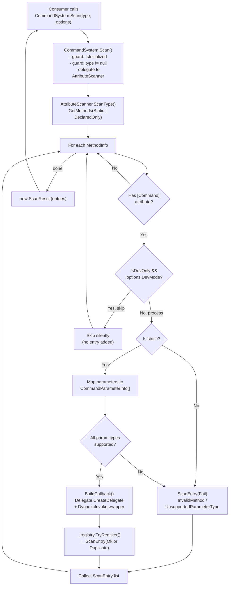
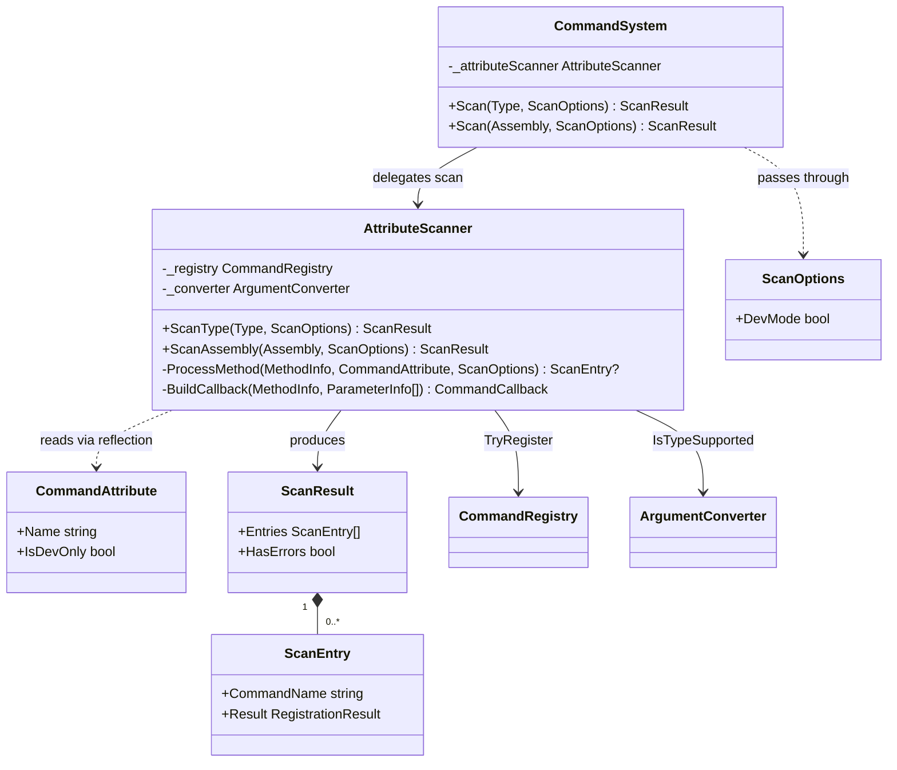

# Attribute-Based Registration

## Status

Draft

## Summary

This design describes the implementation of attribute-based command registration for the kmCommands library. Developers will be able to decorate static methods with `[Command]` and register them by passing a `Type` or `Assembly` to a new `CommandSystem.Scan()` method. The feature is purely additive — the existing manual `Register()` path is unchanged. Scanning is constrained to initialization time, and the design is fully IL2CPP/AOT-safe.

---

## Requirements Input

- Source: `.github/tasks/attribute-based-registration/requirements.md`
- Key requirements carried into design:
  - `[Command]` attribute on static methods with `IsDevOnly` flag
  - Type-scoped and assembly-wide scan entry points on `CommandSystem`
  - Parameter auto-mapping from `MethodInfo.GetParameters()` to `CommandParameterInfo[]`
  - Graceful failure for unsupported parameter types (no partial registration)
  - Dev-mode flag controls whether `IsDevOnly` commands are scanned
  - IL2CPP/AOT-safe delegate creation — no `Emit`, no expression trees, no `DynamicMethod`
  - Per-command result reporting from scan
  - All 71 pre-existing tests must continue to pass unchanged

---

## Scope Notes

- **In scope:** `[Command]` attribute, `ScanOptions` struct, `ScanResult`/`ScanEntry` result types, `AttributeScanner` internal component, two new `Scan()` methods on `CommandSystem`, `RegistrationError.InvalidMethod` enum value.
- **Out of scope:** Changes to `Register()`, `Execute()`, `Initialize()`, or `Shutdown()` signatures; instance-method discovery; deferred/runtime scanning; Unity-specific adapters; build-symbol–based stripping.

---

## Architecture Overview

Four new source artifacts are introduced alongside targeted surgery on two existing files:

```
src/
  CommandAttribute.cs          ← new public attribute
  ScanOptions.cs               ← new public options struct
  CommandSystem.cs             ← +2 Scan() overloads, +_attributeScanner field
  Results/
    ScanResult.cs              ← new public result + entry types
  Core/
    AttributeScanner.cs        ← new internal scanner component
src/Results/RegistrationResult.cs  ← +InvalidMethod enum value
```

`AttributeScanner` follows the same pattern as `ExecutionHandler`: it receives `CommandRegistry` and `ArgumentConverter` as constructor arguments and operates entirely within the `kmCommands.Core` layer. `CommandSystem` instantiates it during `Initialize()` and delegates scan calls to it, similar to how it delegates execution to `ExecutionHandler`.

---

## Data Flow / Control Flow



For assembly-wide scan, `ScanType()` is called per loaded type; results are merged into a single `ScanResult`.

---

## Components and Responsibilities

### `CommandAttribute` (`src/CommandAttribute.cs`)

- **Responsibility:** Marks a static method as a registerable command. Carries the command name and optional `IsDevOnly` flag.
- **Interactions:** Read by `AttributeScanner` via `MethodInfo.GetCustomAttribute<CommandAttribute>()`.

### `ScanOptions` (`src/ScanOptions.cs`)

- **Responsibility:** Carries per-scan configuration. Currently exposes only `DevMode`.
- **Interactions:** Passed by the consumer to `CommandSystem.Scan()`, forwarded to `AttributeScanner`.

### `ScanResult` / `ScanEntry` (`src/Results/ScanResult.cs`)

- **Responsibility:** Returns per-command outcomes from a scan to the consumer. `ScanEntry` pairs a command name with its `RegistrationResult`.
- **Interactions:** Produced by `AttributeScanner`, returned from `CommandSystem.Scan()`.

### `AttributeScanner` (`src/Core/AttributeScanner.cs`)

- **Responsibility:** Discovers `[Command]`-decorated methods, validates them, builds `CommandCallback` delegates via `Delegate.CreateDelegate`, and registers commands into `CommandRegistry`. Returns a `ScanResult`.
- **Interactions:** Constructed in `CommandSystem.Initialize()`, holds `CommandRegistry` and `ArgumentConverter` references, calls `_registry.TryRegister()` directly.

### `CommandSystem` (modified)

- **Responsibility:** Exposes `Scan(Type, ScanOptions)` and `Scan(Assembly, ScanOptions)` as new public methods. Guards on `IsInitialized` and null inputs before delegating to `AttributeScanner`.
- **Change surface:** Two new methods + a new `_attributeScanner` field initialized in `Initialize()` and nulled in `Shutdown()`.

### `RegistrationResult.cs` (modified)

- **Responsibility:** Add `RegistrationError.InvalidMethod` for the non-static method failure case.
- **Change surface:** Single enum value addition.

---

## Dependency Evaluation

- **New dependencies:** None.
- **Rationale:** The scanner uses `System.Reflection` (already in `netstandard2.0`) and `Delegate.CreateDelegate` (BCL, AOT-safe). No third-party library is needed or appropriate.
- **Alternatives considered:** None warranted. The feature is self-contained in BCL reflection APIs.

---

## API / Contract Sketch

### `CommandAttribute`

```csharp
// src/CommandAttribute.cs
namespace kmCommands
{
    [AttributeUsage(AttributeTargets.Method, Inherited = false, AllowMultiple = false)]
    public sealed class CommandAttribute : Attribute
    {
        public string Name { get; }
        public bool IsDevOnly { get; set; }

        public CommandAttribute(string name)
        {
            Name = name;
        }
    }
}
```

### `ScanOptions`

```csharp
// src/ScanOptions.cs
namespace kmCommands
{
    public struct ScanOptions
    {
        /// <summary>
        /// When true, commands decorated with IsDevOnly = true are included in the scan.
        /// When false (default), IsDevOnly commands are silently skipped.
        /// </summary>
        public bool DevMode { get; set; }
    }
}
```

`default(ScanOptions)` produces `DevMode = false`, which is the correct production default. No explicit `Default` sentinel needed.

### `ScanEntry` and `ScanResult`

```csharp
// src/Results/ScanResult.cs
namespace kmCommands
{
    public readonly struct ScanEntry
    {
        public string CommandName { get; }
        public RegistrationResult Result { get; }

        internal ScanEntry(string commandName, RegistrationResult result)
        {
            CommandName = commandName;
            Result = result;
        }
    }

    public sealed class ScanResult
    {
        public ScanEntry[] Entries { get; }
        public bool HasErrors { get; }

        internal ScanResult(ScanEntry[] entries)
        {
            Entries = entries;
            bool hasErrors = false;
            for (int i = 0; i < entries.Length; i++)
            {
                if (!entries[i].Result.Success)
                {
                    hasErrors = true;
                    break;
                }
            }
            HasErrors = hasErrors;
        }
    }
}
```

`ScanEntry[]` is preferred over `IReadOnlyList<ScanEntry>` to avoid allocation of a wrapper object and to be consistent with the array-first stance elsewhere in the library.

### `RegistrationError` addition

```csharp
// Append to the existing RegistrationError enum in RegistrationResult.cs:

/// <summary>The target method is not static. Only static methods can be registered via [Command].</summary>
InvalidMethod,
```

### `CommandSystem` new methods

```csharp
// New field added alongside _registry, _converter, _executionHandler:
private AttributeScanner _attributeScanner;

// In Initialize():
_attributeScanner = new AttributeScanner(_registry, _converter);

// In Shutdown():
_attributeScanner = null;

// New public surface:
public ScanResult Scan(Type type, ScanOptions options = default)
{
    if (!IsInitialized)
        return ScanResult.SystemFailure(RegistrationError.NotInitialized,
            "CommandSystem has not been initialized. Call Initialize() first.");

    if (type == null)
        return ScanResult.SystemFailure(RegistrationError.NullParameters,
            "Type argument must not be null.");

    return _attributeScanner.ScanType(type, options);
}

public ScanResult Scan(Assembly assembly, ScanOptions options = default)
{
    if (!IsInitialized)
        return ScanResult.SystemFailure(RegistrationError.NotInitialized,
            "CommandSystem has not been initialized. Call Initialize() first.");

    if (assembly == null)
        return ScanResult.SystemFailure(RegistrationError.NullParameters,
            "Assembly argument must not be null.");

    return _attributeScanner.ScanAssembly(assembly, options);
}
```

`ScanResult.SystemFailure` is a private-internal factory that returns a `ScanResult` with `HasErrors = true` and a single `ScanEntry` with `CommandName = string.Empty` and the provided failure result. This keeps non-per-command errors surfaceable to consumers without requiring a separate system-error field.

```csharp
// Internal factory on ScanResult:
internal static ScanResult SystemFailure(RegistrationError error, string message)
{
    return new ScanResult(new[]
    {
        new ScanEntry(string.Empty, RegistrationResult.Fail(error, message))
    });
}
```

---

## Implementation Notes

### `AttributeScanner` method discovery

Use `BindingFlags.Public | BindingFlags.NonPublic | BindingFlags.Static | BindingFlags.DeclaredOnly`. `DeclaredOnly` prevents scanning inherited methods twice during an assembly scan (a method defined on `Base` is found on `Base`, not again on `Derived`).

### Non-static method handling

Non-static methods decorated with `[Command]` are **reported as failures**. Silent skip is intentional only for `IsDevOnly` commands outside dev mode. Non-static placement is a programmer error that warrants feedback. `RegistrationError.InvalidMethod` is used.

### Processing order per method

1. DevOnly check — if `attr.IsDevOnly && !options.DevMode`: **skip silently** (no `ScanEntry` added).
2. Static check — if not static: add `ScanEntry(name, Fail(InvalidMethod, ...))`.
3. Parameter mapping — iterate `MethodInfo.GetParameters()`, check `_converter.IsTypeSupported()` per type. If any unsupported: add `ScanEntry(name, Fail(UnsupportedParameterType, ...))`.
4. Build `CommandCallback` via `Delegate.CreateDelegate` (see below).
5. Call `_registry.TryRegister()` — if false: add `ScanEntry(name, Fail(DuplicateCommandName, ...))`.
6. On success: add `ScanEntry(name, Ok())`.

Steps 2–6 are mutually exclusive: the method returns as soon as a failure condition is detected.

### Assembly scan type enumeration

```csharp
internal ScanResult ScanAssembly(Assembly assembly, ScanOptions options)
{
    Type[] types;
    try
    {
        types = assembly.GetTypes();
    }
    catch (ReflectionTypeLoadException ex)
    {
        types = ex.Types ?? Array.Empty<Type>();
    }

    List<ScanEntry> entries = new List<ScanEntry>();
    for (int i = 0; i < types.Length; i++)
    {
        if (types[i] == null) continue;
        ScanResult typeResult = ScanType(types[i], options);
        for (int j = 0; j < typeResult.Entries.Length; j++)
            entries.Add(typeResult.Entries[j]);
    }
    return new ScanResult(entries.ToArray());
}
```

`ReflectionTypeLoadException` is caught because partially-loaded assemblies (common in Unity projects with missing dependencies) should not abort the entire scan.

### Naming conflicts across types in assembly scan

First-registered command wins. If type `A` and type `B` both define `[Command("fire")]`, the type encountered first during `assembly.GetTypes()` order gets registered. The second gets a `ScanEntry` with `DuplicateCommandName` failure. This is consistent with the existing `TryRegister()` semantics that manual `Register()` uses.

### No LINQ in scanner

Use `List<ScanEntry>` with `.Add()` for collection. Call `.ToArray()` at the end. No `System.Linq` import. No `Where`, `Select`, or lambda projections.

---

## Code Examples

### `BuildCallback` — AOT-safe delegate creation

The core challenge: `CommandCallback` is `delegate void CommandCallback(object[] args)`, but decorated methods have typed parameters like `void Heal(int amount, string target)`. Direct `Delegate.CreateDelegate(typeof(CommandCallback), method)` would fail due to signature mismatch.

**Design:** Use `Delegate.CreateDelegate` to create a strongly-typed intermediate `Action` or `Action<T1,T2,...>` delegate matching the method's actual signature. IL2CPP preserves the method reference through this typed delegate. Then wrap with a `CommandCallback` lambda that captures the typed delegate (not `MethodInfo`) and calls `DynamicInvoke`.

```csharp
private static CommandCallback BuildCallback(MethodInfo method, ParameterInfo[] reflectedParams)
{
    if (reflectedParams.Length == 0)
    {
        // Zero-parameter fast path: no boxing/unboxing at execute time
        Action del = (Action)Delegate.CreateDelegate(typeof(Action), method);
        return _ => del();
    }

    // Build the concrete Action<T1[,T2,...]> type from parameter types
    Type[] paramTypes = new Type[reflectedParams.Length];
    for (int i = 0; i < reflectedParams.Length; i++)
        paramTypes[i] = reflectedParams[i].ParameterType;

    Type actionType = GetActionDelegateType(paramTypes);

    // Delegate.CreateDelegate preserves the method under IL2CPP stripping
    Delegate typedDelegate = Delegate.CreateDelegate(actionType, method);

    // Wrapper captures the typed Delegate (not MethodInfo) — AOT-safe
    // DynamicInvoke on a concrete delegate works on IL2CPP/Unity 2021+
    return args => typedDelegate.DynamicInvoke(args);
}

private static Type GetActionDelegateType(Type[] paramTypes)
{
    switch (paramTypes.Length)
    {
        case 1: return typeof(Action<>).MakeGenericType(paramTypes);
        case 2: return typeof(Action<,>).MakeGenericType(paramTypes);
        case 3: return typeof(Action<,,>).MakeGenericType(paramTypes);
        case 4: return typeof(Action<,,,>).MakeGenericType(paramTypes);
        // Extend as needed; commands with 5+ parameters are unusual for a console
        default:
            throw new NotSupportedException(
                string.Format("Commands with {0} parameters are not supported.", paramTypes.Length));
    }
}
```

**Why `DynamicInvoke` over `MethodInfo.Invoke`:** By the time `DynamicInvoke` is called, the delegate already holds a JIT/AOT-compiled function pointer to the target method (the `Delegate.CreateDelegate` call registers this at scan time). `DynamicInvoke` on a concrete delegate invokes through that function pointer — it does not re-resolve the method via reflection the way `MethodInfo.Invoke` does. This makes it AOT-safe and prevents IL2CPP from treating the target method as unreachable.

**Why not a pure typed-delegate approach:** Building compile-time wrappers for all combinations of 4 supported types × arbitrary parameter counts requires either expression tree compilation (not AOT-safe) or a combinatorial switch across ~80+ cases. `DynamicInvoke` on a pre-bound delegate is the practical middle ground and is acceptable because command execution is user-triggered (not per-frame).

**IL2CPP consideration:** `MakeGenericType` at runtime for `Action<T>` with `int`, `float`, `bool`, `string` is reliably supported in Unity 2021+ IL2CPP. These combinations fall under IL2CPP's generic sharing for reference types and are directly AOT-compiled for value types. No `link.xml` entry is required for standard setups.

The zero-parameter path avoids `DynamicInvoke` entirely and uses a direct delegate call.

### Full scanner method example

```csharp
private ScanEntry? ProcessMethod(MethodInfo method, CommandAttribute attr, ScanOptions options)
{
    // 1. Silent skip for IsDevOnly commands outside dev mode
    if (attr.IsDevOnly && !options.DevMode)
        return null;

    string name = attr.Name;

    // 2. Non-static: reported failure
    if (!method.IsStatic)
    {
        return new ScanEntry(name, RegistrationResult.Fail(
            RegistrationError.InvalidMethod,
            string.Format(
                "Method '{0}.{1}' is not static. Only static methods can be registered via [Command].",
                method.DeclaringType != null ? method.DeclaringType.Name : "?",
                method.Name)));
    }

    // 3. Parameter mapping + type validation
    ParameterInfo[] reflectedParams = method.GetParameters();
    CommandParameterInfo[] parameters = new CommandParameterInfo[reflectedParams.Length];

    for (int i = 0; i < reflectedParams.Length; i++)
    {
        Type paramType = reflectedParams[i].ParameterType;
        if (!_converter.IsTypeSupported(paramType))
        {
            return new ScanEntry(name, RegistrationResult.Fail(
                RegistrationError.UnsupportedParameterType,
                string.Format(
                    "Parameter '{0}' at index {1} has unsupported type '{2}'.",
                    reflectedParams[i].Name, i, paramType.Name)));
        }
        parameters[i] = new CommandParameterInfo(reflectedParams[i].Name, paramType);
    }

    // 4. Build AOT-safe callback
    CommandCallback callback = BuildCallback(method, reflectedParams);

    // 5. Register
    CommandDefinition definition = new CommandDefinition(name, parameters, callback);
    if (!_registry.TryRegister(definition))
    {
        return new ScanEntry(name, RegistrationResult.Fail(
            RegistrationError.DuplicateCommandName,
            string.Format("A command named '{0}' is already registered.", name)));
    }

    return new ScanEntry(name, RegistrationResult.Ok());
}
```

### Consumer usage example

```csharp
// Command declarations (user's game code)
public static class PlayerCommands
{
    [Command("heal")]
    public static void Heal(int amount) { /* ... */ }

    [Command("teleport")]
    public static void Teleport(float x, float y, float z) { /* ... */ }

    [Command("debuginfo", IsDevOnly = true)]
    public static void DebugInfo() { /* ... */ }
}

// At startup (e.g., in a Unity MonoBehaviour.Awake)
var system = new CommandSystem();
system.Initialize();

bool isDebugBuild = /* derive from build config outside the library */;
ScanOptions options = new ScanOptions { DevMode = isDebugBuild };

ScanResult result = system.Scan(typeof(PlayerCommands), options);
if (result.HasErrors)
{
    foreach (ScanEntry entry in result.Entries)
    {
        if (!entry.Result.Success)
            Debug.LogWarning($"[kmCommands] {entry.CommandName}: {entry.Result.ErrorMessage}");
    }
}

// Later
system.Execute("heal", new[] { "50" });
```

---

## Diagram



---

## Testing Strategy

### New test file

`tests/kmCommands.Tests/AttributeScannerTests.cs` — `[TestFixture]` on `AttributeScannerTests` class, following existing test conventions.

### Unit test scenarios

| Scenario                                                       | Key assertion                                                                                        |
| -------------------------------------------------------------- | ---------------------------------------------------------------------------------------------------- |
| Single attributed static method → scanned and executed         | `Execute("name", args)` returns `Success`                                                            |
| Multiple attributed methods on one type                        | All commands registered; all return `Success` on execute                                             |
| Method with unsupported parameter type                         | `ScanResult.HasErrors`; `ScanEntry.Result.Error == UnsupportedParameterType`; command not executable |
| Method with no parameters                                      | Registered and callable with empty args                                                              |
| `IsDevOnly = true`, `DevMode = false`                          | Command absent from `Entries`; `Execute()` returns `CommandNotFound`                                 |
| `IsDevOnly = true`, `DevMode = true`                           | Command present in `Entries` and executable                                                          |
| Duplicate name (same via attribute + manual or two attributes) | Second registration: `ScanEntry.Result.Error == DuplicateCommandName`                                |
| Non-static method decorated with `[Command]`                   | `ScanEntry.Result.Error == InvalidMethod`                                                            |
| Assembly-wide scan across multiple types                       | Commands from both types registered and executable                                                   |
| `Scan()` called before `Initialize()`                          | `ScanResult.HasErrors == true`; `ScanEntry.Result.Error == NotInitialized`                           |
| `Scan(null type)`                                              | `ScanResult.HasErrors == true`; `ScanEntry.Result.Error == NullParameters`                           |
| All 71 pre-existing tests                                      | Unchanged; pass without modification                                                                 |

### Test fixture structure

Use `private static` inner classes within `AttributeScannerTests` as test command containers. This isolates test commands from the rest of the test suite and avoids namespace pollution:

```csharp
[TestFixture]
public class AttributeScannerTests
{
    private CommandSystem _system;

    [SetUp]
    public void SetUp() { _system = new CommandSystem(); _system.Initialize(); }

    [TearDown]
    public void TearDown() { if (_system.IsInitialized) _system.Shutdown(); }

    private static class SingleCommandTarget
    {
        public static int LastAmount;
        [Command("heal")]
        public static void Heal(int amount) { LastAmount = amount; }
    }

    private static class DevOnlyTarget
    {
        [Command("debuginfo", IsDevOnly = true)]
        public static void DebugInfo() { }
    }

    // ... tests using _system.Scan(typeof(SingleCommandTarget)) etc.
}
```

`LastAmount` fields expose side-effects for assertions without requiring parameter capture closures.

---

## Risks and Tradeoffs

| Risk                                                        | Mitigation                                                                                                                                                         |
| ----------------------------------------------------------- | ------------------------------------------------------------------------------------------------------------------------------------------------------------------ |
| `DynamicInvoke` overhead per command execution              | Commands are user-triggered (not per-frame); overhead is acceptable. Zero-param path uses direct delegate call.                                                    |
| `MakeGenericType` for `Action<T>` at scan time              | Reliably supported in Unity 2021+ IL2CPP for concrete types. No `link.xml` needed for standard setups.                                                             |
| `ReflectionTypeLoadException` on partial assemblies         | Caught; `ex.Types` is enumerated with null guards.                                                                                                                 |
| `[Command]` on instance methods silently misbehaving        | Reported as `InvalidMethod` failure — developer sees it immediately in `ScanResult`.                                                                               |
| Naming conflicts in large assembly scans                    | First-registered wins; all subsequent conflicts are `DuplicateCommandName` entries in `ScanResult`. Consumer controls scan order via `Scan(Type)` calls if needed. |
| `ScanOptions` struct default = `DevMode = false`            | Correct: production default is non-dev mode. No special initialization needed.                                                                                     |
| Parameter count > 4 (current `GetActionDelegateType` limit) | Throws `NotSupportedException` at scan time with clear message. Documented limit. Extendable to 8 if needed (BCL has `Action<T1...T8>`).                           |

---

## Open Questions

All four open questions from `requirements.md` are resolved in this design:

1. **Dev-mode API surface** → `ScanOptions` struct with `DevMode` bool. Extensible without API churn. Not on `Initialize()` (that signature is frozen). Not a bare bool on the scan method (less discoverable, less extensible).

2. **Scan result type** → New `ScanResult` class with `ScanEntry[]` and `HasErrors`. Provides per-command feedback with command name attached. `RegistrationResult` alone cannot carry the command name, and `IReadOnlyList<RegistrationResult>` loses the aggregate `HasErrors` shortcut and requires a wrapper object anyway.

3. **Non-static method behavior** → **Reported failure** (`RegistrationError.InvalidMethod`). Applying `[Command]` to an instance method is a programmer error; silent skip would hide it during development.

4. **Naming conflicts across types in assembly scan** → **First wins, second is a `DuplicateCommandName` failure**. Consistent with existing `TryRegister()` semantics. The consumer can always call `Scan(Type)` per type if they need deterministic ordering.

---

## Task Planning Handoff

### Suggested implementation slices

1. **Attribute + options types** — `CommandAttribute`, `ScanOptions`, `RegistrationError.InvalidMethod`. No logic, pure declarations. Low risk, no test changes.

2. **`ScanResult` + `ScanEntry`** — New result types with `HasErrors` computation. Unit-testable in isolation.

3. **`AttributeScanner` core** — Type-scoped scan logic: attribute discovery, static check, parameter mapping, `BuildCallback`, `TryRegister`. This is the main implementation chunk.

4. **`CommandSystem.Scan()` overloads** — Wire `AttributeScanner` into `CommandSystem.Initialize/Shutdown` and expose the two public methods. Guards for uninitialized and null inputs.

5. **Assembly-wide scan** — `ScanAssembly()` on `AttributeScanner` with `ReflectionTypeLoadException` handling. Depends on type-scoped scan being complete.

6. **Tests** — `AttributeScannerTests.cs` covering all scenarios from the testing strategy section above.

### Coupling notes for task splitting

- Slices 1–2 have no dependencies on each other and can be implemented in parallel.
- Slice 3 depends on slices 1 and 2 (needs the attribute, options, and result types).
- Slice 4 depends on slice 3.
- Slice 5 depends on slice 3 (reuses `ScanType`).
- Slice 6 depends on all of the above.

### Areas to validate after full integration

- End-to-end: attribute-registered command executes identically to a manually-registered command.
- `Scan()` + `Register()` interplay: manual and scan registrations can coexist.
- Dev-mode correctness: `IsDevOnly` commands are neither registered nor reported as scan entries when `DevMode = false`.
- `ReflectionTypeLoadException` path does not drop successfully-loaded types.

---

## Final Review Contract for `taskReviewer`

### Critical behaviors to verify

- [ ] `Delegate.CreateDelegate` is used in `BuildCallback` — no `MethodInfo.Invoke` or lambda capturing `MethodInfo` in the callback path.
- [ ] Zero-parameter commands use the `Action` fast path (no `DynamicInvoke`).
- [ ] A method with any unsupported parameter type is never partially registered.
- [ ] `IsDevOnly` commands are absent from `ScanResult.Entries` (not failed, not counted) when `DevMode = false`.
- [ ] Non-static methods produce `RegistrationError.InvalidMethod` in the entry, not a silent skip.
- [ ] Duplicate names produce `RegistrationError.DuplicateCommandName` and the first registration stands.
- [ ] `ScanResult.HasErrors` is `true` if and only if at least one `ScanEntry.Result.Success == false`.
- [ ] `CommandSystem.Scan()` called before `Initialize()` returns a `ScanResult` with `HasErrors = true`, not an exception.
- [ ] No `using UnityEngine;` or `UnityEngine.` reference appears in any `src/` file.
- [ ] All source files in `src/` carry the required Apache 2.0 license header.

### Design invariants that must hold true

- The existing `Register()` path is unchanged at the source and behavior level.
- `AttributeScanner` does not reference `CommandSystem` — it only uses `CommandRegistry` and `ArgumentConverter`.
- Scan is called only at initialization time; no lazy or deferred scanning paths exist.

### Required test evidence for acceptance

- All 71 pre-existing tests pass in `kmCommands.Tests`.
- All scenarios in the Testing Strategy table above have corresponding test methods.
- Each test is self-contained: `[SetUp]` creates a fresh `CommandSystem`, `[TearDown]` shuts it down.

### Known acceptable deviations

- `DynamicInvoke` is used for methods with 1+ parameters. This is the documented tradeoff (see Risks and Tradeoffs). A fully typed-delegate approach is not required for acceptance.
- `GetActionDelegateType` may support up to 4 parameters initially. Commands with 5+ parameters throw `NotSupportedException` at scan time. This limit is documented and extension to 8 is trivial when needed.

### Blocking conditions for final approval

- Any `MethodInfo.Invoke` call in the execute-time callback path (inside the lambda stored as `CommandCallback`).
- Any `UnityEngine` reference in `src/`.
- Any failing pre-existing test.
- `IsDevOnly` commands appearing as `ScanEntry` records (success or failure) when `DevMode = false` — they must be absent entirely.
