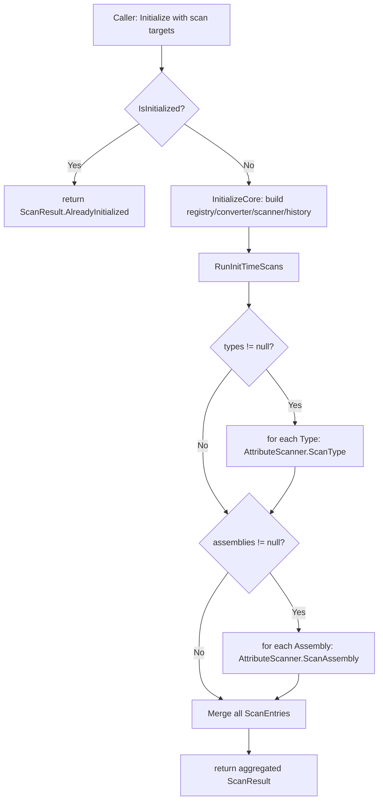

# Auto-Scan at Initialize

## Status

Draft

## Summary

Extend `CommandSystem.Initialize()` with three new overloads that accept scan targets (`Type[]`, `Assembly[]`, or both) and a `ScanOptions` value, so attribute-based command registration runs automatically during startup without requiring a follow-up `Scan()` call. The overloads return a single aggregated `ScanResult` so callers can inspect per-command outcomes immediately.

## Requirements Input

- Source: `.github/tasks/auto-scan-at-initialize/requirements.md`
- Key requirements carried into design:
  - New overloads accept `Type[]`, `Assembly[]`, or combined alongside optional history capacity and `ScanOptions`.
  - Scan execution reuses existing `AttributeScanner` internals — no duplicated scan logic.
  - Overloads are idempotent: already-initialized → no-op, returning a result distinguishable from a zero-entry scan.
  - History capacity clamping (`< 1 → 1`) matches existing `Initialize(int)` semantics.
  - Returned result exposes aggregated per-command outcomes across all targets.
  - No LINQ in new runtime paths; IL2CPP/AOT safe throughout.
  - Existing `Initialize()` and `Initialize(int)` remain unchanged in public contract.

## Scope Notes

- In scope: three new `Initialize` overloads on `CommandSystem`; `ScanResult.IsAlreadyInitialized` property; `ScanResult.AlreadyInitialized()` internal factory; private `InitializeCore(int)` helper; private `RunInitTimeScans(Type[], Assembly[], ScanOptions)` helper; new `AutoScanAtInitializeTests.cs` test file.
- Out of scope: changes to `Scan(Type, ScanOptions)` / `Scan(Assembly, ScanOptions)` public methods; changes to `Shutdown()`; accumulating init-time results for later retrieval; background or deferred scanning; any Unity-layer concerns.

## Architecture Overview

Three new public overloads are added to `CommandSystem`. Each overload:

1. Guards against already-initialized (idempotent no-op path).
2. Runs base initialization through a shared private `InitializeCore(int)` helper.
3. Delegates scan execution to a shared private `RunInitTimeScans(Type[], Assembly[], ScanOptions)` helper, which calls the already-existing `AttributeScanner` methods.
4. Returns an aggregated `ScanResult`.

`ScanResult` gains one new public property (`IsAlreadyInitialized`) and one new internal factory method (`AlreadyInitialized()`). The internal constructor gains an optional `bool isAlreadyInitialized` parameter (defaulting to `false`) — backward-compatible for all existing internal callsites.

No new external dependencies are introduced.

## Data Flow / Control Flow

```
Caller
  │
  ├─ Initialize(types, options, capacity)
  │       │
  │       ├── IsInitialized? ─── YES ──► return ScanResult.AlreadyInitialized()
  │       │
  │       ├── InitializeCore(capacity)          // sets up registry, converter,
  │       │       │                             // executionHandler, attributeScanner,
  │       │       │                             // historyBuffer; flushes _pendingConverters;
  │       │       └── IsInitialized = true
  │       │
  │       └── RunInitTimeScans(types, null, options)
  │               │
  │               ├── for each non-null Type   → _attributeScanner.ScanType(t, options)
  │               ├── (assemblies loop skipped — null)
  │               └── return aggregated ScanResult
  │
  ├─ Initialize(assemblies, options, capacity)
  │       └── same flow; RunInitTimeScans(null, assemblies, options)
  │
  └─ Initialize(types, assemblies, options, capacity)
          └── same flow; RunInitTimeScans(types, assemblies, options)
```

## Components and Responsibilities

### `CommandSystem` (modified)

- Responsibility: expose three new `Initialize` overloads; own `InitializeCore` and `RunInitTimeScans` private helpers.
- Interactions: `InitializeCore` creates all sub-components and sets `IsInitialized = true`; `RunInitTimeScans` delegates to `_attributeScanner.ScanType` / `_attributeScanner.ScanAssembly`.

### `ScanResult` (modified)

- Responsibility: carry per-command scan outcomes; signal the already-initialized no-op state.
- New surface: `bool IsAlreadyInitialized { get; }` public property; `internal static ScanResult AlreadyInitialized()` factory; updated internal constructor (`bool isAlreadyInitialized = false` optional parameter).

### `AttributeScanner` (unchanged)

- Responsibility: type/assembly scanning and command registration — no changes needed.

## Dependency Evaluation

- New dependencies: **None**
- Rationale: the problem is straightforward; the existing `AttributeScanner`, `ScanResult`, and `CommandRegistry` infrastructure already cover every required capability. No new packages are warranted.

## API / Contract Sketch

```csharp
// CommandSystem — three new public overloads

/// <summary>
/// Initializes the command system and scans the given types for [Command]-decorated methods.
/// Idempotent — if already initialized, returns <see cref="ScanResult.IsAlreadyInitialized"/> result.
/// </summary>
public ScanResult Initialize(
    Type[] types,
    ScanOptions options = default,
    int historyCapacity = DefaultHistoryCapacity);

/// <summary>
/// Initializes the command system and scans all types in the given assemblies.
/// Idempotent — if already initialized, returns <see cref="ScanResult.IsAlreadyInitialized"/> result.
/// </summary>
public ScanResult Initialize(
    Assembly[] assemblies,
    ScanOptions options = default,
    int historyCapacity = DefaultHistoryCapacity);

/// <summary>
/// Initializes the command system and scans the given types and assemblies.
/// Idempotent — if already initialized, returns <see cref="ScanResult.IsAlreadyInitialized"/> result.
/// </summary>
public ScanResult Initialize(
    Type[] types,
    Assembly[] assemblies,
    ScanOptions options = default,
    int historyCapacity = DefaultHistoryCapacity);
```

```csharp
// ScanResult — additions only

public sealed class ScanResult
{
    // existing members unchanged ...

    /// <summary>
    /// <c>true</c> when this result was returned because <see cref="CommandSystem"/>
    /// was already initialized; the scan was not run. Distinct from a successful scan
    /// that found zero commands (<c>Entries.Length == 0</c>, <c>IsAlreadyInitialized == false</c>).
    /// </summary>
    public bool IsAlreadyInitialized { get; }

    // internal constructor gains an optional bool parameter (default false):
    internal ScanResult(ScanEntry[] entries, bool isAlreadyInitialized = false) { ... }

    // new internal factory:
    internal static ScanResult AlreadyInitialized()
        => new ScanResult(Array.Empty<ScanEntry>(), isAlreadyInitialized: true);
}
```

## Implementation Notes

### `InitializeCore(int historyCapacity)` — private helper

Extract the repeated object-graph construction into one private method. Both existing overloads and all three new overloads call it after their guard check. The existing `Initialize()` and `Initialize(int)` overloads may be refactored to delegate to `InitializeCore` — this does not change their public behavior. If the implementer prefers to keep the existing methods unchanged at the source level, the new overloads may call `InitializeCore` while the old ones keep their inline initialization. Either is acceptable.

```csharp
private void InitializeCore(int historyCapacity)
{
    int effectiveCapacity = historyCapacity < 1 ? 1 : historyCapacity;

    _registry = new CommandRegistry();
    _converter = new ArgumentConverter();
    _executionHandler = new ExecutionHandler(_registry, _converter);
    _attributeScanner = new AttributeScanner(_registry, _converter);

    foreach (KeyValuePair<Type, TypeConverterDelegate> entry in _pendingConverters)
    {
        _converter.AddConverter(entry.Key, AdaptConverter(entry.Value));
    }

    _pendingConverters.Clear();
    _historyBuffer = new CommandHistoryBuffer(effectiveCapacity);
    IsInitialized = true;
}
```

### `RunInitTimeScans(Type[], Assembly[], ScanOptions)` — private helper

Merges per-target scan entries into one `ScanResult`. Null arrays and null items inside arrays are silently skipped (same pattern as `AttributeScanner.ScanAssembly` skipping null types from `ReflectionTypeLoadException`).

```csharp
private ScanResult RunInitTimeScans(Type[] types, Assembly[] assemblies, ScanOptions options)
{
    List<ScanEntry> all = new List<ScanEntry>();

    if (types != null)
    {
        for (int i = 0; i < types.Length; i++)
        {
            if (types[i] == null) { continue; }
            ScanResult r = _attributeScanner.ScanType(types[i], options);
            for (int j = 0; j < r.Entries.Length; j++)
            {
                all.Add(r.Entries[j]);
            }
        }
    }

    if (assemblies != null)
    {
        for (int i = 0; i < assemblies.Length; i++)
        {
            if (assemblies[i] == null) { continue; }
            ScanResult r = _attributeScanner.ScanAssembly(assemblies[i], options);
            for (int j = 0; j < r.Entries.Length; j++)
            {
                all.Add(r.Entries[j]);
            }
        }
    }

    return new ScanResult(all.ToArray());
}
```

### Full overload shape (body)

```csharp
public ScanResult Initialize(Type[] types, ScanOptions options = default, int historyCapacity = DefaultHistoryCapacity)
{
    if (IsInitialized)
    {
        return ScanResult.AlreadyInitialized();
    }

    InitializeCore(historyCapacity);
    return RunInitTimeScans(types, null, options);
}

public ScanResult Initialize(Assembly[] assemblies, ScanOptions options = default, int historyCapacity = DefaultHistoryCapacity)
{
    if (IsInitialized)
    {
        return ScanResult.AlreadyInitialized();
    }

    InitializeCore(historyCapacity);
    return RunInitTimeScans(null, assemblies, options);
}

public ScanResult Initialize(Type[] types, Assembly[] assemblies, ScanOptions options = default, int historyCapacity = DefaultHistoryCapacity)
{
    if (IsInitialized)
    {
        return ScanResult.AlreadyInitialized();
    }

    InitializeCore(historyCapacity);
    return RunInitTimeScans(types, assemblies, options);
}
```

### `ScanResult` constructor modification

The existing internal constructor signature is `internal ScanResult(ScanEntry[] entries)`. Add the optional second parameter with a default value of `false`:

```csharp
internal ScanResult(ScanEntry[] entries, bool isAlreadyInitialized = false)
{
    Entries = entries;
    IsAlreadyInitialized = isAlreadyInitialized;
    bool hasErrors = false;
    for (int i = 0; i < entries.Length; i++)
    {
        if (!entries[i].Result.Success)
        {
            hasErrors = true;
            break;
        }
    }
    HasErrors = hasErrors;
}
```

All existing internal callsites (`new ScanResult(entries)`) remain valid — the optional parameter does not break them.

### `IsAlreadyInitialized` vs. `HasErrors` interaction

When `IsAlreadyInitialized` is `true`, `Entries` is empty (`Length == 0`) and `HasErrors` is `false`. Callers that only check `HasErrors` see "no errors" — which is accurate since no scan ran. Callers that need to distinguish no-op from a zero-command scan check `IsAlreadyInitialized`. This layered approach avoids repurposing `HasErrors` for lifecycle signalling.

### History capacity and default values

`DefaultHistoryCapacity` is a `public const int` so it is valid as a C# default parameter value. The clamping inside `InitializeCore` (`historyCapacity < 1 ? 1 : historyCapacity`) applies identically to all overloads. No additional clamping logic is needed in the new overloads.

### Placement in `CommandSystem.cs`

Insert the three new overloads immediately after `Initialize(int historyCapacity)`. Insert `InitializeCore` and `RunInitTimeScans` immediately before `Shutdown()` (private helpers grouped together).

### No allocations on `Execute()` hot path

`RunInitTimeScans` allocates a `List<ScanEntry>` at initialization time only. `Execute()` is unaffected.

## Resolved Open Questions

### Q1 — Overload shape

**Decision: Three separate overloads** (`Initialize(Type[], ScanOptions, int)`, `Initialize(Assembly[], ScanOptions, int)`, `Initialize(Type[], Assembly[], ScanOptions, int)`).

**Rationale:** The existing API already uses separate `Scan(Type, ...)` and `Scan(Assembly, ...)` methods — this extends the same pattern naturally. A descriptor struct would require additional public type surface and offers no ergonomic advantage at the call site. Three overloads are AOT safe (no generic dispatch, no dynamic construction), directly expressible in `netstandard2.0`, and immediately discoverable by IDE tooling.

### Q2 — Result type

**Decision: Single aggregated `ScanResult`** (entries from all targets merged into one instance).

**Rationale:** `AttributeScanner.ScanAssembly` already merges entries across all types within one assembly into a single `ScanResult`. The same idiom scales to multiple targets. Callers care about command-level outcomes, not which target a command came from. A `ScanResult[]` return forces per-target iteration at every call site, adds an array allocation, and diverges from the existing `Scan()` return type. A new wrapper type introduces unnecessary surface area.

### Q3 — Already-initialized return value

**Decision: `ScanResult.AlreadyInitialized()` internal factory + `bool IsAlreadyInitialized` public property on `ScanResult`.**

**Rationale:** Nullable return (`ScanResult?`) would propagate null checks to every call site and change the return type contract. An out-parameter clashes with the existing API style. A new `RegistrationError` value (`AlreadyInitialized`) added to the enum would work but would surface lifecycle state through a registration-error channel — a conceptual mismatch. The `IsAlreadyInitialized` bool is explicit, zero-allocation, readable at a glance (`if (result.IsAlreadyInitialized) { ... }`), and consistent with `HasErrors` as a quick-check flag on `ScanResult`. The `AlreadyInitialized()` factory is consistent with the existing `SystemFailure()` factory already on `ScanResult`.

## Diagram



## Testing Strategy

### Test file

`tests/kmCommands.Tests/AutoScanAtInitializeTests.cs`

Use the same fixture pattern as `AttributeScannerTests`: `[SetUp]` creates a new `CommandSystem`, `[TearDown]` calls `Shutdown()` if initialized.

### Inner test command containers (static nested classes)

```csharp
private static class BasicScanTarget
{
    public static bool WasCalled;

    [Command("autoscan_ping")]
    public static void Ping() { WasCalled = true; }

    [Command("autoscan_add")]
    public static void Add(int a, int b) { }
}

private static class DevOnlyTarget
{
    [Command("autoscan_devonly", IsDevOnly = true)]
    public static void DevCmd() { }

    [Command("autoscan_regular")]
    public static void RegularCmd() { }
}

private static class FailingTarget
{
    [Command("autoscan_bad")]
    public void NonStaticMethod() { }  // non-static → guaranteed failure
}
```

### Test cases

| #   | Test name                                                                     | Validates                                                                                                 |
| --- | ----------------------------------------------------------------------------- | --------------------------------------------------------------------------------------------------------- |
| 1   | `Initialize_TypeArray_SetsIsInitializedTrue`                                  | `IsInitialized == true` after the call                                                                    |
| 2   | `Initialize_TypeArray_RegistersCommandsFromType`                              | Commands from the type are discoverable via `GetCommandNames()`                                           |
| 3   | `Initialize_AssemblyArray_RegistersCommandsFromAssembly`                      | Commands in the assembly are discoverable                                                                 |
| 4   | `Initialize_TypeAndAssemblyArrays_RegistersFromBoth`                          | Combined overload — commands from both targets registered                                                 |
| 5   | `Initialize_WhenAlreadyInitialized_TypeArray_ReturnsAlreadyInitializedResult` | `result.IsAlreadyInitialized == true`                                                                     |
| 6   | `Initialize_WhenAlreadyInitialized_TypeArray_DoesNotDoubleRegister`           | No duplicate command entries after second call                                                            |
| 7   | `Initialize_WhenAlreadyInitialized_IsInitializedRemainsTrue`                  | `IsInitialized` stays `true`                                                                              |
| 8   | `Initialize_EmptyTypeArray_ReturnsZeroEntriesAndNoErrors`                     | `Entries.Length == 0`, `HasErrors == false`, `IsAlreadyInitialized == false`                              |
| 9   | `Initialize_EmptyAssemblyArray_ReturnsZeroEntriesAndNoErrors`                 | same for assembly overload                                                                                |
| 10  | `Initialize_NullTypeArray_TreatedAsEmpty`                                     | null input → zero entries, no exception                                                                   |
| 11  | `Initialize_NullAssemblyArray_TreatedAsEmpty`                                 | null input → zero entries, no exception                                                                   |
| 12  | `Initialize_DevModeTrue_IncludesDevOnlyCommands`                              | dev-only command appears in result entries and `GetCommandNames()`                                        |
| 13  | `Initialize_DevModeFalse_ExcludesDevOnlyCommands`                             | dev-only command absent from result entries and `GetCommandNames()`                                       |
| 14  | `Initialize_DefaultOptions_ExcludesDevOnlyCommands`                           | calling without explicit options defaults to `DevMode = false`                                            |
| 15  | `Initialize_ResultContainsEntryPerRegisteredCommand`                          | `Entries.Length` matches expected command count                                                           |
| 16  | `Initialize_ResultHasErrors_WhenCommandFails`                                 | `HasErrors == true`, failing entry present                                                                |
| 17  | `Initialize_CommandsVisibleInGetCommandNames`                                 | `GetCommandNames()` contains scanned command names immediately after call                                 |
| 18  | `Initialize_CommandsVisibleInGetSnapshot`                                     | `GetSnapshot()` contains scanned command descriptors                                                      |
| 19  | `Initialize_ThenRegister_Succeeds`                                            | `Register()` after init-time scan returns `Success == true`                                               |
| 20  | `Initialize_ThenScan_Succeeds`                                                | explicit `Scan()` after init-time scan returns valid result                                               |
| 21  | `Initialize_AlreadyInitialized_IsDistinctFromZeroEntries`                     | `IsAlreadyInitialized == true` differs from `Entries.Length == 0` on a fresh init                         |
| 22  | `Initialize_HistoryCapacity_ClampedToOne_WhenBelowOne`                        | capacity ≤ 0 clamped; `HistoryCount` starts at 0, buffer doesn't throw                                    |
| 23  | `Initialize_UsesDefaultHistoryCapacity_WhenNotSpecified`                      | calling without capacity parameter uses `DefaultHistoryCapacity`                                          |
| 24  | `Initialize_MultipleTypes_AllEntriesMergedInResult`                           | scanning two types produces entries from both in one result                                               |
| 25  | `Initialize_NullItemInTypeArray_SkippedGracefully`                            | `new Type[] { null, typeof(BasicScanTarget) }` → only `BasicScanTarget` commands registered, no exception |

### Mapping to acceptance criteria

| Acceptance criterion                                                     | Test(s)             |
| ------------------------------------------------------------------------ | ------------------- |
| Single `Initialize()` call registers commands without follow-up `Scan()` | 2, 3, 4             |
| Dev-mode filtering works at init time                                    | 12, 13, 14          |
| Post-init `Register()` and `Scan()` succeed                              | 19, 20              |
| Existing `Initialize()` / `Initialize(int)` callers unaffected           | existing test suite |
| Already-initialized is safe no-op                                        | 5, 6, 7             |
| Discovery APIs reflect init-time results immediately                     | 17, 18              |

## Risks and Tradeoffs

- **`ScanResult` internal constructor change**: adding an optional `bool` parameter to an `internal` constructor is completely backward-compatible. No risk to public callers; all internal callsites compile as-is.
- **`List<ScanEntry>` allocation in `RunInitTimeScans`**: this happens once at init time and is not on any hot path. Acceptable per requirements.
- **Three overloads vs. one combined**: three overloads produce more API surface but are more discoverable and eliminate boilerplate at call sites. The combined overload handles the rare mixed case.
- **Null items in input arrays**: silently skipping null entries (consistent with `ScanAssembly`) is the most robust choice at library initialization, where partial reflection load failures are plausible.

## Open Questions

None — all design questions from requirements have been resolved above.

## Task Planning Handoff

### Suggested implementation slices

1. **`ScanResult` extension** — add `IsAlreadyInitialized` property, optional constructor parameter, `AlreadyInitialized()` factory. Single file change to `src/Results/ScanResult.cs`. Commit: `feat(auto-scan-at-initialize): add IsAlreadyInitialized to ScanResult`.

2. **`CommandSystem` helpers** — add `InitializeCore(int)` and `RunInitTimeScans(Type[], Assembly[], ScanOptions)` private methods to `CommandSystem.cs`. Commit: `feat(auto-scan-at-initialize): add InitializeCore and RunInitTimeScans helpers`.

3. **New overloads** — add the three public `Initialize` overloads to `CommandSystem.cs`. Commit: `feat(auto-scan-at-initialize): add Initialize overloads with scan targets`.

4. **Tests** — create `AutoScanAtInitializeTests.cs` with all 25 test cases. Commit: `test(auto-scan-at-initialize): add AutoScanAtInitializeTests`.

### Coupling notes for task splitting

- Slice 1 must land before slices 3 and 4 (slices 3 and 4 reference `ScanResult.AlreadyInitialized()`).
- Slice 2 must land before slice 3 (the new overloads call `InitializeCore` and `RunInitTimeScans`).
- Slices 1 and 2 can be combined into one commit if the implementer prefers smaller diffs.
- Slice 4 (tests) depends on slices 1–3 compiling.

### Areas to validate after full integration

- Confirm that all 161 existing tests still pass after `ScanResult` constructor change.
- Verify `GetSnapshot()` returns the expected command descriptions for commands scanned at init time.
- Verify `HistoryCount` increment still works correctly after commands are registered via init-time scan and then executed.

---

## Final Review Contract

### Critical behaviors the reviewer must verify

1. `ScanResult.IsAlreadyInitialized` is `true` only when returned from the already-initialized no-op path; `false` on all normal scan returns (including zero-entry results).
2. `ScanResult.HasErrors` is unaffected by `IsAlreadyInitialized` — it reflects only command-level registration failures.
3. `InitializeCore` is called exactly once per `Initialize(...)` invocation; `IsInitialized` is `true` after `InitializeCore` returns.
4. `RunInitTimeScans` delegates to `_attributeScanner.ScanType` / `ScanAssembly` without reimplementing scan logic.
5. Null arrays and null items in arrays are silently skipped; no `NullReferenceException` is thrown.
6. History capacity is clamped inside `InitializeCore` (values `< 1` → `1`); the new overloads do not add a second clamping step.
7. All three new overloads use `DefaultHistoryCapacity` (64) when `historyCapacity` is not supplied.

### Design invariants that must hold

- Existing `Initialize()` and `Initialize(int)` compile and behave identically before and after this change.
- `ScanResult` internal constructor has `Array.Empty<ScanEntry>()` passed when `isAlreadyInitialized = true` (never null).
- No LINQ appears in `RunInitTimeScans`, `InitializeCore`, or any new overload body.
- No `UnityEngine` namespace reference exists in any modified `src/` file.

### Required test evidence for acceptance

- All 25 test cases in `AutoScanAtInitializeTests.cs` pass.
- All 161 pre-existing tests continue to pass.
- Test 21 explicitly asserts `result.IsAlreadyInitialized == true` on a second call AND `result.IsAlreadyInitialized == false` on a fresh init that returns zero entries — demonstrating distinguishability.

### Known acceptable deviations

- Existing `Initialize()` and `Initialize(int)` bodies may optionally be refactored to call `InitializeCore` instead of keeping their inline initialization code. Either form is acceptable provided behavior is identical.
- If both arrays are `null` in the combined overload, the result is an empty-entries `ScanResult` (not a system failure). This is intentional and consistent with the "null treated as empty" rule.

### Blocking conditions for final approval

- Any regression in existing test suite.
- `IsAlreadyInitialized` missing from `ScanResult` public surface.
- Any new LINQ usage in `src/`.
- Any `UnityEngine` reference introduced in `src/`.
- Existing `Initialize()` or `Initialize(int)` public signatures altered.
- `RunInitTimeScans` reimplementing attribute lookup logic rather than delegating to `AttributeScanner`.
