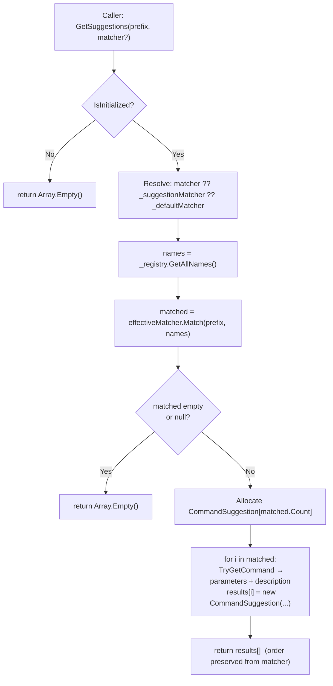

# Autocomplete / Command Suggestions

## Status

Draft

## Summary

This design adds a `GetSuggestions` API to both `CommandSystem` and `CommandMetadataSnapshot`, backed by a pluggable `ISuggestionMatcher` interface and a built-in `PrefixSuggestionMatcher`. Callers receive typed `CommandSuggestion` structs that bundle a command name, its parameter descriptors, and its description — everything a UI autocompletion layer needs without further registry access. The matching algorithm is fully replaceable per-call or globally, while the library never re-sorts after the matcher returns, preserving custom ordering.

---

## Requirements Input

- Source: `.github/tasks/autocomplete-suggestions/requirements.md`
- Key requirements carried into design:
  - FR-1: `CommandSuggestion` readonly struct — `CommandName`, `Parameters` (never null), `Description` (never null)
  - FR-2: `ISuggestionMatcher` interface — single method, IL2CPP/AOT-safe, no generic method parameters
  - FR-3: Built-in `PrefixSuggestionMatcher` — case-insensitive ordinal prefix, alpha sort, null/empty prefix returns all
  - FR-4/FR-5: `CommandSystem.GetSuggestions(prefix)` and `GetSuggestions(prefix, matcher)` — lifecycle-safe, pre-init/post-shutdown return empty array
  - FR-6: `CommandSystem.SetSuggestionMatcher(matcher)` — global override; `null` reverts; `Shutdown()` resets
  - FR-7/FR-8: `CommandMetadataSnapshot.GetSuggestions(prefix)` and `GetSuggestions(prefix, matcher)` — snapshot-isolated, same safety guarantees
  - FR-9: Description sourced from live registry (`def.Description`) or snapshot `_descriptions` dict
  - FR-10: Null/empty prefix returns all registered commands
  - FR-11: Matcher returns names; library builds `CommandSuggestion[]` from them without re-sorting
  - NFR-1: No LINQ anywhere in new code
  - NFR-2: Allocations limited to one temp `List<string>` + one `CommandSuggestion[]` result
  - NFR-3: `CommandSuggestion` is a `readonly struct`; no generic method signatures on `ISuggestionMatcher`
  - NFR-4: No `UnityEngine` imports
  - NFR-5: `netstandard2.0` target
  - NFR-6: All additions are additive (no existing signatures changed)
  - NFR-7: All new `CommandSystem` members handle pre-init/post-shutdown safely

---

## Scope Notes

- **In scope:** `CommandSuggestion`, `ISuggestionMatcher`, `PrefixSuggestionMatcher`, `CommandSystem.GetSuggestions` (×2), `CommandSystem.SetSuggestionMatcher`, `CommandMetadataSnapshot.GetSuggestions` (×2), `Shutdown` reset
- **Out of scope:** Fuzzy matching, scoring, async APIs, per-parameter token suggestions, UI/rendering, DevMode filtering of results, changes to registration or execution, changes to existing public member signatures

---

## Architecture Overview

The feature introduces three new types and extends two existing public classes. No new sub-systems or external dependencies are required.

```
┌─────────────────────────────────┐
│  src/ (public layer)            │
│  CommandSuggestion.cs           │  ← new public readonly struct
│  ISuggestionMatcher.cs          │  ← new public interface
│  CommandSystem.cs               │  ← extended: 3 new methods + 1 field
│  CommandMetadataSnapshot.cs     │  ← extended: 2 new methods
└─────────────────────────────────┘
          ↓ uses
┌─────────────────────────────────┐
│  src/Core/ (internal layer)     │
│  PrefixSuggestionMatcher.cs     │  ← new internal sealed class
│  CommandRegistry.cs             │  ← unchanged; GetAllNames() + TryGetCommand() used
└─────────────────────────────────┘
```

There are no new dependencies between systems. `CommandSystem` delegates name-list acquisition to the existing `_registry.GetAllNames()`. `CommandMetadataSnapshot` uses its existing `CommandNames` array and `_entries`/`_descriptions` dictionaries.

---

## Data Flow / Control Flow

### `CommandSystem.GetSuggestions(prefix, matcher)`

```
Caller
  │
  ▼
CommandSystem.GetSuggestions(prefix, matcher)
  │
  ├─ [!IsInitialized] → return Array.Empty<CommandSuggestion>()
  │
  ├─ Resolve effective matcher:
  │     matcher ?? _suggestionMatcher ?? _defaultMatcher
  │
  ├─ names = _registry.GetAllNames()          // sorted string[] snapshot
  │
  ├─ matched = effectiveMatcher.Match(prefix, names)
  │                                             // IList<string>, caller-ordered
  │
  ├─ [matched null or empty] → return Array.Empty<CommandSuggestion>()
  │
  ├─ Allocate CommandSuggestion[matched.Count]
  │
  └─ for each name in matched (preserve order):
        _registry.TryGetCommand(name, out def)
        → CommandSuggestion(name, def.Parameters, def.Description ?? string.Empty)
        → store at index i
  │
  ▼
return CommandSuggestion[]
```

### `CommandMetadataSnapshot.GetSuggestions(prefix, matcher)`

```
Caller
  │
  ▼
GetSuggestions(prefix, matcher)
  │
  ├─ Resolve effective matcher:
  │     matcher ?? _defaultMatcher                // no global matcher on snapshot
  │
  ├─ matched = effectiveMatcher.Match(prefix, CommandNames)
  │                                             // CommandNames already sorted
  │
  ├─ [matched null or empty] → return Array.Empty<CommandSuggestion>()
  │
  ├─ Allocate CommandSuggestion[matched.Count]
  │
  └─ for each name in matched (preserve order):
        _entries.TryGetValue(name, out parameters)
        parameters = parameters ?? Array.Empty<CommandParameterInfo>()
        _descriptions.TryGetValue(name, out description)
        description = description ?? string.Empty
        → CommandSuggestion(name, parameters, description)
  │
  ▼
return CommandSuggestion[]
```

---

## Components and Responsibilities

### `CommandSuggestion` (new — `src/CommandSuggestion.cs`)

- **Responsibility:** Immutable value carrying a matched command name, its parameters, and its description.
- **Interactions:** Created only inside `CommandSystem` and `CommandMetadataSnapshot` result-building loops. Consumed externally (read-only).

### `ISuggestionMatcher` (new — `src/ISuggestionMatcher.cs`)

- **Responsibility:** Defines the matching contract. Receives a prefix and a name snapshot; returns an ordered name collection.
- **Interactions:** Implemented by `PrefixSuggestionMatcher` internally; may be implemented by consumer code. Invoked by `CommandSystem.GetSuggestions` and `CommandMetadataSnapshot.GetSuggestions`.

### `PrefixSuggestionMatcher` (new — `src/Core/PrefixSuggestionMatcher.cs`)

- **Responsibility:** Default built-in `ISuggestionMatcher` implementation. Stateless; shared via a static singleton.
- **Interactions:** Held in a `private static readonly` field on `CommandSystem`; referenced directly by `CommandMetadataSnapshot`.

### `CommandSystem` (extended — `src/CommandSystem.cs`)

- **Responsibility:** Hosts the global matcher field, exposes public `GetSuggestions` overloads and `SetSuggestionMatcher`.
- **New fields:** `private ISuggestionMatcher _suggestionMatcher` (instance state, nullable — null means use default), `private static readonly ISuggestionMatcher _defaultMatcher = new PrefixSuggestionMatcher()` (class-level singleton).
- **Interactions:** Reads from `_registry`; delegates matching to the resolved matcher.

### `CommandMetadataSnapshot` (extended — `src/CommandMetadataSnapshot.cs`)

- **Responsibility:** Exposes snapshot-local `GetSuggestions` overloads using existing snapshot data.
- **Interactions:** Uses `CommandNames`, `_entries`, and `_descriptions` already captured at snapshot time. References `_defaultMatcher` (same static singleton).

### `CommandRegistry` (unchanged)

- **`GetAllNames()`:** Used by `CommandSystem.GetSuggestions` to obtain a sorted name snapshot.
- **`TryGetCommand(name, out def)`:** Used by the result-building loop to look up `Parameters` and `Description`.

---

## Dependency Evaluation

- **New dependencies:** None.
- **Rationale:** All required functionality (prefix matching, sorted list building, struct allocation) is trivially implementable with `System.Collections.Generic.List<string>` and `string.StartsWith`. No third-party library matches the constraints better than a small focused internal class.
- **Alternatives considered:** N/A — no complex algorithm required.

---

## API / Contract Sketch

```csharp
// src/CommandSuggestion.cs
namespace kmCommands
{
    public readonly struct CommandSuggestion
    {
        public string CommandName { get; }
        public CommandParameterInfo[] Parameters { get; }
        public string Description { get; }

        internal CommandSuggestion(string commandName, CommandParameterInfo[] parameters, string description)
        {
            CommandName = commandName;
            Parameters = parameters;
            Description = description;
        }
    }
}

// src/ISuggestionMatcher.cs
using System.Collections.Generic;

namespace kmCommands
{
    public interface ISuggestionMatcher
    {
        IList<string> Match(string prefix, string[] commandNames);
    }
}

// src/Core/PrefixSuggestionMatcher.cs  (internal)
namespace kmCommands.Core
{
    internal sealed class PrefixSuggestionMatcher : ISuggestionMatcher
    {
        public IList<string> Match(string prefix, string[] commandNames) { ... }
    }
}

// CommandSystem additions (conceptual)
public ISuggestionMatcher SetSuggestionMatcher(ISuggestionMatcher matcher);   // void
public CommandSuggestion[] GetSuggestions(string prefix);
public CommandSuggestion[] GetSuggestions(string prefix, ISuggestionMatcher matcher);

// CommandMetadataSnapshot additions (conceptual)
public CommandSuggestion[] GetSuggestions(string prefix);
public CommandSuggestion[] GetSuggestions(string prefix, ISuggestionMatcher matcher);
```

---

## Implementation Notes

### Static Default Matcher

`_defaultMatcher` is a `private static readonly` field on `CommandSystem`, initialized to `new PrefixSuggestionMatcher()`. This allocation happens once per AppDomain load. `CommandMetadataSnapshot` accesses the default matcher by declaring its own `private static readonly ISuggestionMatcher _defaultMatcher = new PrefixSuggestionMatcher()` field, keeping it self-contained and independent of `CommandSystem` state.

**Reason for separate statics:** `CommandMetadataSnapshot` is a public type and must not depend on `CommandSystem` internals. Two stateless singleton instances are negligible cost.

### Matcher Resolution

The null-fallback chain is: `effectiveMatcher = matcher ?? _suggestionMatcher ?? _defaultMatcher`. This holds for both `CommandSystem` methods. For snapshot methods (no global matcher): `effectiveMatcher = matcher ?? _defaultMatcher`.

### Null Return Guard on Matcher

The result-building loop must guard against a custom matcher returning `null`:

```csharp
IList<string> matched = effectiveMatcher.Match(prefix, names);
if (matched == null || matched.Count == 0)
    return Array.Empty<CommandSuggestion>();
```

### Sort Preservation Invariant

The library **never calls `Array.Sort` or any sort after the matcher returns**. The result array is populated by iterating `matched` in index order (`0..matched.Count-1`). This applies identically to `CommandSystem` and `CommandMetadataSnapshot`. This invariant is explicitly required by FR-11 and must be maintained.

### `PrefixSuggestionMatcher` Sort Guarantee

Because `CommandRegistry.GetAllNames()` and `CommandMetadataSnapshot.CommandNames` are both pre-sorted ordinal case-insensitive, the prefix matcher can iterate in-order and accumulate matches into a `List<string>` that is already alpha-sorted — no additional sort step is needed inside the matcher.

```csharp
// Pattern for PrefixSuggestionMatcher.Match:
bool matchAll = string.IsNullOrEmpty(prefix);
var results = new List<string>();
for (int i = 0; i < commandNames.Length; i++)
{
    if (matchAll || commandNames[i].StartsWith(prefix, StringComparison.OrdinalIgnoreCase))
        results.Add(commandNames[i]);
}
return results;
// Input is already sorted → output is already sorted (no extra sort).
```

### `SetSuggestionMatcher` Signature

```csharp
public void SetSuggestionMatcher(ISuggestionMatcher matcher)
{
    _suggestionMatcher = matcher; // null is valid (reverts to default)
}
```

This is lifecycle-safe; it only writes an instance field and never touches `_registry` or other initialized-only state.

### `Shutdown` Reset

In the existing `Shutdown()` body:

```csharp
_suggestionMatcher = null;
```

Add this alongside the other field-nulling operations. The static `_defaultMatcher` is unaffected.

### `CommandSuggestion` Constructor Visibility

`CommandSuggestion` is a `readonly struct`. Its parameterized constructor is `internal`. External consumers can still create `default(CommandSuggestion)` (all fields null/empty), which is harmless; only the library produces valid populated instances.

### `Parameters` Null Guard

When `_registry.TryGetCommand` fails for a name returned by the matcher (e.g., concurrent modification or stale custom matcher), `Parameters` falls back to `Array.Empty<CommandParameterInfo>()` and `Description` to `string.Empty`, satisfying FR-1's never-null contract.

### Thread Safety Scope

`GetSuggestions` offers the same single-threaded guarantee as the existing `GetCommandNames()` — documented as "all calls from the same thread (typically main thread)." No new locking is introduced. The existing behavior is preserved exactly.

---

## Code Examples

### `CommandSystem.GetSuggestions` implementation sketch

```csharp
public CommandSuggestion[] GetSuggestions(string prefix)
{
    return GetSuggestions(prefix, null);
}

public CommandSuggestion[] GetSuggestions(string prefix, ISuggestionMatcher matcher)
{
    if (!IsInitialized)
        return Array.Empty<CommandSuggestion>();

    ISuggestionMatcher effective = matcher ?? _suggestionMatcher ?? _defaultMatcher;
    string[] names = _registry.GetAllNames();
    IList<string> matched = effective.Match(prefix, names);

    if (matched == null || matched.Count == 0)
        return Array.Empty<CommandSuggestion>();

    CommandSuggestion[] results = new CommandSuggestion[matched.Count];
    for (int i = 0; i < matched.Count; i++)
    {
        string name = matched[i];
        CommandParameterInfo[] parameters = Array.Empty<CommandParameterInfo>();
        string description = string.Empty;

        if (_registry.TryGetCommand(name, out Core.CommandDefinition def))
        {
            parameters = def.Parameters;
            description = def.Description ?? string.Empty;
        }

        results[i] = new CommandSuggestion(name, parameters, description);
    }

    return results;
}
```

### `CommandMetadataSnapshot.GetSuggestions` implementation sketch

```csharp
private static readonly ISuggestionMatcher _defaultMatcher = new Core.PrefixSuggestionMatcher();

public CommandSuggestion[] GetSuggestions(string prefix)
{
    return GetSuggestions(prefix, null);
}

public CommandSuggestion[] GetSuggestions(string prefix, ISuggestionMatcher matcher)
{
    ISuggestionMatcher effective = matcher ?? _defaultMatcher;
    IList<string> matched = effective.Match(prefix, CommandNames);

    if (matched == null || matched.Count == 0)
        return Array.Empty<CommandSuggestion>();

    CommandSuggestion[] results = new CommandSuggestion[matched.Count];
    for (int i = 0; i < matched.Count; i++)
    {
        string name = matched[i];

        CommandParameterInfo[] parameters;
        if (!_entries.TryGetValue(name, out parameters) || parameters == null)
            parameters = Array.Empty<CommandParameterInfo>();

        string description;
        if (!_descriptions.TryGetValue(name, out description) || description == null)
            description = string.Empty;

        results[i] = new CommandSuggestion(name, parameters, description);
    }

    return results;
}
```

### `PrefixSuggestionMatcher` implementation sketch

```csharp
internal sealed class PrefixSuggestionMatcher : ISuggestionMatcher
{
    public IList<string> Match(string prefix, string[] commandNames)
    {
        if (commandNames == null || commandNames.Length == 0)
            return Array.Empty<string>();

        bool matchAll = string.IsNullOrEmpty(prefix);
        List<string> results = new List<string>();

        for (int i = 0; i < commandNames.Length; i++)
        {
            if (matchAll || commandNames[i].StartsWith(prefix, StringComparison.OrdinalIgnoreCase))
                results.Add(commandNames[i]);
        }

        return results;
    }
}
```

---

## Diagram



---

## Allocation Profile Analysis

For a call returning N suggestions from a registry of M commands:

| Allocation                      | Count               | Notes                                                                                |
| ------------------------------- | ------------------- | ------------------------------------------------------------------------------------ |
| `string[]` from `GetAllNames()` | 1 × M elements      | Existing behavior when names are present                                             |
| `List<string>` inside matcher   | 1 × up to M entries | Temp collection, GC'd after call                                                     |
| `CommandSuggestion[]` result    | 1 × N elements      | Returned to caller                                                                   |
| Per-element boxing              | 0                   | `CommandSuggestion` is a `readonly struct`; `CommandParameterInfo[]` refs are reused |

Total: 3 allocations per call (input name array, temp list, result array). Matches NFR-2 intent. No per-element object allocation.

`Array.Empty<CommandSuggestion>()` is returned as a static singleton for all empty-result paths — zero allocation.

---

## IL2CPP Safety Notes

- `ISuggestionMatcher.Match` uses concrete types only: `string` (primitive), `string[]` (array of primitive), `IList<string>` (concrete generic). No open generic type parameters on the method. ✓
- `CommandSuggestion` is a `readonly struct` — stored in arrays without boxing. ✓
- `PrefixSuggestionMatcher` uses `string.StartsWith(prefix, StringComparison.OrdinalIgnoreCase)` — no reflection, no dynamic. ✓
- `List<string>` is a well-known generic type; its instantiation is always preserved by the IL2CPP linker. ✓
- No `Delegate.CreateDelegate` with open generics, no `System.Reflection.Emit`, no `dynamic`. ✓
- `Array.Empty<string>()` and `Array.Empty<CommandSuggestion>()` — both concrete instantiations, preserved. ✓

---

## Testing Strategy

New test file: `tests/kmCommands.Tests/SuggestionTests.cs`

### Unit tests required

| Test area                     | Test description                                                                                                                           |
| ----------------------------- | ------------------------------------------------------------------------------------------------------------------------------------------ |
| Prefix matching               | `GetSuggestions("he")` returns only commands starting with `"he"`                                                                          |
| Case-insensitivity            | `GetSuggestions("HE")` returns same results as `GetSuggestions("he")`                                                                      |
| Null prefix                   | `GetSuggestions(null)` returns all registered commands                                                                                     |
| Empty prefix                  | `GetSuggestions("")` returns all registered commands                                                                                       |
| No-match prefix               | `GetSuggestions("zzz")` returns empty array (not null)                                                                                     |
| Pre-init safety               | `GetSuggestions("x")` before `Initialize()` returns empty array without throwing                                                           |
| Post-shutdown safety          | `GetSuggestions("x")` after `Shutdown()` returns empty array without throwing                                                              |
| Two-arg with custom matcher   | Custom `ISuggestionMatcher` returning reverse order produces `CommandSuggestion[]` in that reverse order                                   |
| Two-arg null matcher fallback | Null supplied matcher falls back to global/default                                                                                         |
| `SetSuggestionMatcher` effect | After `SetSuggestionMatcher(customMatcher)`, `GetSuggestions(prefix)` uses `customMatcher`                                                 |
| `SetSuggestionMatcher(null)`  | After `SetSuggestionMatcher(null)`, reverts to built-in prefix behavior                                                                    |
| `Shutdown` resets matcher     | `SetSuggestionMatcher(x)` then `Shutdown()` then re-`Initialize()`: `GetSuggestions` uses built-in default                                 |
| Snapshot `GetSuggestions`     | `CommandMetadataSnapshot.GetSuggestions(prefix)` matches the same results as `CommandSystem.GetSuggestions(prefix)` on a captured snapshot |
| `Empty` snapshot              | `CommandMetadataSnapshot.Empty.GetSuggestions(prefix)` returns empty array                                                                 |
| `Parameters` never null       | Zero-parameter command: `suggestion.Parameters` is empty array, not null                                                                   |
| `Description` never null      | No-description command: `suggestion.Description` is `""`, not null                                                                         |
| Description populated         | Command with description: `suggestion.Description` equals the registered description string                                                |
| Snapshot custom matcher       | `snapshot.GetSuggestions(prefix, customMatcher)` uses custom matcher order                                                                 |

---

## Risks and Tradeoffs

| Risk                                        | Mitigation                                                                                                                                                                                  |
| ------------------------------------------- | ------------------------------------------------------------------------------------------------------------------------------------------------------------------------------------------- |
| Custom matcher returns stale/invalid names  | Library guards with `TryGetCommand` fallback; `Parameters` → empty array, `Description` → `""`                                                                                              |
| Custom matcher returns null `IList<string>` | Explicit null check before building result array                                                                                                                                            |
| `GetAllNames()` allocates on every call     | Acceptable per NFR-2; same cost incurred by existing `GetCommandNames()` calls                                                                                                              |
| Two separate `_defaultMatcher` statics      | Both are `PrefixSuggestionMatcher` instances — stateless, negligible cost. Alternative (shared constant) would couple `CommandMetadataSnapshot` to `CommandSystem`, violating encapsulation |

---

## Open Questions

All three open questions from `requirements.md` are resolved by this design:

1. **Sort preservation** — Resolved: the library does **not** re-sort after the matcher returns. Order is strictly preserved. `PrefixSuggestionMatcher` produces alpha-sorted results by relying on the pre-sorted input names.

2. **Thread-safety scope** — Resolved: same single-threaded guarantee as existing `GetCommandNames()`; no new locking introduced. The design explicitly states this in Implementation Notes.

3. **Null matcher fallback** — Resolved: lenient fallback (`matcher ?? _suggestionMatcher ?? _defaultMatcher`). No `ArgumentNullException` is thrown. This is consistent with the library's broader pattern of treating missing context as a fallback rather than an error.

---

## Task Planning Handoff

### Suggested implementation slices (commit-aligned)

1. **Add `CommandSuggestion` struct and `ISuggestionMatcher` interface** — new files only; no existing files changed. Self-contained, independently reviewable.
2. **Add `PrefixSuggestionMatcher`** — new internal file; depends on `ISuggestionMatcher`.
3. **Extend `CommandSystem`** — add `_suggestionMatcher` field, `_defaultMatcher` static, `SetSuggestionMatcher`, both `GetSuggestions` overloads, and `_suggestionMatcher = null` in `Shutdown`.
4. **Extend `CommandMetadataSnapshot`** — add `_defaultMatcher` static, both `GetSuggestions` overloads. Depends on the snapshot's existing fields.
5. **Add `SuggestionTests.cs`** — full test suite covering all rows in the Testing Strategy table.

### Coupling notes for task splitting

- Slices 1 and 2 can be done sequentially in one commit (public + internal pair).
- Slices 3 and 4 are independent of each other once slices 1–2 are done.
- Slice 5 requires slices 1–4 to be complete to run.

### Areas to validate after full integration

- `Shutdown()` correctly resets `_suggestionMatcher` (verify with test: set, shutdown, re-init, call `GetSuggestions` → default behavior).
- `CommandMetadataSnapshot.Empty.GetSuggestions` returns empty array (not null).
- Custom matcher returning names not in the registry does not throw — verify the null-guard fallback path.

---

## Final Review Contract

### Critical behaviors to verify

- `GetSuggestions(null)` and `GetSuggestions("")` both return all registered commands (not empty).
- Result array preserves the exact order returned by the matcher — no re-sort anywhere in the library.
- `CommandSuggestion.Parameters` is never null for any registered command (including zero-parameter commands).
- `CommandSuggestion.Description` is never null for any registered command (including commands with no description).
- `GetSuggestions` before `Initialize()` returns `Array.Empty<CommandSuggestion>()` without throwing.
- `GetSuggestions` after `Shutdown()` returns `Array.Empty<CommandSuggestion>()` without throwing.
- `Shutdown()` sets `_suggestionMatcher` to null.
- `SetSuggestionMatcher(null)` reverts to built-in default behavior.
- Two-arg overload with null matcher falls back gracefully (no `NullReferenceException`).
- `CommandMetadataSnapshot.Empty.GetSuggestions(anything)` returns empty array.

### Design invariants that must hold

- No LINQ usage in any new source file.
- No `UnityEngine` import in any new source file.
- `ISuggestionMatcher.Match` method has no generic type parameters.
- `CommandSuggestion` is declared as `readonly struct`.
- `PrefixSuggestionMatcher` is `internal sealed`.
- No existing public member signatures are changed.
- The static `_defaultMatcher` field is never null.

### Required test evidence for acceptance

- All rows in the Testing Strategy table have a corresponding passing NUnit test in `SuggestionTests.cs`.
- Test count ≥ 16 (one per row in the testing table; some rows may warrant multiple tests).
- All 306+ existing tests continue to pass (no regression).

### Known acceptable deviations

- `default(CommandSuggestion)` produces a struct with null fields — this is a C# struct limitation, not a violation of FR-1 (FR-1 applies to library-constructed results only).
- `PrefixSuggestionMatcher` returns a `List<string>` wrapped as `IList<string>` — calling code relies only on the interface contract (count + index access).

### Blocking conditions for final approval

- Any `NullReferenceException` thrown from pre-init or post-shutdown call paths.
- `CommandSuggestion.Parameters` or `CommandSuggestion.Description` null in any non-default instance.
- Matcher sort order not preserved (library re-sorts after matcher returns).
- LINQ usage anywhere in new `src/` files.
- `UnityEngine` reference in any new `src/` file.
- Existing test suite regression.

---

## Traceability Table

| Requirement                                                    | Design Element                                                                                                                                      |
| -------------------------------------------------------------- | --------------------------------------------------------------------------------------------------------------------------------------------------- |
| FR-1 `CommandSuggestion` struct                                | `src/CommandSuggestion.cs` — `readonly struct` with `CommandName`, `Parameters`, `Description`; internal constructor; null guards in result-builder |
| FR-2 `ISuggestionMatcher` interface                            | `src/ISuggestionMatcher.cs` — `IList<string> Match(string, string[])`; no generic methods                                                           |
| FR-3 Built-in prefix matcher                                   | `src/Core/PrefixSuggestionMatcher.cs` — case-insensitive `StartsWith`, alpha sort via pre-sorted input, null/empty → all                            |
| FR-4 `CommandSystem.GetSuggestions(prefix)`                    | Delegates to two-arg overload with `null` explicit matcher                                                                                          |
| FR-5 `CommandSystem.GetSuggestions(prefix, matcher)`           | Null-fallback chain; `TryGetCommand` for enrichment; preserves matcher order                                                                        |
| FR-6 `SetSuggestionMatcher` + `Shutdown` reset                 | `_suggestionMatcher` instance field; `SetSuggestionMatcher` sets it; `Shutdown()` nulls it                                                          |
| FR-7 `CommandMetadataSnapshot.GetSuggestions(prefix)`          | Delegates to two-arg overload; uses snapshot `CommandNames`                                                                                         |
| FR-8 `CommandMetadataSnapshot.GetSuggestions(prefix, matcher)` | Null-fallback to snapshot-local `_defaultMatcher`; builds from `_entries` + `_descriptions`                                                         |
| FR-9 Description inclusion                                     | `def.Description ?? string.Empty`; `_descriptions.TryGetValue` with `?? string.Empty` fallback                                                      |
| FR-10 Null/empty prefix → all                                  | `PrefixSuggestionMatcher`: `string.IsNullOrEmpty(prefix)` → matchAll short-circuit                                                                  |
| FR-11 Name-only matching                                       | Library builds structs after matcher returns; matcher never sees `Parameters` or `Description`                                                      |
| NFR-1 No LINQ                                                  | Manual `for` loops throughout; no `using System.Linq` in new files                                                                                  |
| NFR-2 Allocation discipline                                    | One `List<string>` temp + one `CommandSuggestion[]`; `Array.Empty` singleton for zero-result paths                                                  |
| NFR-3 IL2CPP/AOT safety                                        | `readonly struct`; no open generic on interface method; `IList<string>` (concrete instantiation)                                                    |
| NFR-4 No UnityEngine                                           | No import; no reference                                                                                                                             |
| NFR-5 `netstandard2.0`                                         | C# 7.3 features only (`readonly struct` supported); no later language features                                                                      |
| NFR-6 API stability                                            | All changes purely additive; no existing signature modified                                                                                         |
| NFR-7 Lifecycle safety                                         | All new `CommandSystem` methods guard `!IsInitialized` returning empty array; `SetSuggestionMatcher` is unconditionally safe                        |
