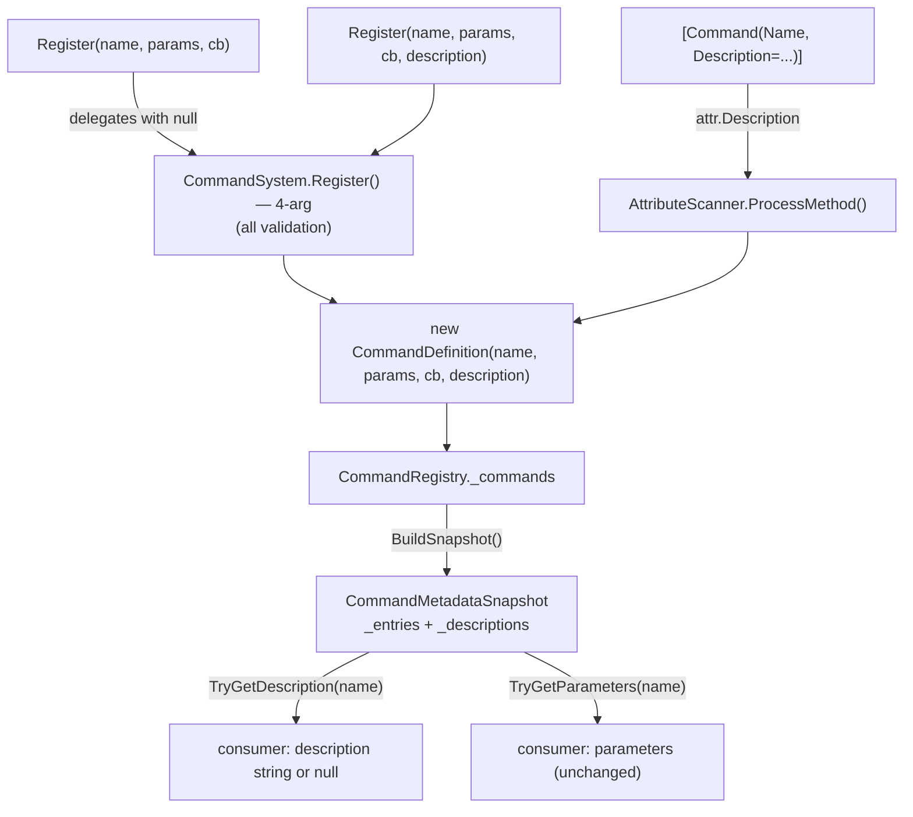

# Design: Command Description / Help Text

**Status:** Draft
**Feature:** Command Description / Help Text
**Slug:** `command-help-text`
**Branch:** `feat_command-help-text`
**Requirements:** `.github/tasks/command-help-text/requirements.md`

---

## Summary

Attach an optional, human-readable `Description` string to a command at registration time and
surface it through `CommandMetadataSnapshot`. Both registration paths — manual `Register()` and
attribute-based `[Command]` — can supply a description. Omitting it is always valid and changes
nothing for existing callers.

Six files change. One new test file is added. No new public types, no new dependencies.

---

## Requirements Input

- Source: `.github/tasks/command-help-text/requirements.md`
- Key requirements:
  - Description is optional; absent description is exposed as `null`, not `""`.
  - `Register()` extended via a new 4-arg overload; existing 3-arg overload delegates with `null`.
  - `[Command]` attribute gains a settable `Description` property.
  - `AttributeScanner` forwards `attr.Description` to `CommandDefinition`.
  - `CommandMetadataSnapshot` gains `TryGetDescription(name, out string description)`.
  - `Empty` singleton returns `false` / `out null` from `TryGetDescription`.
  - Case-insensitive description lookup on the snapshot.
  - No changes to `CommandParameterInfo`, `ExecutionResult`, `RegistrationResult`,
    `RegistrationError`, `GetCommandNames()`, or `TryGetCommandParameters()`.

---

## Scope Notes

- **In scope:** `CommandDefinition`, `CommandRegistry`, `CommandSystem.Register()`,
  `CommandAttribute`, `AttributeScanner`, `CommandMetadataSnapshot`, new test file.
- **Out of scope:** Parameter-level descriptions, description validation/sanitisation,
  localisation, rendering, changes to existing public API signatures.

---

## Architecture Overview

The description flows inward at registration and outward at snapshot time. No runtime lookup
touches descriptions during command execution — the execution path is entirely unaffected.

```
[Command("name", Description = "...")]         CommandSystem.Register(..., description)
            │                                                │
            ▼                                                ▼
     AttributeScanner.ProcessMethod()          CommandSystem.Register() — 4-arg overload
            │                                                │
            └────────────────┬───────────────────────────────┘
                             ▼
                   new CommandDefinition(name, params, cb, description)
                             │
                             ▼
                     CommandRegistry._commands
                             │
                     BuildSnapshot()
                             │
                             ▼
               CommandMetadataSnapshot(_entries, _descriptions)
                             │
                     TryGetDescription(name, out desc)
```

---

## Data Flow / Control Flow

**Registration (manual):**

1. Caller invokes `CommandSystem.Register(name, params, callback)` — 3-arg overload.
2. 3-arg overload delegates immediately to the 4-arg overload with `description: null`.
3. 4-arg overload runs all existing validation (unchanged), then constructs
   `new CommandDefinition(name, params, callback, description)`.
4. Registry stores the definition; `Description` is `null`.

**Registration (attribute):**

1. `AttributeScanner.ProcessMethod()` reads `attr.Description` (may be `null`).
2. Constructs `new CommandDefinition(name, params, callback, attr.Description)`.
3. Registry stores the definition.

**Snapshot:**

1. `CommandRegistry.BuildSnapshot()` iterates all definitions.
2. Builds both `_entries` (params) and `_descriptions` (non-null descriptions only).
3. Returns `new CommandMetadataSnapshot(names, entries, descriptions)`.

**Description retrieval:**

1. Consumer calls `snapshot.TryGetDescription("cmd", out string desc)`.
2. Returns `_descriptions.TryGetValue(name, ...)`.
3. Returns `true`+value for a command with a non-null description,
   `false`+`null` for a command with `null` description or a name not in snapshot.

---

## Components and Responsibilities

### `src/Core/CommandDefinition.cs`

- **Responsibility:** Internal storage model. Carries the `Description` string alongside name,
  parameters, callback, and `RequiredParameterCount`.
- **Change:** Add `internal string Description { get; }` property. Add `description` parameter to
  constructor (4th positional, assigned directly — no caching needed).

### `src/CommandAttribute.cs`

- **Responsibility:** Marks a static method as a registerable command.
- **Change:** Add `public string Description { get; set; }` — a settable named property following
  the existing `IsDevOnly` pattern. Defaults to `null`.

### `src/CommandSystem.cs`

- **Responsibility:** Public API entry point; validates and delegates to registry.
- **Change:** Existing 3-arg `Register()` body moves into a new 4-arg overload. The 3-arg overload
  becomes a one-line delegation wrapper calling `Register(name, parameters, callback, null)`.

### `src/Core/AttributeScanner.cs`

- **Responsibility:** Discovers `[Command]`-decorated methods and registers them.
- **Change:** In `ProcessMethod()`, pass `attr.Description` as 4th argument when constructing
  `CommandDefinition`.

### `src/Core/CommandRegistry.cs`

- **Responsibility:** Dictionary-backed command store; builds snapshots.
- **Change:** `BuildSnapshot()` collects descriptions from definitions into a separate
  `Dictionary<string, string>` (OrdinalIgnoreCase), then passes it to the `CommandMetadataSnapshot`
  constructor. Only non-null descriptions are stored in this dictionary.

### `src/CommandMetadataSnapshot.cs`

- **Responsibility:** Immutable point-in-time registry snapshot exposed to consumers.
- **Changes:**
  - Add `private readonly Dictionary<string, string> _descriptions` field.
  - Update internal constructor to accept descriptions dictionary.
  - Update `Empty` singleton to pass an empty descriptions dictionary.
  - Add `public bool TryGetDescription(string name, out string description)`.

---

## Dependency Evaluation

- **New dependencies:** None.
- **Rationale:** The feature is a plain string property propagated through an existing data flow.
  A second `Dictionary<string, string>` on the snapshot mirrors the existing `_entries` pattern
  exactly. No library is needed.

---

## API / Contract Sketch

```csharp
// CommandAttribute — new property
public sealed class CommandAttribute : Attribute
{
    public string Name { get; }
    public bool IsDevOnly { get; set; }
    public string Description { get; set; }   // NEW — named arg: [Command("x", Description = "...")]
    public CommandAttribute(string name) { Name = name; }
}

// CommandSystem — new overload; existing 3-arg becomes delegation wrapper
public RegistrationResult Register(
    string name,
    CommandParameterInfo[] parameters,
    CommandCallback callback)
    => Register(name, parameters, callback, null);  // delegates; no validation change

public RegistrationResult Register(
    string name,
    CommandParameterInfo[] parameters,
    CommandCallback callback,
    string description)             // NEW overload — null is valid; empty string is valid
{ /* all current validation body + new CommandDefinition(name, params, cb, description) */ }

// CommandMetadataSnapshot — new method
public bool TryGetDescription(string name, out string description);
```

---

## Implementation Notes

- `Description` on `CommandAttribute` uses the settable-property pattern already established by
  `IsDevOnly` — no constructor overload is needed on the attribute.
- The `Empty` singleton must be updated to pass an empty descriptions dict to the updated
  constructor; failure to do so is a compile error, so it cannot be accidentally missed.
- `BuildSnapshot()` stores only non-null descriptions in `_descriptions`. This means
  `TryGetDescription` returns `false`/`null` for both "command not in snapshot" and "command has
  no description" — consistent with `TryGet` semantics.
- Empty-string descriptions (`""`) are non-null, so they ARE stored and `TryGetDescription` returns
  `true`+`""` for them — satisfying FR #10.
- The `_descriptions` dictionary must be initialised with `StringComparer.OrdinalIgnoreCase` to
  guarantee case-insensitive lookup, matching the existing `_entries` pattern.
- `CommandRegistry.TryRegister()` needs no change — it works with `CommandDefinition` as-is; the
  new field is transparent to the storage/lookup mechanism.
- No validation is applied to the description string content in `CommandSystem.Register()` — the
  requirements explicitly exclude content validation.
- The execution path (`ExecutionHandler`) is completely untouched.

---

## Code Examples

### `CommandDefinition` — updated constructor

```csharp
internal sealed class CommandDefinition
{
    internal string Name { get; }
    internal CommandParameterInfo[] Parameters { get; }
    internal CommandCallback Callback { get; }
    internal int RequiredParameterCount { get; }
    internal string Description { get; }   // NEW

    internal CommandDefinition(
        string name,
        CommandParameterInfo[] parameters,
        CommandCallback callback,
        string description)    // NEW parameter — null for no description
    {
        Name = name;
        Parameters = parameters;
        Callback = callback;
        Description = description;   // NEW

        int required = 0;
        for (int i = 0; i < parameters.Length; i++)
        {
            if (!parameters[i].IsOptional)
                required++;
        }
        RequiredParameterCount = required;
    }
}
```

### `CommandAttribute` — new `Description` property

```csharp
/// <summary>
/// An optional human-readable description of what this command does.
/// Used by consumers (e.g., a help/autocomplete UI) to surface command intent.
/// Defaults to <c>null</c> when not set.
/// </summary>
public string Description { get; set; }
```

### `CommandSystem.Register()` — delegation + new overload

```csharp
// Existing method becomes a one-line delegation wrapper.
public RegistrationResult Register(
    string name,
    CommandParameterInfo[] parameters,
    CommandCallback callback)
{
    return Register(name, parameters, callback, null);
}

// New overload carries all current validation logic plus description.
public RegistrationResult Register(
    string name,
    CommandParameterInfo[] parameters,
    CommandCallback callback,
    string description)
{
    if (!IsInitialized)
        return RegistrationResult.Fail(RegistrationError.NotInitialized, "...");

    if (string.IsNullOrEmpty(name))
        return RegistrationResult.Fail(RegistrationError.NullOrEmptyName, "...");

    if (parameters == null)
        return RegistrationResult.Fail(RegistrationError.NullParameters, "...");

    if (callback == null)
        return RegistrationResult.Fail(RegistrationError.NullCallback, "...");

    // ... existing type-support loop ...
    // ... existing optional-ordering loop ...

    CommandDefinition definition = new CommandDefinition(name, parameters, callback, description);

    if (!_registry.TryRegister(definition))
        return RegistrationResult.Fail(RegistrationError.DuplicateCommandName, "...");

    return RegistrationResult.Ok();
}
```

### `AttributeScanner.ProcessMethod()` — forward description

```csharp
// 4. Build AOT-safe callback.
CommandCallback callback = BuildCallback(method, reflectedParams);

// 5. Register; fail on duplicate name.
CommandDefinition definition = new CommandDefinition(name, parameters, callback, attr.Description);  // CHANGED
if (!_registry.TryRegister(definition))
{
    return new ScanEntry(name, RegistrationResult.Fail(
        RegistrationError.DuplicateCommandName,
        string.Format("A command named '{0}' is already registered.", name)));
}
```

### `CommandRegistry.BuildSnapshot()` — collect descriptions

```csharp
internal CommandMetadataSnapshot BuildSnapshot()
{
    int count = _commands.Count;
    if (count == 0)
        return CommandMetadataSnapshot.Empty;

    string[] names = new string[count];
    Dictionary<string, CommandParameterInfo[]> entries =
        new Dictionary<string, CommandParameterInfo[]>(count, StringComparer.OrdinalIgnoreCase);
    Dictionary<string, string> descriptions =                                      // NEW
        new Dictionary<string, string>(count, StringComparer.OrdinalIgnoreCase);  // NEW

    int i = 0;
    foreach (KeyValuePair<string, CommandDefinition> pair in _commands)
    {
        CommandDefinition def = pair.Value;
        names[i++] = def.Name;

        CommandParameterInfo[] paramsCopy = new CommandParameterInfo[def.Parameters.Length];
        Array.Copy(def.Parameters, paramsCopy, def.Parameters.Length);
        entries[def.Name] = paramsCopy;

        if (def.Description != null)                    // NEW — only store non-null descriptions
            descriptions[def.Name] = def.Description;  // NEW
    }

    Array.Sort(names, StringComparer.OrdinalIgnoreCase);
    return new CommandMetadataSnapshot(names, entries, descriptions);  // CHANGED — pass descriptions
}
```

### `CommandMetadataSnapshot` — updated constructor, new method, updated Empty

```csharp
public sealed class CommandMetadataSnapshot
{
    private static readonly CommandMetadataSnapshot _empty =
        new CommandMetadataSnapshot(
            Array.Empty<string>(),
            new Dictionary<string, CommandParameterInfo[]>(StringComparer.OrdinalIgnoreCase),
            new Dictionary<string, string>(StringComparer.OrdinalIgnoreCase));  // NEW arg

    private readonly Dictionary<string, CommandParameterInfo[]> _entries;
    private readonly Dictionary<string, string> _descriptions;  // NEW

    public string[] CommandNames { get; }
    internal static CommandMetadataSnapshot Empty => _empty;

    internal CommandMetadataSnapshot(
        string[] names,
        Dictionary<string, CommandParameterInfo[]> entries,
        Dictionary<string, string> descriptions)  // NEW parameter
    {
        CommandNames = names;
        _entries = entries;
        _descriptions = descriptions;  // NEW
    }

    public bool TryGetParameters(string name, out CommandParameterInfo[] parameters)
    {
        if (string.IsNullOrEmpty(name)) { parameters = null; return false; }
        return _entries.TryGetValue(name, out parameters);
    }

    /// <summary>
    /// Attempts to retrieve the description for the named command.
    /// Lookup is case-insensitive. Returns <c>false</c> with <c>null</c> when the command was
    /// registered without a description or is not present in this snapshot.
    /// </summary>
    /// <param name="name">The command name to look up.</param>
    /// <param name="description">
    /// When this method returns <c>true</c>, the description string captured at snapshot time.
    /// <c>null</c> when this method returns <c>false</c>.
    /// </param>
    /// <returns>
    /// <c>true</c> if the command was found with a non-null description; <c>false</c> otherwise.
    /// </returns>
    public bool TryGetDescription(string name, out string description)  // NEW
    {
        if (string.IsNullOrEmpty(name))
        {
            description = null;
            return false;
        }

        return _descriptions.TryGetValue(name, out description);
    }
}
```

---

## Diagram



---

## Testing Strategy

### New file: `tests/kmCommands.Tests/CommandDescriptionTests.cs`

Test class: `CommandDescriptionTests`

- NUnit `[TestFixture]`
- Each test: `[SetUp]` calls `_system.Initialize()`, `[TearDown]` calls `_system.Shutdown()`
- Uses a local `CommandSystem` instance (not static state)

#### Method-to-acceptance-criteria mapping

| Test method                                                              | AC    |
| ------------------------------------------------------------------------ | ----- |
| `Register_WithNonNullDescription_SnapshotContainsDescription`            | AC #1 |
| `Register_WithoutDescription_SnapshotDescriptionIsNull`                  | AC #2 |
| `Register_WithEmptyStringDescription_SnapshotDescriptionIsEmptyString`   | AC #3 |
| `Scan_AttributeWithDescription_SnapshotContainsDescription`              | AC #4 |
| `Scan_AttributeWithoutDescription_SnapshotDescriptionIsNull`             | AC #5 |
| `TryGetDescription_ExistingCommandWithDescription_CaseInsensitiveLookup` | AC #6 |
| `TryGetDescription_CommandWithNullDescription_ReturnsFalse`              | AC #7 |
| `Empty_TryGetDescription_ReturnsFalseWithNullDescription`                | AC #8 |
| `SnapshotIsolation_DescriptionNotIncludedForLaterRegisteredCommand`      | AC #9 |

#### Supporting attribute-scan test fixture (inner private class)

```csharp
private static class ScanTargets
{
    [Command("described", Description = "A described command")]
    public static void DescribedCommand() { }

    [Command("nodesc")]
    public static void NoDescCommand() { }
}
```

#### Backward-compatibility coverage

Existing 103 tests cover AC #10 and AC #11 by definition — they must all still pass after the
change. No new tests needed for those criteria; the CI run is the evidence.

---

## Risks and Tradeoffs

| Risk                                                           | Likelihood | Mitigation                           |
| -------------------------------------------------------------- | ---------- | ------------------------------------ |
| `Empty` singleton not updated to pass descriptions dict        | Low        | Compile error on updated constructor |
| Description dict uses wrong comparer → case-sensitive mismatch | Low        | Mirror exact pattern from `_entries` |
| 3-arg `Register` validation silently lost during refactor      | Low        | Tests cover all existing error paths |
| `attr.Description` not forwarded in scanner path               | Low        | AC #4/#5 tests would fail clearly    |

---

## Open Questions

None. Scope and design are fully resolved.

---

## Task Planning Handoff

### Suggested implementation slices

Each slice is a logical commit boundary:

1. **`CommandDefinition` + `CommandAttribute`** — add `Description` field and attribute property.
   No behavior change; just data model.
2. **`CommandSystem.Register()` refactor** — move body to 4-arg overload, make 3-arg delegate.
   All existing tests must still pass at this point.
3. **`AttributeScanner` update** — forward `attr.Description` to `CommandDefinition`.
4. **`CommandMetadataSnapshot` + `CommandRegistry.BuildSnapshot()`** — update snapshot to carry
   descriptions; add `TryGetDescription()`.
5. **Tests** — add `CommandDescriptionTests.cs` with all 9 new test methods.

### Coupling notes for task splitting

- Slices 1 and 2 can be implemented in either order; both are prerequisites for 3 and 4.
- Slice 3 depends on slice 1 (attribute property) and slice 2 (4-arg `Register` signature precedent,
  though the scanner bypasses `CommandSystem.Register` directly).
- Slice 4 depends on slice 1 (`CommandDefinition.Description` field).
- Slice 5 depends on slices 1–4 being complete; all test assertions depend on the full data flow.

### Areas to validate after full integration

- Snapshot immutability: registrations after `GetSnapshot()` do not retroactively appear.
- `Empty.TryGetDescription` returns `false` without throwing.
- Case-insensitive lookup (`"CMD"` finds description for `"cmd"`).

---

## Final Review Contract (for `taskReviewer`)

### Critical behaviors to verify

- [ ] `Register(name, params, cb)` (3-arg) still compiles and behaves identically to pre-feature.
- [ ] `Register(name, params, cb, description)` (4-arg) stores description on the definition.
- [ ] `Register(name, params, cb, null)` stores `null` description (same as 3-arg path).
- [ ] `Register(name, params, cb, "")` stores `""` description; snapshot `TryGetDescription` returns `true`+`""`.
- [ ] `[Command("x", Description = "y")]` attribute compiles and scanner forwards `"y"`.
- [ ] `[Command("x")]` without `Description` property → scanner forwards `null`.
- [ ] `BuildSnapshot()` builds `_descriptions` with `OrdinalIgnoreCase` comparer.
- [ ] `BuildSnapshot()` skips `null` descriptions (does not store null entries in `_descriptions`).
- [ ] `TryGetDescription` on `Empty` returns `false`, sets `out null`.
- [ ] `TryGetDescription` on a valid snapshot is case-insensitive.
- [ ] `TryGetDescription` with null/empty name returns `false`, `out null`.
- [ ] Snapshot taken before second registration does not contain second command's description.

### Design invariants that must hold

- `CommandMetadataSnapshot._descriptions` is never `null` (constructed with empty dict for `Empty`).
- `_descriptions` uses `StringComparer.OrdinalIgnoreCase` (same as `_entries`).
- `CommandDefinition.Description` is immutable after construction (get-only property).
- No execution-path file (`ExecutionHandler`, `ArgumentConverter`) is modified.
- `CommandParameterInfo`, `RegistrationResult`, `RegistrationError`, `ExecutionResult`,
  `GetCommandNames()`, `TryGetCommandParameters()` are all unmodified.

### Required test evidence for acceptance

- All 103 existing tests pass without modification.
- All 9 new `CommandDescriptionTests` tests pass.
- Test coverage includes: manual registration with/without/empty description, attribute scan
  with/without description, case-insensitive lookup, `Empty` sentinel, snapshot isolation.

### Known acceptable deviations

- None.

### Blocking conditions for final approval

- Any existing test fails after the change.
- Any new test is skipped or failing.
- `CommandMetadataSnapshot.Empty` modified to reuse a different constructor signature.
- Any new dependency added to `src/`.
- Any `UnityEngine` reference introduced in `src/`.
