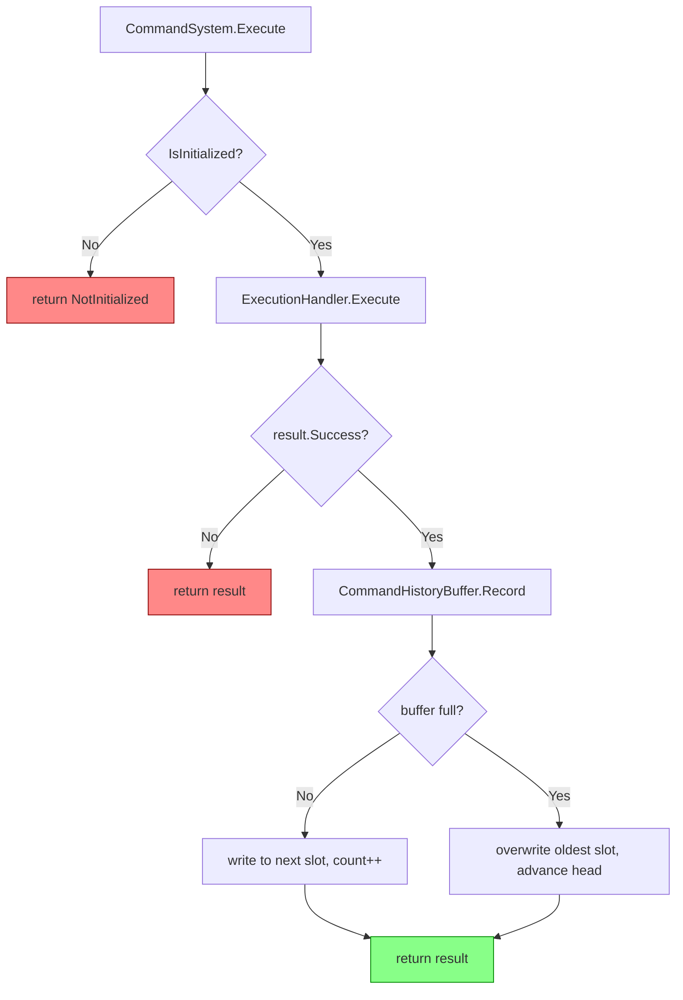

# Command History

## Status

Draft

---

## Summary

Add an in-memory command history buffer to the kmCommands core library. When `Execute()` is called and the command succeeds, the command name and a snapshot of its argument tokens are recorded into a fixed-capacity ring buffer. The buffer evicts the oldest entry when it is full. `CommandSystem` gains three new public API members for retrieval, count, and clear. Capacity is configurable via a new `Initialize(int historyCapacity)` overload that preserves backward compatibility with existing no-arg callers. Two new files are added to `src/`: a public `CommandHistoryEntry` struct and an internal `CommandHistoryBuffer` class.

---

## Requirements Input

- Source: `.github/tasks/command-history/requirements.md`
- Key requirements carried into design:
  - REQ-1: Entry captures command name + immutable args snapshot.
  - REQ-2: Buffer is ordered oldest → newest.
  - REQ-3: Configurable capacity with oldest-eviction at capacity.
  - REQ-4: Sensible default capacity defined and documented.
  - REQ-5: Minimum capacity ≥ 1.
  - REQ-6: `GetHistory()` returns a snapshot array.
  - REQ-7: `HistoryCount` property, non-allocating.
  - REQ-8: `ClearHistory()` resets the buffer.
  - REQ-9: Recording occurs inside `Execute()` flow; not recorded when not initialized.
  - REQ-10: `Shutdown()` discards history; next `Initialize()` starts empty.
  - REQ-11: Pre-init calls do not throw.
  - REQ-12: IL2CPP/AOT safe.
  - REQ-13: One allocation per `Execute()` (the args copy); no hot-path allocation beyond that.

---

## Scope Notes

- **In scope:** `CommandHistoryEntry` struct, `CommandHistoryBuffer` internal class, `Initialize(int)` overload, `GetHistory()`, `HistoryCount`, `ClearHistory()`, `Execute()` integration, unit tests.
- **Out of scope:** UI, persistence, search/filter, timestamps, keyboard recall, thread safety, `ExecutionResult` shape changes.

---

## Resolved Open Questions

### 1. Which executions are recorded?

**Decision: success-only.**

Only executions where `result.Success == true` are recorded.

**Rationale:**

- Terminal-style history (bash, PowerShell) records commands that were accepted and ran, not typos or unknown commands.
- Failed entries (CommandNotFound, ArgumentConversionFailed, etc.) are typically user-input errors, not meaningful replay candidates.
- Keeps the stored history clean for the primary use case: recalling a command that previously worked.
- A Unity UI layer can surface the `ExecutionResult.Error` inline; it does not need the history buffer for that.

---

### 2. Capacity configuration point

**Decision: new `Initialize(int historyCapacity)` overload.**

```csharp
public void Initialize()               // existing — unchanged; uses DefaultHistoryCapacity
public void Initialize(int historyCapacity)  // new overload
```

**Rationale:**

- The existing no-arg overload is fully preserved; existing callers require zero changes.
- Capacity is logically a construction-time parameter: the ring buffer is sized at initialization and stays fixed, so passing it at `Initialize` time is the most natural fit.
- Avoids a mutable `SetHistoryCapacity(int)` setter that could be misused after initialization.
- Avoids a config struct that would add a new public type for a single integer.
- Consistent with how `ExecutionHandler`, `CommandRegistry`, and `ArgumentConverter` are all constructed inside `Initialize()`.
- Both overloads are idempotent (no-op if already initialized), consistent with the existing contract.

---

### 3. Pre-init `ClearHistory()` behavior

**Decision: no-op.**

`ClearHistory()` before `Initialize()` (or after `Shutdown()`) does nothing.

**Rationale:**

- There is nothing to clear. The buffer does not exist until `Initialize()` runs.
- A "pending clear" intent would be invisible and confusing; `Initialize()` already guarantees an empty buffer on every call, making a pending-clear flag redundant.
- Consistent with how pre-init `Execute()` and `Register()` behave — they return early rather than buffering.

---

### 4. Entry type: struct vs. class

**Decision: `struct` (`readonly struct`).**

`CommandHistoryEntry` is a `readonly struct`.

**Rationale:**

- Consistent with existing result types (`ExecutionResult`, `RegistrationResult`) which are `readonly struct`.
- Stored directly inside the ring buffer's fixed `CommandHistoryEntry[]` array — no per-entry heap object.
- Small data shape (one `string` + one `string[]` reference): value semantics are appropriate.
- The `string[]` field is a reference type internally; the struct wrapper avoids an extra heap allocation for the container.

---

## Architecture Overview

```
CommandSystem.Execute()
    │
    ├─► ExecutionHandler.Execute()   [unchanged]
    │       └─► returns ExecutionResult
    │
    └─► if result.Success
            └─► CommandHistoryBuffer.Record(name, args)   [new]
                    └─► copies args → CommandHistoryEntry → ring buffer slot
```

`CommandHistoryBuffer` is a new internal class owned by `CommandSystem` (like `ExecutionHandler`). It is created at `Initialize()` and nulled at `Shutdown()`.

---

## Data Flow / Control Flow

**Initialize:**

```
CommandSystem.Initialize(capacity)
  → clamp capacity to max(1, capacity)
  → new CommandHistoryBuffer(capacity)
  → assign to _historyBuffer
```

**Execute (success path):**

```
CommandSystem.Execute(name, args)
  → _executionHandler.Execute(name, args) → ExecutionResult
  → if result.Success:
       _historyBuffer.Record(name, args)
  → return result
```

**Record inside CommandHistoryBuffer:**

```
Record(name, args)
  → copy args into argsCopy (Array.Copy or Array.Empty)
  → new CommandHistoryEntry(name, argsCopy)
  → if _count < _capacity:
       write to _buffer[(_head + _count) % _capacity]
       _count++
  → else (buffer full):
       write to _buffer[_head]   (overwrites oldest)
       _head = (_head + 1) % _capacity
```

**GetHistory:**

```
CommandSystem.GetHistory()
  → if not initialized: return Array.Empty<CommandHistoryEntry>()
  → _historyBuffer.GetSnapshot()
       → allocate CommandHistoryEntry[_count]
       → copy in oldest-to-newest order (starting from _head)
       → return array
```

**Shutdown:**

```
CommandSystem.Shutdown()
  → _historyBuffer = null  (buffer + internal array GC'd)
  → [existing teardown]
```

---

## Components and Responsibilities

### `CommandHistoryEntry` (new public `readonly struct`)

- **File:** `src/CommandHistoryEntry.cs`
- **Responsibility:** Holds an immutable snapshot of one execution — the command name as passed to `Execute()` and a copy of the argument tokens.
- **Interactions:** Created by `CommandHistoryBuffer.Record()`. Returned to callers via `GetHistory()`.

### `CommandHistoryBuffer` (new internal `sealed class`)

- **File:** `src/Core/CommandHistoryBuffer.cs`
- **Responsibility:** Manages the fixed-capacity ring buffer of `CommandHistoryEntry` values. Handles eviction, counting, snapshot export, and clear.
- **Interactions:** Instantiated and held by `CommandSystem`. Called from `CommandSystem.Execute()`, `GetHistory()`, `HistoryCount`, and `ClearHistory()`.

### `CommandSystem` (existing, modified)

- **Changes:**
  - New field: `private CommandHistoryBuffer _historyBuffer;`
  - New constant: `public const int DefaultHistoryCapacity = 64;`
  - New overload: `public void Initialize(int historyCapacity)`
  - `Initialize()` updated to pass `DefaultHistoryCapacity` to buffer constructor.
  - `Shutdown()` updated to null `_historyBuffer`.
  - `Execute()` updated to call `_historyBuffer.Record()` on success.
  - New public members: `GetHistory()`, `HistoryCount`, `ClearHistory()`.

---

## Dependency Evaluation

- **New runtime dependencies:** None.
- **Rationale:** The ring buffer is a straightforward fixed-array implementation. No external data-structure library is needed or appropriate here.
- **Alternatives considered:** `Queue<T>` / `LinkedList<T>` — rejected because they grow unboundedly and allocate per-enqueue; a fixed array with index arithmetic is the correct approach for a capacity-bounded hot-path buffer.

---

## API / Contract Sketch

### New public constant

```csharp
/// <summary>
/// The default maximum number of entries stored in the command history buffer.
/// Used when <see cref="Initialize()"/> is called without an explicit capacity argument.
/// </summary>
public const int DefaultHistoryCapacity = 64;
```

### New Initialize overload

```csharp
/// <summary>
/// Initializes the command system with an explicit history buffer capacity.
/// Idempotent — calling when already initialized is a no-op.
/// </summary>
/// <param name="historyCapacity">
/// The maximum number of history entries to retain. Values less than 1 are clamped to 1.
/// </param>
public void Initialize(int historyCapacity)
```

### GetHistory

```csharp
/// <summary>
/// Returns a snapshot of all currently recorded history entries, ordered oldest to newest.
/// The returned array is independent of the live buffer; subsequent executions do not affect it.
/// </summary>
/// <returns>
/// A new <see cref="CommandHistoryEntry"/> array, or <see cref="Array.Empty{T}()"/> when
/// the system is not initialized or the history is empty.
/// </returns>
public CommandHistoryEntry[] GetHistory()
```

### HistoryCount

```csharp
/// <summary>
/// The current number of recorded history entries. Returns 0 when not initialized.
/// </summary>
public int HistoryCount { get; }
```

### ClearHistory

```csharp
/// <summary>
/// Clears all entries from the history buffer.
/// No-op when the system is not initialized.
/// </summary>
public void ClearHistory()
```

### CommandHistoryEntry struct

```csharp
/// <summary>
/// An immutable record of a single successful command execution.
/// </summary>
public readonly struct CommandHistoryEntry
{
    /// <summary>
    /// The command name as passed to <see cref="CommandSystem.Execute"/>.
    /// </summary>
    public string CommandName { get; }

    /// <summary>
    /// A snapshot copy of the argument tokens passed to <see cref="CommandSystem.Execute"/>.
    /// Mutating this array does not affect the stored entry or other snapshots.
    /// Never <c>null</c>; an empty command uses <see cref="Array.Empty{T}()"/>.
    /// </summary>
    public string[] Args { get; }

    internal CommandHistoryEntry(string commandName, string[] args)
    {
        CommandName = commandName;
        Args = args;
    }
}
```

---

## Implementation Notes

### Ring buffer index arithmetic

```
write index  = (_head + _count) % _capacity    // next free slot when not full
evict path   : overwrite _buffer[_head]; _head = (_head + 1) % _capacity
```

Both operations are branchless modulo; no special-casing needed.

### Args copy

The copy is performed in `CommandHistoryBuffer.Record()` before constructing the entry:

```csharp
private static string[] CopyArgs(string[] args)
{
    if (args == null || args.Length == 0)
        return Array.Empty<string>();

    string[] copy = new string[args.Length];
    Array.Copy(args, copy, args.Length);
    return copy;
}
```

`Array.Copy` is AOT-safe and avoids LINQ. The copy result is passed directly to `CommandHistoryEntry`'s internal constructor — the stored entry owns the array.

### Capacity clamping

```csharp
public void Initialize(int historyCapacity)
{
    if (IsInitialized) return;
    int effectiveCapacity = historyCapacity < 1 ? 1 : historyCapacity;
    // ... existing init ...
    _historyBuffer = new CommandHistoryBuffer(effectiveCapacity);
    IsInitialized = true;
}
```

`Initialize()` (no-arg) calls `Initialize(DefaultHistoryCapacity)` or equivalently calls internal shared init with the default constant — **choose one implementation approach**: either delegate to the overload, or keep the two overloads symmetric. Prefer the two symmetric overloads without cross-delegation to avoid an extra stack frame and keep each path explicit and idempotent-checkable at the top.

### Snapshot export in GetHistory

```csharp
internal CommandHistoryEntry[] GetSnapshot()
{
    if (_count == 0)
        return Array.Empty<CommandHistoryEntry>();

    CommandHistoryEntry[] result = new CommandHistoryEntry[_count];
    for (int i = 0; i < _count; i++)
    {
        result[i] = _buffer[(_head + i) % _capacity];
    }
    return result;
}
```

### Clear implementation

```csharp
internal void Clear()
{
    _head = 0;
    _count = 0;
    // No need to zero-fill the array; _count controls validity.
}
```

### CommandSystem.Execute integration

The recording call is placed in `CommandSystem.Execute()` **after** the `_executionHandler.Execute()` call returns, not inside `ExecutionHandler`. `ExecutionHandler` remains history-unaware.

```csharp
public ExecutionResult Execute(string commandName, string[] args)
{
    if (!IsInitialized)
    {
        return ExecutionResult.Fail(
            ExecutionError.NotInitialized,
            "CommandSystem has not been initialized. Call Initialize() first.",
            null);
    }

    ExecutionResult result = _executionHandler.Execute(commandName, args);

    if (result.Success)
    {
        _historyBuffer.Record(commandName, args);
    }

    return result;
}
```

### Idempotent Initialize interaction

Both `Initialize()` and `Initialize(int)` begin with `if (IsInitialized) return;`. If the caller calls `Initialize()` and then `Initialize(32)`, the second call is a no-op. The capacity is fixed to whatever the first successful `Initialize` call used. This is consistent with the existing idempotent contract.

---

## Code Examples

### Full ring buffer class sketch

```csharp
internal sealed class CommandHistoryBuffer
{
    private readonly CommandHistoryEntry[] _buffer;
    private readonly int _capacity;
    private int _head;   // index of oldest valid entry
    private int _count;  // number of valid entries

    internal CommandHistoryBuffer(int capacity)
    {
        _capacity = capacity;
        _buffer = new CommandHistoryEntry[capacity];
        _head = 0;
        _count = 0;
    }

    internal int Count => _count;

    internal void Record(string commandName, string[] args)
    {
        string[] argsCopy = CopyArgs(args);
        CommandHistoryEntry entry = new CommandHistoryEntry(commandName, argsCopy);

        if (_count < _capacity)
        {
            _buffer[(_head + _count) % _capacity] = entry;
            _count++;
        }
        else
        {
            // Buffer full: overwrite oldest slot, advance head
            _buffer[_head] = entry;
            _head = (_head + 1) % _capacity;
        }
    }

    internal void Clear()
    {
        _head = 0;
        _count = 0;
    }

    internal CommandHistoryEntry[] GetSnapshot()
    {
        if (_count == 0)
            return Array.Empty<CommandHistoryEntry>();

        CommandHistoryEntry[] snapshot = new CommandHistoryEntry[_count];
        for (int i = 0; i < _count; i++)
        {
            snapshot[i] = _buffer[(_head + i) % _capacity];
        }
        return snapshot;
    }

    private static string[] CopyArgs(string[] args)
    {
        if (args == null || args.Length == 0)
            return Array.Empty<string>();

        string[] copy = new string[args.Length];
        Array.Copy(args, copy, args.Length);
        return copy;
    }
}
```

### Capacity overload on CommandSystem

```csharp
public void Initialize(int historyCapacity)
{
    if (IsInitialized)
        return;

    int effectiveCapacity = historyCapacity < 1 ? 1 : historyCapacity;

    _registry = new CommandRegistry();
    _converter = new ArgumentConverter();
    _executionHandler = new ExecutionHandler(_registry, _converter);
    _attributeScanner = new AttributeScanner(_registry, _converter);
    _historyBuffer = new CommandHistoryBuffer(effectiveCapacity);

    foreach (KeyValuePair<Type, TypeConverterDelegate> entry in _pendingConverters)
    {
        _converter.AddConverter(entry.Key, AdaptConverter(entry.Value));
    }

    _pendingConverters.Clear();
    IsInitialized = true;
}
```

The existing no-arg `Initialize()` is updated to call through to the overload:

```csharp
public void Initialize()
{
    Initialize(DefaultHistoryCapacity);
}
```

This removes duplication and guarantees both overloads share the same init logic. Since the idempotency check is inside the overload, the no-arg is also idempotent.

---

## Diagram



---

## Testing Strategy

New test file: `tests/kmCommands.Tests/CommandHistoryTests.cs`

| Test                                                                     | Requirement           |
| ------------------------------------------------------------------------ | --------------------- |
| History count is 0 after `Initialize()`                                  | REQ-9, Acceptance     |
| Successful execution adds one entry; name and args match                 | REQ-1, Acceptance     |
| Failed execution (CommandNotFound) does NOT add entry                    | OQ-1 decision         |
| Failed execution (ArgumentConversionFailed) does NOT add entry           | OQ-1 decision         |
| Entries are returned oldest-first                                        | REQ-2                 |
| Buffer evicts oldest when capacity exceeded; count stays at capacity     | REQ-3, Acceptance     |
| Default capacity `DefaultHistoryCapacity` is respected                   | REQ-4                 |
| `Initialize(int)` sets custom capacity; entries beyond it are evicted    | REQ-3                 |
| `Initialize(0)` is clamped to capacity 1                                 | REQ-5, OQ-2 decision  |
| `Initialize(-1)` is clamped to capacity 1                                | REQ-5                 |
| `ClearHistory()` resets count to 0 and `GetHistory()` returns empty      | REQ-8, Acceptance     |
| `Shutdown()` then `Initialize()` starts with empty history               | REQ-10, Acceptance    |
| `GetHistory()` before `Initialize()` returns empty array, does not throw | REQ-11                |
| `HistoryCount` before `Initialize()` returns 0, does not throw           | REQ-11                |
| `ClearHistory()` before `Initialize()` is a no-op, does not throw        | REQ-11, OQ-3 decision |
| Mutating caller's args array after Execute does not affect stored entry  | REQ-1 (immutability)  |
| Null args to `Execute()` stored as empty array in entry                  | REQ-1, REQ-13         |
| `GetHistory()` returns a new array each call (snapshot isolation)        | REQ-6                 |
| `HistoryCount` does not allocate (verified by value consistency)         | REQ-7, REQ-13         |

All tests use the existing NUnit framework and test project structure (`tests/kmCommands.Tests/`).

---

## IL2CPP / AOT Notes

- `CommandHistoryBuffer` uses only fixed array indexing and integer arithmetic — fully AOT-safe.
- `Array.Copy` is a BCL method with AOT-safe codegen on all Unity IL2CPP targets.
- `Array.Empty<CommandHistoryEntry>()` is AOT-safe; the generic instantiation `CommandHistoryEntry[]` will be present wherever the type is used.
- No `typeof`/reflection, no delegates created at record time, no LINQ, no dynamic dispatch.
- `readonly struct` with two fields (`string`, `string[]`) — no boxing unless the struct is used as an interface or `object`, which it is not.

---

## Allocation Notes

| Operation           | Allocations                                                    |
| ------------------- | -------------------------------------------------------------- |
| `Initialize()`      | 1× `CommandHistoryBuffer` + 1× `CommandHistoryEntry[capacity]` |
| `Execute()` success | 1× `string[args.Length]` for args copy inside `Record()`       |
| `Execute()` failure | 0 (no recording)                                               |
| `GetHistory()`      | 1× `CommandHistoryEntry[count]` (snapshot array)               |
| `HistoryCount`      | 0                                                              |
| `ClearHistory()`    | 0                                                              |
| `Shutdown()`        | 0 (buffer is GC-released)                                      |

The one-per-execution allocation (args copy) is unavoidable for immutability; it is a single bounded allocation, not a loop allocation. The snapshot allocation in `GetHistory()` is intentional and consistent with `GetCommandNames()`.

---

## Risks and Tradeoffs

| Risk                                                                                               | Mitigation                                                                                                    |
| -------------------------------------------------------------------------------------------------- | ------------------------------------------------------------------------------------------------------------- |
| Callers expect `Initialize(int)` to reconfigure after init (e.g., calling twice)                   | Document idempotency clearly in XML doc; second call is a no-op, matching existing contract                   |
| `GetHistory()` allocates — may surprise callers in tight loops                                     | XML doc notes this; `HistoryCount` is the non-allocating query; callers should cache the snapshot             |
| Args snapshot copies one string-ref per element — strings are interned/shared, ref copy is shallow | String immutability means shallow copy is sufficient; no deep copy needed                                     |
| Capacity clamping (silent) — caller passes 0, gets capacity 1                                      | Clamping is silent but predictable; consistent with Unity performance-sensitive codebases avoiding exceptions |

---

## Open Questions

None. All questions from `requirements.md` are resolved above.

---

## Task Planning Handoff

### Suggested implementation slices (commit-aligned)

1. **`CommandHistoryEntry` struct** — Add `src/CommandHistoryEntry.cs`. No other changes. Self-contained public type.

2. **`CommandHistoryBuffer` internal class** — Add `src/Core/CommandHistoryBuffer.cs`. No `CommandSystem` changes yet. Testable in isolation.

3. **`CommandSystem` wiring** — Update `CommandSystem.cs`:
   - Add `DefaultHistoryCapacity` constant.
   - Add `_historyBuffer` field.
   - Refactor `Initialize()` to delegate to `Initialize(int)`.
   - Add `Initialize(int)` overload.
   - Update `Shutdown()` to null `_historyBuffer`.
   - Update `Execute()` to call `_historyBuffer.Record()` on success.
   - Add `GetHistory()`, `HistoryCount`, `ClearHistory()`.

4. **Unit tests** — Add `tests/kmCommands.Tests/CommandHistoryTests.cs`. All test cases from the testing strategy table.

### Coupling notes for task splitting

- Slices 1 and 2 are fully independent of each other and of `CommandSystem`.
- Slice 3 depends on slices 1 and 2 being complete.
- Slice 4 depends on slice 3.
- No existing tests are expected to break; `Execute()` behavior is unchanged for callers.

### Areas to validate after full integration

- Confirm default capacity (`64`) is correct at runtime by checking `HistoryCount` at limit.
- Confirm ring-buffer head/tail math with a capacity-1 edge case (only one slot).
- Confirm `Shutdown()` + `Initialize()` cycle fully resets state and does not leak the old buffer.

---

## Final Review Contract

A reviewer (or `taskReviewer` agent) must verify:

### Critical behaviors

- [ ] `Initialize()` (no-arg) uses `DefaultHistoryCapacity`; existing callers unaffected.
- [ ] `Initialize(int historyCapacity)` with value < 1 clamps to 1; no exception thrown.
- [ ] `Execute()` records an entry only on `result.Success == true`.
- [ ] `Execute()` does NOT record on `CommandNotFound`, `ArgumentConversionFailed`, `CallbackThrewException`, `ArgumentCountMismatch`, or `NullOrEmptyCommandName`.
- [ ] Stored `Args` in `CommandHistoryEntry` is an independent copy; mutating the original after `Execute()` does not affect the stored entry.
- [ ] `GetHistory()` entries are ordered oldest → newest.
- [ ] When buffer is full and a new entry is recorded, `HistoryCount` stays at capacity and the oldest entry is gone.
- [ ] `GetHistory()`, `HistoryCount`, `ClearHistory()` before `Initialize()` do not throw.
- [ ] `Shutdown()` followed by `Initialize()` yields `HistoryCount == 0`.

### Design invariants that must hold

- `CommandHistoryBuffer` contains no LINQ, no reflection, no dynamic, no `System.Reflection.Emit`.
- `CommandHistoryEntry` is a `readonly struct` in the `kmCommands` namespace.
- `CommandHistoryBuffer` is `internal sealed` in the `kmCommands.Core` namespace.
- `ExecutionResult` struct is not modified.
- `ExecutionHandler` is not modified.
- The `_historyBuffer` field is `null` before `Initialize()` and after `Shutdown()`.

### Required test evidence for acceptance

- All entries in the testing strategy table are covered by passing NUnit tests.
- No existing tests regress (`dotnet test` passes with 139+ passing tests before and after).

### Acceptable deviations

- None identified.

### Blocking conditions for final approval

- Any new LINQ usage in `src/`.
- Any `ExecutionResult` field addition or removal.
- Any modification to `ExecutionHandler`.
- `HistoryCount` allocating (e.g., via boxing or iterator creation).
- `CommandHistoryEntry` implemented as a `class` instead of `struct`.
- History recorded on failed executions.
