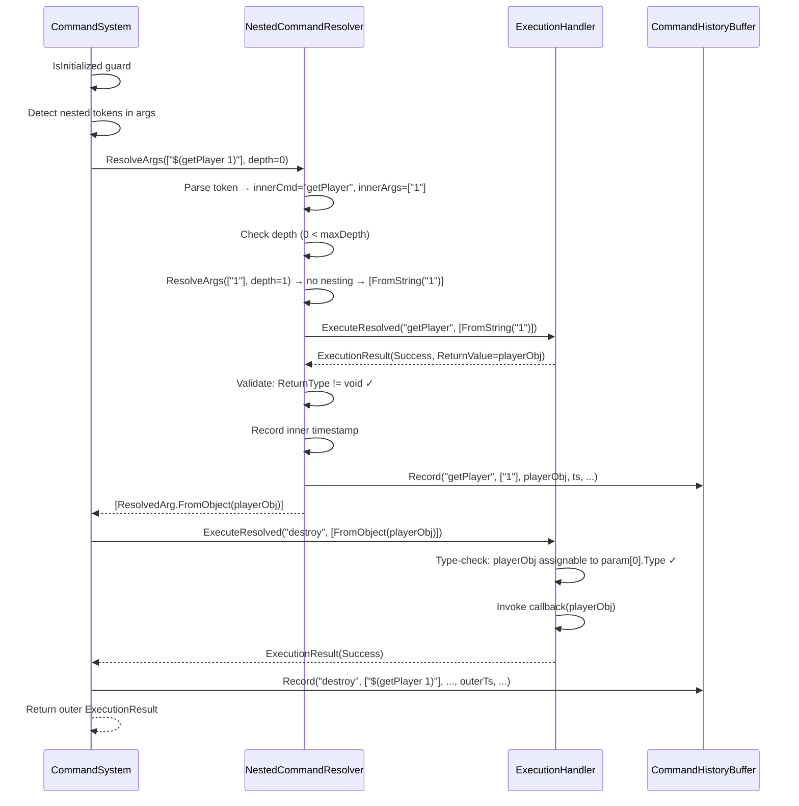
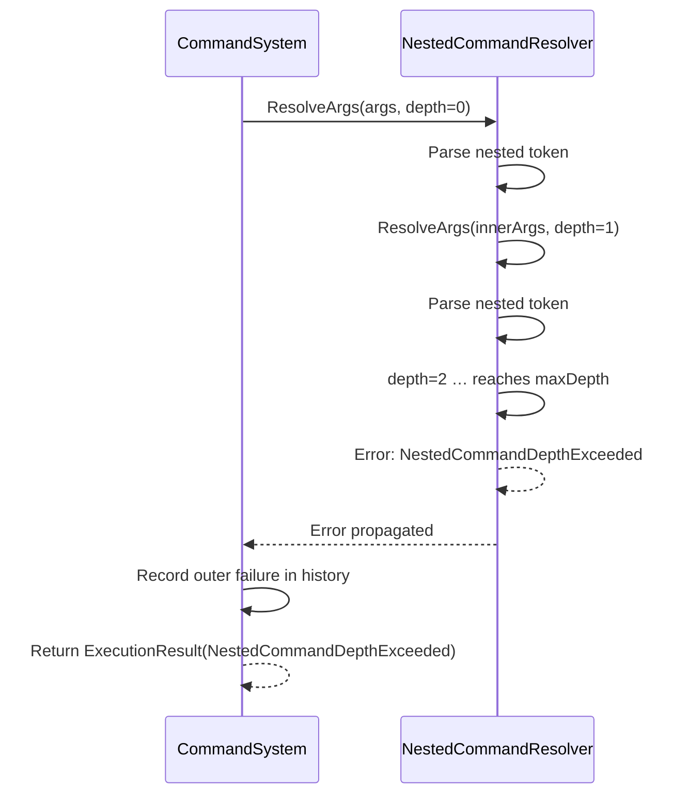
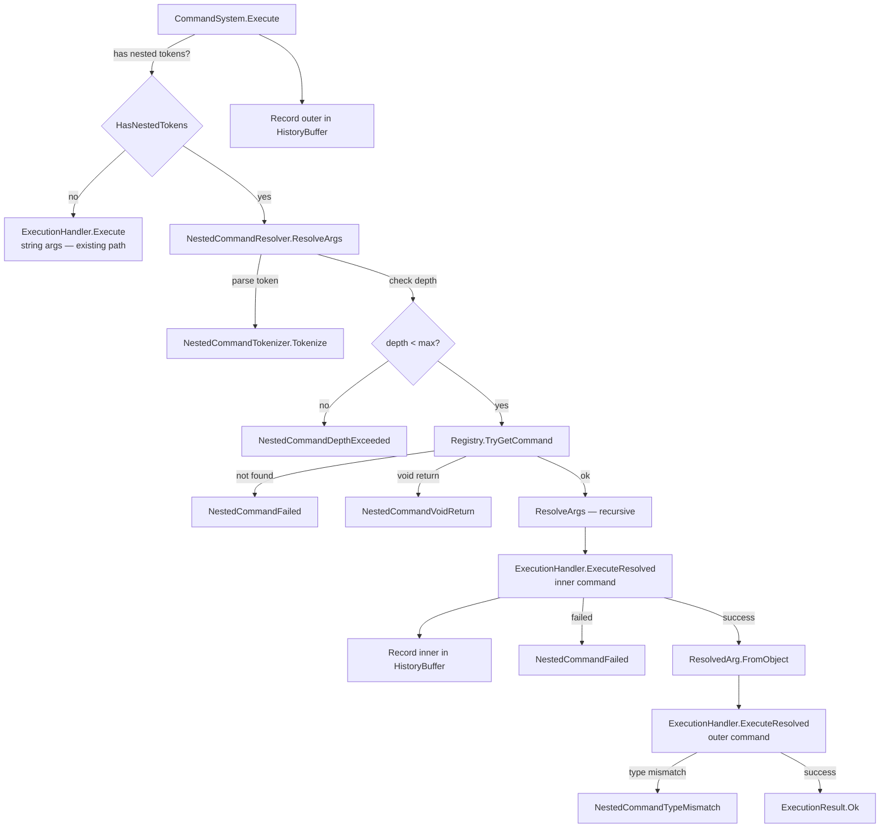

# Commands as Command Arguments — Design

## Status

Draft

## Summary

This design enables nested command invocations within the `string[] args` array of `Execute()`. An argument wrapped in the delimiter pair `$(` … `)` is recognized as an inner command expression, recursively resolved and executed, and its return value is injected directly into the outer command's parameter slot — skipping string round-tripping. A new internal `NestedCommandResolver` class owns all parsing, recursion, depth enforcement, and inner-command history recording. `ExecutionHandler` gains a parallel execution path that accepts pre-resolved argument values alongside normal string arguments.

> **Forward-compatibility note (internal — do not expose):** The `$(…)` delimiter, `ReturnType` metadata on `CommandDefinition`, and the `NestedCommandResolver` infrastructure are designed so that a future Natural Language Command Dispatch feature can emit nested expressions in its generated command strings without additional core changes.

## Requirements Input

- Source: `.github/tasks/commands-as-arguments/requirements.md`
- Key requirements carried into design:
  - Delimiter-wrapped tokens in `string[] args` identify inner commands
  - Recursive resolution up to configurable depth (default 4)
  - Inner commands recorded in history independently
  - Type validation between inner return value and outer parameter
  - Structured error propagation — outer callback never invoked on inner failure
  - Suggestion support when prefix starts with `$(`
  - AOT/IL2CPP safe — no codegen, no Emit, no Expressions

## Scope Notes

- **In scope:** Token parsing, recursive execution, depth limit, `ReturnType` on `CommandDefinition` (internal), new `ExecutionError` values, `CommandConfig.NestedCommandDepth`, suggestion delimiter detection, unit tests.
- **Out of scope:** New `Execute(string rawInput)` overload, command chaining, expression evaluation, consumer-configurable delimiters, any UI/input changes.

---

## Architecture Overview

```
CommandSystem.Execute(name, args)
│
├─ fast path (no nested tokens) → ExecutionHandler.Execute(name, string[] args)
│
└─ nested path (any arg starts with "$(")
   │
   └─ NestedCommandResolver.ResolveArgs(args, depth=0)
      │
      ├─ for each arg: literal string → ResolvedArg.FromString(arg)
      │
      └─ for each arg with "$(…)": parse → validate → recurse → execute inner
         │                                    → record inner history
         │                                    → ResolvedArg.FromObject(returnValue)
         │
         └─ return ResolvedArg[]
   │
   └─ ExecutionHandler.ExecuteResolved(name, ResolvedArg[])
      │
      └─ type-check pre-resolved args, string-convert literals, invoke callback
```

### Key Design Decisions

| Decision                 | Choice                                                                                                                                                                          | Rationale                                                                                                                                      |
| ------------------------ | ------------------------------------------------------------------------------------------------------------------------------------------------------------------------------- | ---------------------------------------------------------------------------------------------------------------------------------------------- |
| Delimiter pair           | `$(` open, `)` close (balanced)                                                                                                                                                 | Shell-familiar, visually distinct, `$` not used in command names; balanced parens enable nesting (`$(a $(b 1))`)                               |
| Nesting depth default    | 4                                                                                                                                                                               | Sufficient for practical use; configurable via `CommandConfig`                                                                                 |
| `nestedCommandDepth = 0` | Clamped to 1                                                                                                                                                                    | Consistent with `historyCapacity` clamping; no "disabled" state — consumers who want to reject nesting can do so in their own input layer      |
| Return type tracking     | Add `Type ReturnType` to `CommandDefinition` (internal)                                                                                                                         | Enables pre-execution void check and type-mismatch detection; scanners already know the type; manual registrations default to `typeof(object)` |
| Type validation timing   | **Two-phase:** (1) Pre-execution: reject void-return inner commands via `ReturnType`; (2) Post-inner-execution: validate runtime return value assignability to outer param type | Avoids executing inner commands that can never produce a useful result; catches runtime mismatches before outer callback                       |
| Pre-resolved arg passing | `ResolvedArg` internal struct — typed value bypasses `ArgumentConverter`                                                                                                        | Avoids lossy `ToString()` + re-parse round-trip for non-string types                                                                           |
| Inner history recording  | Resolver records each inner command in `CommandHistoryBuffer` immediately after inner execution                                                                                 | Matches the requirement that inner entries are identical to direct `Execute()` calls                                                           |

---

## Data Flow / Control Flow

### Happy Path: `Execute("destroy", new[] { "$(getPlayer 1)" })`



### Error Path: Depth Exceeded



---

## Components and Responsibilities

### `NestedCommandResolver` (new — `src/Core/NestedCommandResolver.cs`)

- **Responsibility:** Parse `$(…)` tokens, enforce depth limit, recursively resolve inner commands, record inner history, return `ResolvedArg[]` or structured error.
- **Interactions:** Reads from `CommandRegistry` (lookup + void check); delegates inner execution to `ExecutionHandler.ExecuteResolved`; writes to `CommandHistoryBuffer`.
- **State:** Holds references to `CommandRegistry`, `ExecutionHandler`, `CommandHistoryBuffer`, and `int _maxDepth`. Stateless per-call (no mutable instance state beyond config).

### `NestedCommandTokenizer` (new — static helper inside `NestedCommandResolver` or separate `src/Core/NestedCommandTokenizer.cs`)

- **Responsibility:** Delimiter-aware tokenization of the content inside `$(…)`. Splits by whitespace while respecting nested `$(…)` groups as atomic tokens.
- **Interactions:** Pure function — no dependencies.

### `ResolvedArg` (new — `src/Core/ResolvedArg.cs`)

- **Responsibility:** Discriminated value carrying either a raw string (for normal conversion) or a pre-resolved `object` (from inner command execution).
- **Interactions:** Consumed by `ExecutionHandler.ExecuteResolved`.

### `CommandDefinition` (modified — `src/Core/CommandDefinition.cs`)

- **Change:** Add `Type ReturnType` property (internal). Defaults to `typeof(object)` when not specified.
- **Interactions:** Set by `AttributeScanner` (from `MethodInfo.ReturnType`), `InstanceScanner` / `InstanceCallbackBuilder` (from method/property reflection), and manual `Register()` (defaults to `typeof(object)`).

### `ExecutionHandler` (modified — `src/Core/ExecutionHandler.cs`)

- **Change:** Add `ExecuteResolved(string commandName, ResolvedArg[] args)` method. Mirrors existing `Execute(string, string[])` logic but handles pre-resolved args: type-check instead of string-convert for `IsPreResolved` entries.
- **Interactions:** Called by `NestedCommandResolver` for inner commands and by `CommandSystem` for the outer command (when nesting is present).

### `CommandSystem` (modified — `src/CommandSystem.cs`)

- **Changes:**
  - New `public const int DefaultNestedCommandDepth = 4;`
  - New `private NestedCommandResolver _nestedResolver;` field, instantiated in `InitializeCore`.
  - `Execute()` gains a fast-path check: if no arg starts with `$(`, delegate to existing `ExecutionHandler.Execute`. Otherwise, call through `NestedCommandResolver`.
  - `GetSuggestions()` gains delimiter-aware prefix extraction.
  - `Shutdown()` nulls `_nestedResolver`.
  - All `Initialize(…, int historyCapacity, …)` overloads do NOT gain a new `nestedCommandDepth` parameter — depth is configured exclusively via `CommandConfig`. The `InitializeCore` method reads `_nestedCommandDepth` from a field set by the config path, or uses the default.

### `CommandConfig` (modified — `src/CommandConfig.cs`)

- **Change:** Add `public int NestedCommandDepth { get; set; } = CommandSystem.DefaultNestedCommandDepth;`
- **Change:** `FromJson` handles `"nestedCommandDepth"` key (int, same pattern as `historyCapacity`).

### `ExecutionError` enum (modified — `src/Results/ExecutionResult.cs`)

- **New values:**
  - `NestedCommandDepthExceeded`
  - `NestedCommandFailed`
  - `NestedCommandVoidReturn`
  - `NestedCommandParseFailed`
  - `NestedCommandTypeMismatch`

---

## Dependency Evaluation

- **New dependencies:** None.
- **Rationale:** The tokenizer is a simple balanced-delimiter state machine; the resolver is straightforward recursion. No external libraries needed.
- **Alternatives considered:** None warranted.

---

## API / Contract Sketch

### Public API Changes

```csharp
// CommandSystem — new constant
public const int DefaultNestedCommandDepth = 4;

// CommandConfig — new property
public int NestedCommandDepth { get; set; } = CommandSystem.DefaultNestedCommandDepth;

// ExecutionError — new values
public enum ExecutionError
{
    // ... existing values ...
    NestedCommandDepthExceeded,
    NestedCommandFailed,
    NestedCommandVoidReturn,
    NestedCommandParseFailed,
    NestedCommandTypeMismatch
}
```

### Internal Contracts

```csharp
// --- ResolvedArg (new) ---
internal readonly struct ResolvedArg
{
    internal bool IsPreResolved { get; }
    internal string StringValue { get; }
    internal object ObjectValue { get; }

    internal static ResolvedArg FromString(string value);
    internal static ResolvedArg FromObject(object value);
}

// --- CommandDefinition (modified) ---
internal sealed class CommandDefinition
{
    // ... existing members ...
    internal Type ReturnType { get; }

    internal CommandDefinition(string name, CommandParameterInfo[] parameters,
        CommandCallback callback, string description,
        bool isInstanceCommand = false, Type returnType = null)
    {
        // ... existing logic ...
        ReturnType = returnType ?? typeof(object);
    }
}

// --- NestedCommandResolver (new) ---
internal sealed class NestedCommandResolver
{
    private readonly CommandRegistry _registry;
    private readonly ExecutionHandler _executionHandler;
    private readonly CommandHistoryBuffer _historyBuffer;
    private readonly int _maxDepth;

    internal NestedCommandResolver(CommandRegistry registry,
        ExecutionHandler executionHandler,
        CommandHistoryBuffer historyBuffer,
        int maxDepth);

    /// <summary>
    /// Resolves all nested command tokens in <paramref name="args"/>.
    /// Returns a ResolvedArg[] on success, or an ExecutionResult error.
    /// Inner commands are executed and recorded in history during resolution.
    /// </summary>
    internal NestedResolveResult ResolveArgs(string[] args, int currentDepth);
}

// --- NestedResolveResult (new, internal) ---
internal readonly struct NestedResolveResult
{
    internal bool Success { get; }
    internal ResolvedArg[] ResolvedArgs { get; }   // non-null on success
    internal ExecutionResult Error { get; }         // meaningful on failure

    internal static NestedResolveResult Ok(ResolvedArg[] args);
    internal static NestedResolveResult Fail(ExecutionResult error);
}

// --- ExecutionHandler (modified) ---
internal sealed class ExecutionHandler
{
    // ... existing Execute(string, string[]) ...

    /// <summary>
    /// Executes a command with a mix of pre-resolved and string arguments.
    /// Pre-resolved args bypass ArgumentConverter and are type-checked directly.
    /// </summary>
    internal ExecutionResult ExecuteResolved(string commandName, ResolvedArg[] args);
}
```

---

## Implementation Notes

### Delimiter Constants

```csharp
// In NestedCommandResolver or a shared internal constants class
internal const string OpenDelimiter = "$(";
internal const char CloseDelimiter = ')';
```

### Fast-Path Detection in `CommandSystem.Execute`

Before entering the resolver, check if ANY arg starts with `$(`. This is a simple loop — O(n) over args count, O(1) per arg (check first two chars). When no nesting is present, the existing `ExecutionHandler.Execute(string, string[])` path is used with zero overhead.

```csharp
public ExecutionResult Execute(string commandName, string[] args)
{
    if (!IsInitialized) { /* existing guard */ }

    DateTime timestamp = DateTime.UtcNow;
    string[] rawInput = BuildRawInput(commandName, args);

    ExecutionResult result;

    if (HasNestedTokens(args))
    {
        NestedResolveResult resolved = _nestedResolver.ResolveArgs(args, 0);
        if (!resolved.Success)
        {
            result = resolved.Error;
        }
        else
        {
            result = _executionHandler.ExecuteResolved(commandName, resolved.ResolvedArgs);
        }
    }
    else
    {
        result = _executionHandler.Execute(commandName, args);
    }

    _historyBuffer.Record(commandName, args, result.ReturnValue,
        timestamp, rawInput, result.Error, result.ErrorMessage);
    return result;
}

private static bool HasNestedTokens(string[] args)
{
    if (args == null) return false;
    for (int i = 0; i < args.Length; i++)
    {
        if (args[i] != null && args[i].Length >= 3
            && args[i][0] == '$' && args[i][1] == '(')
            return true;
    }
    return false;
}
```

### Tokenizer: Balanced-Delimiter Splitting

The tokenizer splits the content between `$(` and matching `)` by whitespace, keeping nested `$(…)` groups as single tokens.

```csharp
// Pseudocode for NestedCommandTokenizer.Tokenize(string content)
// Input:  "getTarget $(getPlayer 1) extra"
// Output: ["getTarget", "$(getPlayer 1)", "extra"]

internal static string[] Tokenize(string content)
{
    var tokens = new List<string>();
    int i = 0;
    while (i < content.Length)
    {
        // skip whitespace
        while (i < content.Length && content[i] == ' ') i++;
        if (i >= content.Length) break;

        int start = i;
        if (i + 1 < content.Length && content[i] == '$' && content[i + 1] == '(')
        {
            // nested delimiter — find matching close paren
            int depth = 0;
            while (i < content.Length)
            {
                if (i + 1 < content.Length && content[i] == '$' && content[i + 1] == '(')
                {
                    depth++;
                    i += 2;
                }
                else if (content[i] == ')' && depth > 0)
                {
                    depth--;
                    i++;
                    if (depth == 0) break;
                }
                else
                {
                    i++;
                }
            }
        }
        else
        {
            // normal token — read until whitespace
            while (i < content.Length && content[i] != ' ') i++;
        }

        tokens.Add(content.Substring(start, i - start));
    }
    return tokens.ToArray();
}
```

### Resolver: Recursive Resolution Logic

```csharp
internal NestedResolveResult ResolveArgs(string[] args, int currentDepth)
{
    if (args == null || args.Length == 0)
        return NestedResolveResult.Ok(Array.Empty<ResolvedArg>());

    ResolvedArg[] resolved = new ResolvedArg[args.Length];

    for (int i = 0; i < args.Length; i++)
    {
        string arg = args[i];

        if (!IsNestedToken(arg))
        {
            resolved[i] = ResolvedArg.FromString(arg);
            continue;
        }

        // Depth check
        if (currentDepth >= _maxDepth)
        {
            return NestedResolveResult.Fail(ExecutionResult.Fail(
                ExecutionError.NestedCommandDepthExceeded,
                string.Format(
                    "Nested command depth limit ({0}) exceeded at argument index {1}.",
                    _maxDepth, i),
                null));
        }

        // Parse inner expression
        string content = arg.Substring(2, arg.Length - 3); // strip "$(" and ")"
        string[] tokens = NestedCommandTokenizer.Tokenize(content);
        if (tokens.Length == 0)
        {
            return NestedResolveResult.Fail(ExecutionResult.Fail(
                ExecutionError.NestedCommandParseFailed,
                string.Format("Empty nested command expression at argument index {0}.", i),
                null));
        }

        string innerName = tokens[0];
        string[] innerArgs = tokens.Length > 1
            ? new string[tokens.Length - 1]
            : Array.Empty<string>();
        for (int j = 1; j < tokens.Length; j++)
            innerArgs[j - 1] = tokens[j];

        // Pre-execution: check inner command exists and is not void
        if (!_registry.TryGetCommand(innerName, out CommandDefinition innerDef))
        {
            return NestedResolveResult.Fail(ExecutionResult.Fail(
                ExecutionError.NestedCommandFailed,
                string.Format(
                    "Nested command '{0}' at argument index {1} not found.", innerName, i),
                null));
        }
        if (innerDef.ReturnType == typeof(void))
        {
            return NestedResolveResult.Fail(ExecutionResult.Fail(
                ExecutionError.NestedCommandVoidReturn,
                string.Format(
                    "Nested command '{0}' at argument index {1} returns void and cannot be used as an argument.",
                    innerName, i),
                null));
        }

        // Recursively resolve inner args
        NestedResolveResult innerResolved = ResolveArgs(innerArgs, currentDepth + 1);
        if (!innerResolved.Success)
            return innerResolved; // propagate inner failure

        // Execute inner command
        DateTime innerTimestamp = DateTime.UtcNow;
        string[] innerRawInput = BuildRawInput(innerName, innerArgs);
        ExecutionResult innerResult = _executionHandler.ExecuteResolved(
            innerName, innerResolved.ResolvedArgs);

        // Record inner command in history
        _historyBuffer.Record(innerName, innerArgs, innerResult.ReturnValue,
            innerTimestamp, innerRawInput, innerResult.Error, innerResult.ErrorMessage);

        if (!innerResult.Success)
        {
            return NestedResolveResult.Fail(ExecutionResult.Fail(
                ExecutionError.NestedCommandFailed,
                string.Format(
                    "Nested command '{0}' at argument index {1} failed: {2}",
                    innerName, i, innerResult.ErrorMessage),
                innerResult.Exception));
        }

        if (!innerResult.HasReturnValue)
        {
            return NestedResolveResult.Fail(ExecutionResult.Fail(
                ExecutionError.NestedCommandVoidReturn,
                string.Format(
                    "Nested command '{0}' at argument index {1} returned no value.",
                    innerName, i),
                null));
        }

        resolved[i] = ResolvedArg.FromObject(innerResult.ReturnValue);
    }

    return NestedResolveResult.Ok(resolved);
}

private static bool IsNestedToken(string arg)
{
    return arg != null && arg.Length >= 3
        && arg[0] == '$' && arg[1] == '('
        && arg[arg.Length - 1] == ')';
}
```

### `ExecutionHandler.ExecuteResolved` — Type Checking for Pre-Resolved Args

```csharp
internal ExecutionResult ExecuteResolved(string commandName, ResolvedArg[] args)
{
    // Steps 1-3: identical to Execute(string, string[]) — lookup, count validation
    // ...

    object[] convertedArgs = totalCount > 0 ? new object[totalCount] : Array.Empty<object>();

    for (int i = 0; i < totalCount; i++)
    {
        CommandParameterInfo param = definition.Parameters[i];

        if (i >= actualCount)
        {
            convertedArgs[i] = param.DefaultValue;
            continue;
        }

        ResolvedArg ra = args[i];

        if (ra.IsPreResolved)
        {
            // Type compatibility check
            object val = ra.ObjectValue;
            if (val == null)
            {
                if (param.Type.IsValueType)
                {
                    return ExecutionResult.Fail(
                        ExecutionError.NestedCommandTypeMismatch,
                        string.Format(
                            "Nested command result at index {0} is null but parameter '{1}' expects value type {2}.",
                            i, param.Name, param.Type.Name),
                        null);
                }
                convertedArgs[i] = null;
            }
            else if (param.Type.IsAssignableFrom(val.GetType()))
            {
                convertedArgs[i] = val;
            }
            else
            {
                // Fallback: try string conversion
                string asString = val.ToString();
                if (_converter.TryConvert(param.Type, asString, out object converted))
                {
                    convertedArgs[i] = converted;
                }
                else
                {
                    return ExecutionResult.Fail(
                        ExecutionError.NestedCommandTypeMismatch,
                        string.Format(
                            "Nested command result of type '{0}' at index {1} is not compatible with parameter '{2}' of type '{3}'.",
                            val.GetType().Name, i, param.Name, param.Type.Name),
                        null);
                }
            }
        }
        else
        {
            // Normal string conversion — identical to existing Execute path
            if (!_converter.TryConvert(param.Type, ra.StringValue, out object converted))
            {
                return ExecutionResult.Fail(
                    ExecutionError.ArgumentConversionFailed,
                    string.Format(
                        "Failed to convert argument '{0}' at index {1}: cannot convert '{2}' to {3}.",
                        param.Name, i, ra.StringValue, param.Type.Name),
                    null);
            }
            convertedArgs[i] = converted;
        }
    }

    // Callback invocation — identical to existing path (with same try/catch pattern)
    // ...
}
```

### Suggestion Delimiter Detection

In `CommandSystem.GetSuggestions(string prefix, ISuggestionMatcher matcher)`:

```csharp
public CommandSuggestion[] GetSuggestions(string prefix, ISuggestionMatcher matcher)
{
    if (!IsInitialized)
        return Array.Empty<CommandSuggestion>();

    // Strip nested command delimiter if present — find innermost unclosed $(
    string effectivePrefix = ExtractInnermostPrefix(prefix);

    ISuggestionMatcher effective = matcher ?? _suggestionMatcher ?? _defaultMatcher;
    string[] names = _registry.GetAllNames();
    IList<string> matched = effective.Match(effectivePrefix, names);

    // ... rest unchanged ...
}

/// <summary>
/// If <paramref name="prefix"/> contains an unclosed "$(" (i.e. the user is typing
/// inside a nested command expression), returns the content after the last unclosed
/// "$(". Otherwise returns the original prefix unchanged.
/// </summary>
private static string ExtractInnermostPrefix(string prefix)
{
    if (string.IsNullOrEmpty(prefix))
        return prefix;

    // Walk the string tracking balanced $(...) depth
    int lastUnclosedStart = -1;
    int depth = 0;
    for (int i = 0; i < prefix.Length; i++)
    {
        if (i + 1 < prefix.Length && prefix[i] == '$' && prefix[i + 1] == '(')
        {
            depth++;
            lastUnclosedStart = i + 2; // content starts after "$("
            i++; // skip '('
        }
        else if (prefix[i] == ')' && depth > 0)
        {
            depth--;
        }
    }

    if (depth > 0 && lastUnclosedStart >= 0 && lastUnclosedStart <= prefix.Length)
    {
        // Extract content after the last unclosed "$("
        // Then find the last space — content after it is the current token
        string inner = prefix.Substring(lastUnclosedStart);
        int lastSpace = inner.LastIndexOf(' ');
        if (lastSpace < 0)
            return inner; // typing the command name itself
        else
            return inner.Substring(lastSpace + 1); // won't be useful for command completion, but handles edge
    }

    return prefix;
}
```

### `CommandConfig` Changes

```csharp
public sealed class CommandConfig
{
    public int HistoryCapacity { get; set; } = CommandSystem.DefaultHistoryCapacity;
    public bool DevMode { get; set; }
    public int NestedCommandDepth { get; set; } = CommandSystem.DefaultNestedCommandDepth;

    // In FromJson — new branch in the key matching loop:
    // else if (StringEquals(entry.Key, "nestedCommandDepth"))
    // {
    //     if (entry.ValueType != typeof(int))
    //         return ConfigResult.Fail(ConfigError.TypeMismatch, ...);
    //     config.NestedCommandDepth = (int)entry.Value;
    // }
}
```

### `CommandDefinition` Change

```csharp
internal sealed class CommandDefinition
{
    internal string Name { get; }
    internal CommandParameterInfo[] Parameters { get; }
    internal CommandCallback Callback { get; }
    internal int RequiredParameterCount { get; }
    internal string Description { get; }
    internal bool IsInstanceCommand { get; }
    internal Type ReturnType { get; }

    internal CommandDefinition(string name, CommandParameterInfo[] parameters,
        CommandCallback callback, string description,
        bool isInstanceCommand = false, Type returnType = null)
    {
        // ... existing ...
        ReturnType = returnType ?? typeof(object);
    }
}
```

- `AttributeScanner`: pass `method.ReturnType` (already available at line 168) to `CommandDefinition` constructor.
- `InstanceScanner` / `InstanceCallbackBuilder`: pass the reflected method/property return type.
- Manual `Register()` in `CommandSystem`: pass `typeof(object)` (no public API change; internal default).

### `InitializeCore` Change

```csharp
private int _nestedCommandDepth = DefaultNestedCommandDepth;
private NestedCommandResolver _nestedResolver;

private void InitializeCore(int historyCapacity)
{
    // ... existing ...
    _nestedResolver = new NestedCommandResolver(
        _registry, _executionHandler, _historyBuffer,
        _nestedCommandDepth < 1 ? 1 : _nestedCommandDepth);
}
```

For the `Initialize(CommandConfig)` path:

```csharp
public void Initialize(CommandConfig config)
{
    if (IsInitialized || config == null) return;
    _devMode = config.DevMode;
    _nestedCommandDepth = config.NestedCommandDepth;
    InitializeCore(config.HistoryCapacity);
}
```

### `Shutdown` Change

```csharp
public void Shutdown()
{
    // ... existing nulling ...
    _nestedResolver = null;
    _nestedCommandDepth = DefaultNestedCommandDepth;
}
```

---

## Code Examples

### Consumer Usage

```csharp
var cmd = new CommandSystem();
cmd.Initialize();

// Register commands
cmd.Register("getPlayer",
    new[] { new CommandParameterInfo("id", typeof(int)) },
    args => players[(int)args[0]]);

cmd.Register("destroy",
    new[] { new CommandParameterInfo("target", typeof(object)) },
    args => { Destroy(args[0]); return null; });

// Execute with nested command
var result = cmd.Execute("destroy", new[] { "$(getPlayer 1)" });
// Inner: getPlayer(1) → playerObj
// Outer: destroy(playerObj) → success

// Multi-level nesting
cmd.Register("getHealth",
    new[] { new CommandParameterInfo("target", typeof(object)) },
    args => ((Player)args[0]).Health);

var r2 = cmd.Execute("print", new[] { "$(getHealth $(getPlayer 0))" });
// Deepest: getPlayer(0) → player0
// Middle: getHealth(player0) → 100
// Outer: print(100)
```

### Config Usage

```json
{
  "historyCapacity": 128,
  "devMode": true,
  "nestedCommandDepth": 2
}
```

---

## Diagram

### Component Interaction



---

## Testing Strategy

### Unit Tests — `tests/kmCommands.Tests/NestedCommandTests.cs` (new file)

**Resolution — happy path:**

- Single nesting: `Execute("outer", ["$(inner 1)"])` → inner executes, outer receives return value, both history entries present.
- Multi-level nesting: `$(a $(b $(c 1)))` resolves from innermost outward.
- Mixed args: `Execute("cmd", ["literal", "$(nested 1)", "42"])` — literal and nested args coexist.
- No nesting: existing `Execute` behavior is completely unchanged (regression).

**Resolution — error paths:**

- `NestedCommandParseFailed`: empty expression `$()`.
- `NestedCommandFailed` — inner command not found: `$(nonexistent 1)`.
- `NestedCommandFailed` — inner command execution fails (e.g., arg conversion): `$(inner notAnInt)`.
- `NestedCommandVoidReturn`: inner command returns void.
- `NestedCommandDepthExceeded`: nesting exceeds configured limit.
- `NestedCommandTypeMismatch`: inner returns string, outer expects int, no converter path.

**Depth limit:**

- Default depth (4) allows 4 levels.
- Custom depth via `CommandConfig`: depth=2 allows 2, rejects 3.
- Depth clamped: `nestedCommandDepth=0` → behaves as 1.

**Type compatibility:**

- Inner returns `int`, outer param `int` → direct pass.
- Inner returns `int`, outer param `object` → assignable, passes.
- Inner returns `object` (custom type), outer param `string` → fallback `ToString()` + converter.
- Inner returns `null`, outer param value type → `NestedCommandTypeMismatch`.
- Inner returns `null`, outer param reference type → passes (null is valid).

**History recording:**

- Inner commands get independent history entries with own timestamps.
- Outer command gets its own entry (with original nested-token args in rawInput).
- Failed inner: inner entry recorded with failure status, outer entry recorded with `NestedCommandFailed`.

**Suggestions:**

- `GetSuggestions("$(")` → all command names.
- `GetSuggestions("$(get")` → commands starting with "get".
- `GetSuggestions("$(outer $(get")` → commands starting with "get" (innermost unclosed `$(` detected).
- `GetSuggestions("normalPrefix")` → unchanged behavior.

### Unit Tests — `tests/kmCommands.Tests/NestedCommandTokenizerTests.cs` (new file)

- Basic: `"cmd arg1 arg2"` → `["cmd", "arg1", "arg2"]`.
- Nested: `"cmd $(inner 1) arg2"` → `["cmd", "$(inner 1)", "arg2"]`.
- Deep: `"cmd $(a $(b 1))"` → `["cmd", "$(a $(b 1))"]`.
- Empty: `""` → `[]`.
- Whitespace handling: leading/trailing spaces trimmed, multiple spaces collapsed.
- Edge: unbalanced parens → treated as literal (no crash).

### Unit Tests — `tests/kmCommands.Tests/ConfigTests.cs` (existing file, extend)

- `nestedCommandDepth` parsed from JSON.
- Unknown key still produces warning (regression).
- Type mismatch for `nestedCommandDepth` → `ConfigResult.Fail`.

### Unit Tests — `tests/kmCommands.Tests/ResolvedArgTests.cs` (new file, optional)

- `FromString`: `IsPreResolved == false`, `StringValue` set.
- `FromObject`: `IsPreResolved == true`, `ObjectValue` set.

---

## Risks and Tradeoffs

| Risk                                                                                    | Mitigation                                                                                                                                                                       |
| --------------------------------------------------------------------------------------- | -------------------------------------------------------------------------------------------------------------------------------------------------------------------------------- |
| `ExecutionHandler` refactor could introduce regressions in existing execution paths     | The existing `Execute(string, string[])` method is NOT modified — `ExecuteResolved` is a new parallel method. All existing tests continue to exercise the original path.         |
| Tokenizer edge cases (unbalanced delimiters, empty content)                             | Dedicated tokenizer test suite covers edge cases. Malformed tokens produce `NestedCommandParseFailed` rather than exceptions.                                                    |
| `ReturnType` on `CommandDefinition` could become stale if callback is swapped           | `CommandDefinition` is immutable — callback and return type are set at construction. No mutation path exists.                                                                    |
| `ToString()` fallback in type mismatch converts objects to strings nondeterministically | The fallback is a best-effort convenience. If `ToString()` + converter fails, a clear `NestedCommandTypeMismatch` error is returned.                                             |
| `$` in argument values could conflict with delimiter detection                          | `IsNestedToken` requires the full token to start with `$(` AND end with `)`. A literal `$` or partial `$(` that doesn't form a balanced expression is treated as a plain string. |

---

## Open Questions

All requirements-level open questions have been resolved in this design:

| Question                   | Resolution                                                                                                                                            |
| -------------------------- | ----------------------------------------------------------------------------------------------------------------------------------------------------- |
| Delimiter characters       | `$(` open, `)` close — balanced matching                                                                                                              |
| `nestedCommandDepth = 0`   | Clamped to 1 — consistent with history capacity clamping                                                                                              |
| Void-return inner commands | Rejected via two checks: (1) pre-execution `ReturnType == typeof(void)` on the definition; (2) post-execution `HasReturnValue == false` on the result |

---

## Task Planning Handoff

### Suggested Implementation Slices

1. **`ReturnType` on `CommandDefinition`** — Add the property, update constructor, update `AttributeScanner`, `InstanceScanner`, `InstanceCallbackBuilder`, and manual `Register()` to pass it. No behavioral change yet. All existing tests pass.

2. **`ResolvedArg` struct + `ExecutionHandler.ExecuteResolved`** — New types, new method. Unit-testable in isolation with manually constructed `ResolvedArg[]`. No integration with nesting yet.

3. **`NestedCommandTokenizer`** — Pure static tokenizer. Unit-test file `NestedCommandTokenizerTests.cs`.

4. **`NestedCommandResolver`** + integration in `CommandSystem.Execute` — Core recursive resolution logic. Depends on slices 1–3. Main test file `NestedCommandTests.cs`.

5. **`CommandConfig.NestedCommandDepth`** + `InitializeCore` wiring — Config parsing, depth field, clamping. Extend `ConfigTests.cs`.

6. **`GetSuggestions` delimiter detection** — `ExtractInnermostPrefix` logic. Suggestion tests in `NestedCommandTests.cs` or `SuggestionTests.cs`.

7. **New `ExecutionError` enum values** — Can be added in slice 2 or 4; needed by both.

### Coupling Notes

- Slices 1–3 are independent of each other and can be implemented in any order.
- Slice 4 depends on all of 1, 2, 3, and 7.
- Slice 5 is independent but should land before or with slice 4 (resolver reads max depth).
- Slice 6 is independent of 4 but logically related.

### Areas to Validate After Full Integration

- All existing test suites pass unchanged (regression).
- `Execute()` with no nested tokens has identical behavior and no measurable overhead (fast-path check is ~ns).
- History entries for nested calls appear in correct order (inner before outer, by timestamp).
- `GetSnapshot()` / `CommandMetadataSnapshot` continues to work (no changes expected, but verify).

---

## Final Review Contract

### Critical Behaviors to Verify

- [ ] `Execute("outer", ["$(inner 1)"])` produces correct result; both commands recorded in history.
- [ ] Nesting to the configured depth succeeds; depth+1 returns `NestedCommandDepthExceeded`.
- [ ] `nestedCommandDepth` in JSON config is parsed and applied; absent key uses default 4.
- [ ] Void-return inner command → `NestedCommandVoidReturn` error, no callback invoked on either side.
- [ ] Inner command failure → `NestedCommandFailed`, outer callback never invoked, both recorded in history.
- [ ] Type mismatch between inner return and outer param → `NestedCommandTypeMismatch`.
- [ ] `GetSuggestions("$(get")` returns commands starting with "get".
- [ ] Arguments without `$(…)` delimiters are completely unaffected (full regression suite green).
- [ ] All new `ExecutionError` values are present and tested.
- [ ] `ReturnType` on `CommandDefinition` is populated by scanners; manual registrations default to `typeof(object)`.

### Design Invariants

- The existing `ExecutionHandler.Execute(string, string[])` method is never modified — only a new `ExecuteResolved` method is added.
- Inner commands are executed and recorded in history identically to direct `Execute()` calls.
- No `System.Linq`, no `Emit`, no `Expressions` — AOT/IL2CPP safe throughout.
- All new types are `internal` except the `ExecutionError` enum additions and `CommandConfig.NestedCommandDepth`.
- `Shutdown()` resets `_nestedResolver` and `_nestedCommandDepth` to defaults.

### Required Test Evidence

- `NestedCommandTests.cs`: ≥ 15 tests covering all resolution paths, depth limits, type checks, history recording, and suggestions.
- `NestedCommandTokenizerTests.cs`: ≥ 8 tests covering tokenization edge cases.
- `ConfigTests.cs`: ≥ 3 new tests for `nestedCommandDepth` config key.
- All existing test suites pass unmodified.

### Known Acceptable Deviations

- Manual `Register()` does not expose a public `returnType` parameter in this iteration. `ReturnType` defaults to `typeof(object)` for manually registered commands, which means pre-execution void-check is bypassed for those commands (runtime `HasReturnValue` check still catches it).

### Blocking Conditions

- Any existing test failure is a blocker.
- Missing test coverage for any of the 5 new `ExecutionError` values is a blocker.
- `ExecutionHandler.Execute(string, string[])` modified instead of parallel `ExecuteResolved` method is a blocker.
