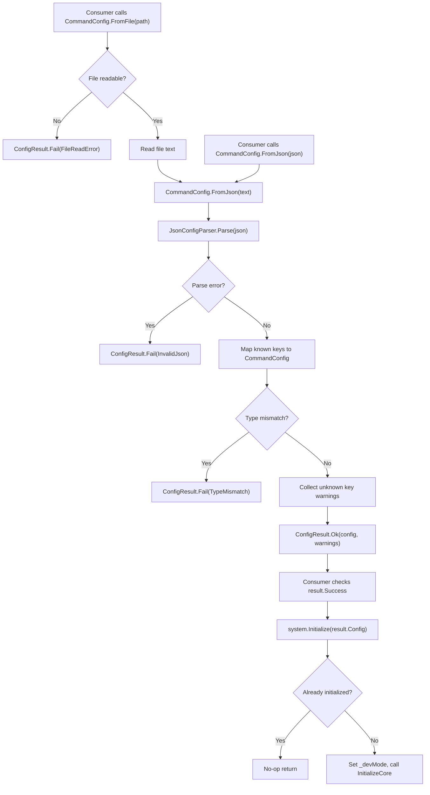

# Configuration File Support

## Status

Draft

## Summary

Add a minimal JSON-based configuration path so consumers can drive `CommandSystem` initialisation from a declarative file instead of code-only `Initialize()` calls. The implementation introduces three new public types (`CommandConfig`, `ConfigResult`, `ConfigError`) and one new `Initialize(CommandConfig)` overload, plus a hand-rolled, AOT-safe JSON parser internal class. Unknown keys produce warnings; malformed JSON or type mismatches produce errors. No third-party dependencies.

## Requirements Input

- Source: `.github/tasks/config-file-support/requirements.md`
- Key requirements carried into design:
  - `CommandConfig` public class with `HistoryCapacity` (int) and `DevMode` (bool) — coded defaults matching existing `Initialize()`.
  - `CommandConfig.FromJson(string json)` → `ConfigResult` with warnings/errors.
  - `CommandConfig.FromFile(string filePath)` → delegates to `FromJson`.
  - `CommandSystem.Initialize(CommandConfig config)` → `void`, equivalent to `Initialize(historyCapacity, devMode)`.
  - Unknown keys → warnings (non-blocking). Malformed JSON / wrong types → error (blocking).
  - No third-party JSON library. AOT/IL2CPP safe. No reflection.
  - `Shutdown()` resets config state (already naturally satisfied since config is consumed at init time).

## Scope Notes

- In scope: `CommandConfig`, `ConfigResult`, `ConfigError`, `Initialize(CommandConfig)`, internal JSON parser, unit tests.
- Out of scope: YAML, live-reload, config serialisation/write-back, `Initialize(string filePath)` shorthand, config keys for unimplemented features.

## Architecture Overview

```
Consumer code
     │
     ▼
CommandConfig.FromFile(path)          ← reads file, delegates to FromJson
     │
     ▼
CommandConfig.FromJson(json)          ← hand-rolled parser, produces ConfigResult
     │
     ▼
ConfigResult { Config, Warnings, Error }
     │
     ▼
CommandSystem.Initialize(config)      ← extracts HistoryCapacity + DevMode, calls InitializeCore
```

All new types live in the `kmCommands` namespace. The internal JSON parser lives in `kmCommands.Core`.

The design keeps parse and initialise as two explicit steps — errors are surfaced in `ConfigResult` before `Initialize()` is ever called, matching the requirement that consumers inspect the result first.

## Data Flow / Control Flow

### Happy path

1. Consumer calls `CommandConfig.FromFile("commands.json")`.
2. `FromFile` reads the file via `System.IO.File.ReadAllText`, catches `IOException`/`FileNotFoundException`, returns `ConfigResult.Fail(...)` on error.
3. `FromFile` delegates to `CommandConfig.FromJson(text)`.
4. `FromJson` passes the string to `JsonConfigParser.Parse(json)`, which returns a `ParseOutput` containing key-value pairs, unknown keys, and any parse error.
5. `FromJson` maps known keys to `CommandConfig` properties, validates value types, collects unknown-key warnings.
6. Returns `ConfigResult` with the populated `CommandConfig` and any warnings, or a failure result.
7. Consumer checks `result.Success`, inspects `result.Warnings` if desired.
8. Consumer calls `commandSystem.Initialize(result.Config)`.
9. `Initialize(CommandConfig)` reads `config.HistoryCapacity` and `config.DevMode`, calls `InitializeCore(...)` (same as existing overloads).

### Error paths

- File not found / IO error → `ConfigResult.Fail(ConfigError.FileReadError, message)`.
- Null/empty JSON string → `ConfigResult.Fail(ConfigError.InvalidJson, message)`.
- Malformed JSON (unmatched braces, bad syntax) → `ConfigResult.Fail(ConfigError.InvalidJson, message)`.
- Known key with wrong type (e.g. `"devMode": 42`) → `ConfigResult.Fail(ConfigError.TypeMismatch, message)`.
- Unknown keys → `ConfigResult.Ok(config, warnings: ["Unknown config key: 'foo'"])`.
- `Initialize(null)` → no-op with early return (consistent with defensive patterns in the codebase).
- `Initialize(config)` when already initialised → no-op (consistent with all existing overloads).

## Components and Responsibilities

### `CommandConfig` (public class, `src/CommandConfig.cs`)

- Responsibility: Public configuration container. Holds typed settings with coded defaults. Provides `FromJson` and `FromFile` static factories.
- Interactions: Consumed by `CommandSystem.Initialize(CommandConfig)`. Produced by `FromJson`/`FromFile`.
- Not a struct because it is used as a nullable reference in `ConfigResult` (null on failure) and may grow with more settings in future versions.

### `ConfigResult` (public readonly struct, `src/Results/ConfigResult.cs`)

- Responsibility: Carries the outcome of a config parse operation — success with optional warnings, or failure with error details.
- Interactions: Returned by `CommandConfig.FromJson` and `CommandConfig.FromFile`. Inspected by consumer before calling `Initialize`.

### `ConfigError` (public enum, `src/Results/ConfigResult.cs`)

- Responsibility: Enumerates the possible failure reasons for config parsing.
- Lives in same file as `ConfigResult` (matches existing pattern: `ExecutionError` in `ExecutionResult.cs`, `RegistrationError` in `RegistrationResult.cs`).

### `JsonConfigParser` (internal static class, `src/Core/JsonConfigParser.cs`)

- Responsibility: Minimal hand-rolled JSON object parser. Extracts top-level key-value pairs from a `{ ... }` JSON object. Supports string, integer, boolean, and `null` value types. Does NOT support nested objects, arrays, or the full JSON spec — only the subset needed for flat config.
- Interactions: Called by `CommandConfig.FromJson`. Returns a `ParseOutput` struct.
- No public surface. All types and methods are internal.

### `CommandSystem.Initialize(CommandConfig)` (new public overload)

- Responsibility: Applies config values and initialises the system, identical to `Initialize(historyCapacity, devMode)`.
- Interactions: Calls `InitializeCore(config.HistoryCapacity)` after setting `_devMode`.

## Dependency Evaluation

- New dependencies: **None**.
- Rationale: The JSON parser handles a flat `{ key: value }` object with 2 known keys. A hand-rolled parser is simpler, smaller, and AOT-safe compared to pulling in `System.Text.Json` (unavailable on `netstandard2.0` without a package) or `Newtonsoft.Json`. The implementation is ~150 lines of straightforward character-level parsing.
- Alternatives considered: `System.Text.Json` (requires a NuGet dependency on `netstandard2.0`; too heavy for 2 keys), `Newtonsoft.Json` (adds a large dependency for trivial use). Both rejected per requirements.

## API / Contract Sketch

### `ConfigError` enum

```csharp
namespace kmCommands
{
    public enum ConfigError
    {
        None = 0,
        InvalidJson,
        TypeMismatch,
        FileReadError
    }
}
```

### `ConfigResult` readonly struct

```csharp
namespace kmCommands
{
    public readonly struct ConfigResult
    {
        public bool Success { get; }
        public CommandConfig Config { get; }
        public ConfigError Error { get; }
        public string ErrorMessage { get; }
        public string[] Warnings { get; }

        // Warnings is never null on success (empty array if none)
        // Config is null on failure

        internal static ConfigResult Ok(CommandConfig config, string[] warnings);
        internal static ConfigResult Fail(ConfigError error, string message);
    }
}
```

### `CommandConfig` class

```csharp
namespace kmCommands
{
    public sealed class CommandConfig
    {
        public int HistoryCapacity { get; set; } = CommandSystem.DefaultHistoryCapacity;
        public bool DevMode { get; set; }

        public static ConfigResult FromJson(string json);
        public static ConfigResult FromFile(string filePath);
    }
}
```

### `CommandSystem.Initialize(CommandConfig)` overload

```csharp
public void Initialize(CommandConfig config)
{
    if (IsInitialized) { return; }
    if (config == null) { return; }
    _devMode = config.DevMode;
    InitializeCore(config.HistoryCapacity);
}
```

### `JsonConfigParser` internal API

```csharp
namespace kmCommands.Core
{
    internal static class JsonConfigParser
    {
        internal readonly struct ParsedValue
        {
            internal readonly string Key;
            internal readonly object Value;    // int, bool, string, or null
            internal readonly Type ValueType;  // typeof(int), typeof(bool), typeof(string), or null for JSON null
        }

        internal readonly struct ParseOutput
        {
            internal readonly ParsedValue[] Values;
            internal readonly string Error;  // non-null if parse failed
            internal readonly bool HasError;
        }

        internal static ParseOutput Parse(string json);
    }
}
```

## Implementation Notes

### JSON parser scope

The parser only needs to handle a flat JSON object with string keys and primitive values (int, bool, string). It does NOT need to handle:

- Nested objects or arrays
- Unicode escape sequences beyond basic ASCII
- Floating-point numbers (no float config keys exist today)
- Comments (not valid JSON)
- Trailing commas (not valid JSON)

The parser walks the input character-by-character:

1. Skip whitespace. Expect `{`.
2. Loop: skip whitespace, parse a string key, skip whitespace, expect `:`, skip whitespace, parse a value (string/number/boolean/null), add to results list, skip whitespace, expect `,` or `}`.
3. Return `ParseOutput` with the extracted key-value pairs or an error string.

Negative integers must be supported for `historyCapacity` (they will be clamped to 1 by `InitializeCore`, but the parser must not reject them).

### Key matching in `FromJson`

`FromJson` performs case-insensitive comparison of parsed key names against the known set (`historyCapacity`, `devMode`). This makes config files resilient to casing variations (e.g. `"HistoryCapacity"` and `"historycapacity"` both work).

Known keys with correct types → set on `CommandConfig`.
Known keys with wrong value types → `ConfigResult.Fail(ConfigError.TypeMismatch, ...)`.
Unknown keys → add warning string: `"Unknown config key: '<key>'"`.

### Type validation rules

| Config key        | Expected JSON type       | C# mapped type |
| ----------------- | ------------------------ | -------------- |
| `historyCapacity` | number (integer)         | `int`          |
| `devMode`         | boolean (`true`/`false`) | `bool`         |

A `string` value for `historyCapacity` (e.g. `"historyCapacity": "128"`) is a type mismatch error, not a warning. This prevents silent misconfigurations.

### `FromFile` implementation

```csharp
public static ConfigResult FromFile(string filePath)
{
    if (string.IsNullOrEmpty(filePath))
    {
        return ConfigResult.Fail(ConfigError.FileReadError,
            "File path must not be null or empty.");
    }

    string json;
    try
    {
        json = System.IO.File.ReadAllText(filePath);
    }
    catch (Exception ex)
    {
        return ConfigResult.Fail(ConfigError.FileReadError, ex.Message);
    }

    return FromJson(json);
}
```

The `catch (Exception)` is intentionally broad at this system boundary — `File.ReadAllText` can throw `FileNotFoundException`, `IOException`, `UnauthorizedAccessException`, `PathTooLongException`, etc. All indicate the file could not be read, and the consumer gets the original exception message.

### Null config guard in `Initialize`

`Initialize(CommandConfig config)` treats `null` as a no-op (early return, system not initialised). This is the simplest safe behaviour and avoids introducing an `ArgumentNullException` pattern inconsistent with other `Initialize()` overloads (which all use no-op for invalid/redundant calls).

### `Shutdown()` behaviour

No special reset is needed. `CommandConfig` is consumed only during `Initialize` to set `_devMode` and pass `historyCapacity` to `InitializeCore`. These are already cleaned up by existing `Shutdown()` logic. After `Shutdown()`, a new `Initialize(CommandConfig)` call works correctly.

## Code Examples

### Consumer usage

```csharp
// Load config from file
var result = CommandConfig.FromFile("commands.json");
if (!result.Success)
{
    Debug.LogError($"Config error: {result.ErrorMessage}");
    return;
}

// Optionally log warnings
for (int i = 0; i < result.Warnings.Length; i++)
{
    Debug.LogWarning(result.Warnings[i]);
}

// Initialize with parsed config
var system = new CommandSystem();
system.Initialize(result.Config);
```

### Config JSON examples

```json
// Full config
{ "historyCapacity": 128, "devMode": true }

// Partial config (devMode defaults to false)
{ "historyCapacity": 256 }

// Empty config (all defaults)
{}

// Unknown key triggers warning
{ "historyCapacity": 64, "unknownKey": "foo" }
```

### `FromJson` internal flow

```csharp
public static ConfigResult FromJson(string json)
{
    if (string.IsNullOrEmpty(json))
    {
        return ConfigResult.Fail(ConfigError.InvalidJson,
            "JSON string must not be null or empty.");
    }

    JsonConfigParser.ParseOutput output = JsonConfigParser.Parse(json);
    if (output.HasError)
    {
        return ConfigResult.Fail(ConfigError.InvalidJson, output.Error);
    }

    var config = new CommandConfig();
    var warnings = new List<string>();  // only allocated here on the cold init path

    for (int i = 0; i < output.Values.Length; i++)
    {
        JsonConfigParser.ParsedValue entry = output.Values[i];
        // case-insensitive key matching
        if (StringEquals(entry.Key, "historyCapacity"))
        {
            if (entry.ValueType != typeof(int))
            {
                return ConfigResult.Fail(ConfigError.TypeMismatch,
                    string.Format("Expected integer for 'historyCapacity', got {0}.",
                        entry.ValueType?.Name ?? "null"));
            }
            config.HistoryCapacity = (int)entry.Value;
        }
        else if (StringEquals(entry.Key, "devMode"))
        {
            if (entry.ValueType != typeof(bool))
            {
                return ConfigResult.Fail(ConfigError.TypeMismatch,
                    string.Format("Expected boolean for 'devMode', got {0}.",
                        entry.ValueType?.Name ?? "null"));
            }
            config.DevMode = (bool)entry.Value;
        }
        else
        {
            warnings.Add(string.Format("Unknown config key: '{0}'.", entry.Key));
        }
    }

    return ConfigResult.Ok(config, warnings.Count > 0
        ? warnings.ToArray()
        : Array.Empty<string>());
}

private static bool StringEquals(string a, string b)
{
    return string.Equals(a, b, StringComparison.OrdinalIgnoreCase);
}
```

## Diagram



## Testing Strategy

### Unit tests (new file: `tests/kmCommands.Tests/ConfigTests.cs`)

All tests follow existing patterns: `[TestFixture]`, `CommandSystem` instance per test, `SetUp`/`TearDown`.

**`CommandConfig` defaults:**

- `new CommandConfig()` has `HistoryCapacity == CommandSystem.DefaultHistoryCapacity` and `DevMode == false`.

**`FromJson` — valid inputs:**

- Full config `{ "historyCapacity": 128, "devMode": true }` → `Success`, correct values.
- Partial config `{ "historyCapacity": 256 }` → `Success`, `DevMode == false`.
- Partial config `{ "devMode": true }` → `Success`, `HistoryCapacity == DefaultHistoryCapacity`.
- Empty object `{}` → `Success`, all defaults.
- Whitespace-heavy input `{  "historyCapacity" :  128  }` → `Success`.
- Negative integer `{ "historyCapacity": -5 }` → `Success` (clamping is InitializeCore's job).
- Zero `{ "historyCapacity": 0 }` → `Success`.
- Case-insensitive keys: `{ "HISTORYCAPACITY": 100 }` → `Success`, `HistoryCapacity == 100`.

**`FromJson` — unknown keys:**

- `{ "historyCapacity": 64, "unknownKey": "foo" }` → `Success` with one warning containing `"unknownKey"`.
- `{ "a": 1, "b": true }` → `Success` with two warnings.
- Unknown key with every value type (string, int, bool, null) → all produce warnings, not errors.

**`FromJson` — errors:**

- Null input → `Fail`, `ConfigError.InvalidJson`.
- Empty string → `Fail`, `ConfigError.InvalidJson`.
- Malformed JSON `{ broken` → `Fail`, `ConfigError.InvalidJson`.
- Wrong type: `{ "devMode": 42 }` → `Fail`, `ConfigError.TypeMismatch`.
- Wrong type: `{ "historyCapacity": true }` → `Fail`, `ConfigError.TypeMismatch`.
- Wrong type: `{ "historyCapacity": "128" }` → `Fail`, `ConfigError.TypeMismatch`.
- Wrong type: `{ "devMode": "true" }` → `Fail`, `ConfigError.TypeMismatch`.
- JSON null for known key: `{ "historyCapacity": null }` → `Fail`, `ConfigError.TypeMismatch`.

**`FromFile` — errors:**

- Non-existent path → `Fail`, `ConfigError.FileReadError`.
- Null path → `Fail`, `ConfigError.FileReadError`.
- Empty path → `Fail`, `ConfigError.FileReadError`.

**`FromFile` — valid file (use temp file):**

- Write a temp JSON file, call `FromFile`, verify `Success` and correct values.

**`Initialize(CommandConfig)` — integration:**

- `Initialize(config)` with `HistoryCapacity = 128, DevMode = true` → system is initialized, capacity and devMode are applied (verify via registering a dev-only command).
- `Initialize(config)` when already initialized → no-op, `IsInitialized` remains `true`.
- `Initialize(null)` → no-op, `IsInitialized` remains `false`.
- `Shutdown()` then `Initialize(config)` → works correctly (re-initialization).
- `Initialize(config)` with `HistoryCapacity = 0` → initialized (clamped internally), verify history works.

**`JsonConfigParser.Parse` — internal tests (optional, via InternalsVisibleTo):**

- Valid flat objects with mixed value types.
- Strings with escaped quotes.
- Empty object.
- Trailing content after `}` → error.
- Missing colon → error.
- Duplicate keys → last value wins (or error — see Open Questions section; design chooses last-write-wins).

### Manual verification

- Not required. All scenarios are unit-testable.

## Risks and Tradeoffs

| Risk                                                                   | Mitigation                                                                                                                                       |
| ---------------------------------------------------------------------- | ------------------------------------------------------------------------------------------------------------------------------------------------ |
| Hand-rolled JSON parser may have edge-case bugs                        | Extensive parser unit tests. Scope is intentionally tiny (flat object, 4 value types).                                                           |
| Parser doesn't support full JSON spec                                  | Documented as non-goal. Config is always a flat `{ key: value }` object. If future config needs nesting, the parser can be extended or replaced. |
| `List<string>` allocation for warnings on every `FromJson` call        | Acceptable — this runs once during initialization, not on a hot path.                                                                            |
| Case-insensitive key matching may surprise users expecting exact match | Documented behaviour. Prevents typos like `"DevMode"` vs `"devMode"` from silently falling through to unknown-key warnings.                      |

## Open Questions

- **Duplicate keys**: If the same key appears twice (e.g. `{ "devMode": true, "devMode": false }`), design chooses last-write-wins (consistent with most JSON parsers). This is a minor edge case and does not need a warning. If the user prefers error-on-duplicate, this is easy to change during implementation.

## Task Planning Handoff

### Suggested implementation slices

1. **`JsonConfigParser`** — internal parser + internal unit tests. No public API dependency. Can be implemented and tested in isolation.
2. **`ConfigError` + `ConfigResult`** — public result types in `src/Results/ConfigResult.cs`. Small, self-contained.
3. **`CommandConfig`** — public class with defaults, `FromJson`, `FromFile`. Depends on slice 1 and 2.
4. **`CommandSystem.Initialize(CommandConfig)`** — new overload. Depends on slice 3. Minimal code addition.
5. **Integration tests and full test file** — `ConfigTests.cs` covering all acceptance scenarios. Depends on all prior slices.

### Coupling notes for task splitting

- Slices 1 and 2 are independent of each other and can be done in parallel.
- Slice 3 depends on both 1 and 2.
- Slice 4 is a small addition to `CommandSystem.cs` and depends on slice 3.
- Slice 5 ties everything together.
- All slices can ship in a single PR with up to 5 commits.

### Areas that should be validated after full integration

- `Initialize(CommandConfig)` interacts correctly with all other `Initialize` overloads (idempotency).
- `Shutdown()` → re-`Initialize(CommandConfig)` works.
- Config-initialized system behaves identically to code-initialized system for all downstream operations (Register, Execute, history, etc.).

## Final Review Contract

### Critical behaviours to verify

1. `CommandConfig.FromJson` correctly parses valid JSON with all combinations of known keys.
2. `CommandConfig.FromJson` returns `ConfigError.TypeMismatch` for wrong-type values on known keys.
3. `CommandConfig.FromJson` returns `ConfigError.InvalidJson` for malformed JSON.
4. Unknown keys produce exactly one warning per key and do not prevent success.
5. `CommandConfig.FromFile` returns `ConfigError.FileReadError` for missing/unreadable files.
6. `CommandSystem.Initialize(CommandConfig)` initialises the system with correct capacity and devMode.
7. `Initialize(CommandConfig)` is a no-op when already initialised.
8. `Initialize(null)` is a no-op (system stays uninitialised).
9. Default `CommandConfig` values match `DefaultHistoryCapacity` and `false`.
10. `Shutdown()` allows re-initialisation with a new config.

### Design invariants

- `ConfigResult.Warnings` is never `null` when `Success == true` (empty array if no warnings).
- `ConfigResult.Config` is `null` when `Success == false`.
- No third-party dependencies introduced.
- No reflection, `dynamic`, or expression trees in parser code.
- All new code is `netstandard2.0` compatible and AOT-safe.

### Required test evidence

- All tests in `ConfigTests.cs` pass.
- No regressions in existing test suite (306 tests).

### Known acceptable deviations

- Duplicate JSON keys use last-write-wins; no warning emitted.
- Parser does not support arrays, nested objects, unicode escapes, or floating-point values — these are not needed for current config keys.

### Blocking conditions for final approval

- Any `ConfigResult` returned from `FromJson`/`FromFile` with incorrect `Success`/`Error` state.
- `Initialize(CommandConfig)` behaving differently from `Initialize(historyCapacity, devMode)` for equivalent inputs.
- New code introducing a third-party dependency.
- Build failure on `netstandard2.0`.
