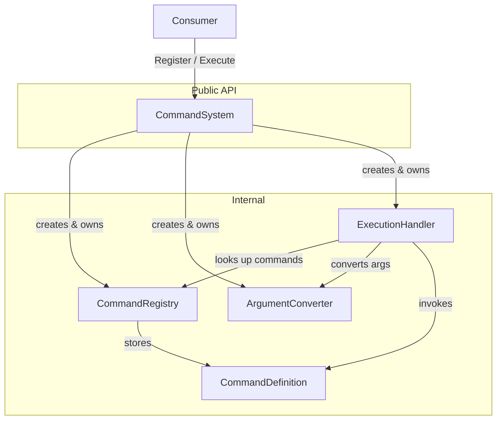
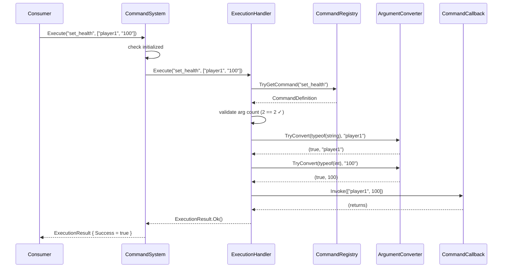

# Core Registration and Execution — Design

## Status

Draft

## Summary

This design establishes the foundational runtime of kmCommands: a lifecycle-gated entry point, an internal command registry, a typed argument converter, and a callback execution path. A consumer initializes the system, registers named commands with typed parameter signatures and callbacks, then executes commands by name with string arguments. The system converts arguments to declared types and invokes the callback, returning structured results for every outcome.

## Requirements Input

- Source: `.github/tasks/core-registration-execution/requirements.md`
- Key requirements carried into design:
  - Explicit `Initialize()` / `Shutdown()` lifecycle gating all operations.
  - Manual registration of commands (name + parameter signature + callback).
  - String-to-type argument conversion for `int`, `float`, `bool`, `string`.
  - Structured result types for registration and execution (no thrown exceptions on expected error paths).
  - Extensible converter design for future type support.
  - IL2CPP / AOT safe. No LINQ in runtime paths. Minimal allocations.

## Scope Notes

- **In scope:** Entry point, registry, manual registration, argument conversion, execution, result types, unit tests, test project setup.
- **Out of scope:** Attribute scanning, aliases, input parsing, chaining, metadata API, middleware, docs, Unity-specific code.

---

## Architecture Overview

```
┌─────────────────────────────────────────────────────┐
│                   Consumer Code                     │
│  (Unity layer or any .NET host)                     │
└─────────────┬───────────────────────────────────────┘
              │ public API
              ▼
┌─────────────────────────────────────────────────────┐
│              CommandSystem (public)                  │
│  - Initialize() / Shutdown()                        │
│  - Register(name, params, callback)                 │
│  - Execute(name, args)                              │
└──────┬──────────────┬───────────────┬───────────────┘
       │              │               │  internal
       ▼              ▼               ▼
┌────────────┐ ┌──────────────┐ ┌────────────────┐
│  Command   │ │  Argument    │ │  Execution     │
│  Registry  │ │  Converter   │ │  Handler       │
└────────────┘ └──────────────┘ └────────────────┘
```

All internal components are created and owned by `CommandSystem`. No static state. The consumer creates a `CommandSystem` instance, calls `Initialize()`, and owns the lifecycle.

---

## Data Flow / Control Flow

### Registration Flow

```
CommandSystem.Register(name, parameters, callback)
  │
  ├─ [gate] not initialized? → return RegistrationResult.Fail(NotInitialized)
  ├─ [validate] null/empty name? → return Fail(NullOrEmptyName)
  ├─ [validate] null parameters? → return Fail(NullParameters)
  ├─ [validate] null callback? → return Fail(NullCallback)
  ├─ [validate] any parameter type unsupported? → return Fail(UnsupportedParameterType)
  │
  ├─ create CommandDefinition(name, parameters, callback)
  │
  └─ CommandRegistry.TryRegister(definition)
       ├─ already exists? → return Fail(DuplicateCommandName)
       └─ added → return RegistrationResult.Ok()
```

### Execution Flow

```
CommandSystem.Execute(commandName, args)
  │
  ├─ [gate] not initialized? → return ExecutionResult.Fail(NotInitialized)
  │
  └─ ExecutionHandler.Execute(commandName, args)
       │
       ├─ [validate] null/empty name? → return Fail(NullOrEmptyCommandName)
       │
       ├─ CommandRegistry.TryGetCommand(name)
       │    └─ not found? → return Fail(CommandNotFound)
       │
       ├─ [validate] args.Length != definition.Parameters.Length?
       │    └─ mismatch → return Fail(ArgumentCountMismatch)
       │
       ├─ for each parameter:
       │    ArgumentConverter.TryConvert(paramType, args[i])
       │    └─ failed? → return Fail(ArgumentConversionFailed, "param 'X' at index N")
       │
       ├─ build object[] with converted values
       │
       ├─ try { definition.Callback.Invoke(convertedArgs) }
       │  catch (Exception ex) → return Fail(CallbackThrewException, ex)
       │
       └─ return ExecutionResult.Ok()
```

---

## Components and Responsibilities

### CommandSystem (`src/CommandSystem.cs`)

- **Responsibility:** Public entry point. Lifecycle management. Input validation at the API boundary. Delegates to internal components.
- **Namespace:** `kmCommands`
- **Visibility:** `public sealed class`
- **Interactions:** Creates and owns `CommandRegistry`, `ArgumentConverter`, `ExecutionHandler`. All three are nulled on `Shutdown()`.
- **Lifecycle:** `Initialize()` and `Shutdown()` are idempotent (calling Initialize when already initialized is a no-op; same for Shutdown when not initialized).

### CommandRegistry (`src/Core/CommandRegistry.cs`)

- **Responsibility:** Store and resolve `CommandDefinition` instances by name. Case-insensitive lookup.
- **Namespace:** `kmCommands.Core`
- **Visibility:** `internal sealed class`
- **Interactions:** Used by `CommandSystem` (registration) and `ExecutionHandler` (lookup).
- **Storage:** `Dictionary<string, CommandDefinition>` with `StringComparer.OrdinalIgnoreCase`.

### ArgumentConverter (`src/Core/ArgumentConverter.cs`)

- **Responsibility:** Convert a string token to a target `Type`. Ships with built-in converters for `int`, `float`, `bool`, `string`. Extensible via internal dictionary for future type support.
- **Namespace:** `kmCommands.Core`
- **Visibility:** `internal sealed class`
- **Interactions:** Used by `ExecutionHandler` during argument conversion.
- **Design note:** Uses a `Dictionary<Type, TryConvertFunc>` where `TryConvertFunc` is an internal delegate. No interfaces, no generics in the hot path.

### ExecutionHandler (`src/Core/ExecutionHandler.cs`)

- **Responsibility:** Orchestrate the execute path: lookup → validate arg count → convert args → invoke callback → return result.
- **Namespace:** `kmCommands.Core`
- **Visibility:** `internal sealed class`
- **Interactions:** Reads from `CommandRegistry`, uses `ArgumentConverter`, invokes `CommandCallback`.
- **Rationale for separate class:** Keeps `CommandSystem` thin. The execution path will grow when chaining, middleware, and other features land.

### CommandDefinition (`src/Core/CommandDefinition.cs`)

- **Responsibility:** Internal storage model for a registered command (name, parameter info array, callback delegate).
- **Namespace:** `kmCommands.Core`
- **Visibility:** `internal sealed class`

### CommandCallback (`src/CommandCallback.cs`)

- **Responsibility:** Public delegate type for command callbacks.
- **Namespace:** `kmCommands`
- **Visibility:** `public delegate`

### CommandParameterInfo (`src/CommandParameterInfo.cs`)

- **Responsibility:** Public data class describing a single command parameter (name + type). Passed by the consumer at registration time.
- **Namespace:** `kmCommands`
- **Visibility:** `public sealed class`

### RegistrationResult (`src/Results/RegistrationResult.cs`)

- **Responsibility:** Structured result for registration operations.
- **Namespace:** `kmCommands`
- **Visibility:** `public readonly struct` + `public enum RegistrationError`

### ExecutionResult (`src/Results/ExecutionResult.cs`)

- **Responsibility:** Structured result for execution operations.
- **Namespace:** `kmCommands`
- **Visibility:** `public readonly struct` + `public enum ExecutionError`

---

## Dependency Evaluation

- **New dependencies:** None for the core library.
- **Test project:** NUnit + NUnit3TestAdapter (standard .NET test framework, familiar to Unity developers).
- **Rationale:** The problem domain is simple enough that no external runtime dependencies are needed. The argument converter, registry, and execution handler are straightforward data structures and procedural logic.

---

## API / Contract Sketch

### Public Delegate

```csharp
namespace kmCommands
{
    /// <summary>
    /// Delegate invoked when a command is executed.
    /// Arguments are pre-converted to the types declared in the command's parameter signature.
    /// </summary>
    public delegate void CommandCallback(object[] args);
}
```

**Design rationale:** `object[]` is the only practical way to deliver heterogeneous typed arguments to a single delegate without runtime codegen. Boxing of value types (`int`, `float`, `bool`) is acceptable because command execution is triggered by human input, not per-frame. Future PRs may add generic convenience overloads (e.g., `Register<T1, T2>(...)`) that wrap into `CommandCallback` internally.

### Public Parameter Info

```csharp
namespace kmCommands
{
    /// <summary>
    /// Describes a single parameter in a command's signature.
    /// </summary>
    public sealed class CommandParameterInfo
    {
        /// <summary>Name of the parameter (used in error messages and future metadata).</summary>
        public string Name { get; }

        /// <summary>Expected type. Must be a type supported by the argument converter.</summary>
        public Type Type { get; }

        public CommandParameterInfo(string name, Type type)
        {
            Name = name ?? throw new ArgumentNullException(nameof(name));
            Type = type ?? throw new ArgumentNullException(nameof(type));
        }
    }
}
```

**Design rationale:** `class` rather than `struct` because it holds reference fields and is created once at registration time (no per-frame allocation concern). Constructor throws on null because passing null is a programming error, not a runtime condition.

### Public Entry Point

```csharp
namespace kmCommands
{
    /// <summary>
    /// Central entry point for the kmCommands system.
    /// Must be initialized before use.
    /// </summary>
    public sealed class CommandSystem
    {
        /// <summary>Whether the system has been initialized.</summary>
        public bool IsInitialized { get; }

        /// <summary>
        /// Initializes the command system. Idempotent — calling when already initialized is a no-op.
        /// </summary>
        public void Initialize();

        /// <summary>
        /// Shuts down the command system, clearing all registered commands. Idempotent.
        /// </summary>
        public void Shutdown();

        /// <summary>
        /// Registers a command with the given name, parameter signature, and callback.
        /// </summary>
        public RegistrationResult Register(
            string name,
            CommandParameterInfo[] parameters,
            CommandCallback callback);

        /// <summary>
        /// Executes a registered command by name with the given string arguments.
        /// Arguments are converted to the types declared in the command's parameter signature.
        /// </summary>
        public ExecutionResult Execute(
            string commandName,
            string[] args);
    }
}
```

### Public Result Types

```csharp
namespace kmCommands
{
    public enum RegistrationError
    {
        None = 0,
        NotInitialized,
        NullOrEmptyName,
        NullParameters,
        NullCallback,
        DuplicateCommandName,
        UnsupportedParameterType
    }

    /// <summary>Result of a command registration operation.</summary>
    public readonly struct RegistrationResult
    {
        public bool Success { get; }
        public RegistrationError Error { get; }
        public string ErrorMessage { get; }

        private RegistrationResult(bool success, RegistrationError error, string errorMessage)
        {
            Success = success;
            Error = error;
            ErrorMessage = errorMessage;
        }

        internal static RegistrationResult Ok()
            => new RegistrationResult(true, RegistrationError.None, null);

        internal static RegistrationResult Fail(RegistrationError error, string message)
            => new RegistrationResult(false, error, message);
    }
}
```

```csharp
namespace kmCommands
{
    public enum ExecutionError
    {
        None = 0,
        NotInitialized,
        NullOrEmptyCommandName,
        CommandNotFound,
        ArgumentCountMismatch,
        ArgumentConversionFailed,
        CallbackThrewException
    }

    /// <summary>Result of a command execution operation.</summary>
    public readonly struct ExecutionResult
    {
        public bool Success { get; }
        public ExecutionError Error { get; }
        public string ErrorMessage { get; }

        /// <summary>Non-null only when Error is CallbackThrewException.</summary>
        public Exception Exception { get; }

        private ExecutionResult(bool success, ExecutionError error, string errorMessage, Exception exception)
        {
            Success = success;
            Error = error;
            ErrorMessage = errorMessage;
            Exception = exception;
        }

        internal static ExecutionResult Ok()
            => new ExecutionResult(true, ExecutionError.None, null, null);

        internal static ExecutionResult Fail(ExecutionError error, string message, Exception exception = null)
            => new ExecutionResult(false, error, message, exception);
    }
}
```

**Design rationale for `readonly struct`:** Avoids heap allocation for result objects. Factory methods are `internal` so only library code creates results — consumers read them. This gives us freedom to change construction logic without breaking public API.

### Internal CommandDefinition

```csharp
namespace kmCommands.Core
{
    internal sealed class CommandDefinition
    {
        internal string Name { get; }
        internal CommandParameterInfo[] Parameters { get; }
        internal CommandCallback Callback { get; }

        internal CommandDefinition(string name, CommandParameterInfo[] parameters, CommandCallback callback)
        {
            Name = name;
            Parameters = parameters;
            Callback = callback;
        }
    }
}
```

### Internal CommandRegistry

```csharp
namespace kmCommands.Core
{
    internal sealed class CommandRegistry
    {
        private readonly Dictionary<string, CommandDefinition> _commands
            = new Dictionary<string, CommandDefinition>(StringComparer.OrdinalIgnoreCase);

        internal bool TryRegister(CommandDefinition definition)
        {
            if (_commands.ContainsKey(definition.Name))
                return false;

            _commands.Add(definition.Name, definition);
            return true;
        }

        internal bool TryGetCommand(string name, out CommandDefinition definition)
        {
            return _commands.TryGetValue(name, out definition);
        }

        internal void Clear()
        {
            _commands.Clear();
        }

        internal int Count => _commands.Count;
    }
}
```

**Design note:** `StringComparer.OrdinalIgnoreCase` makes commands case-insensitive (e.g., `"setHealth"` and `"SETHEALTH"` resolve to the same command).

### Internal ArgumentConverter

```csharp
namespace kmCommands.Core
{
    internal sealed class ArgumentConverter
    {
        internal delegate bool TryConvertFunc(string input, out object result);

        private readonly Dictionary<Type, TryConvertFunc> _converters;

        internal ArgumentConverter()
        {
            _converters = new Dictionary<Type, TryConvertFunc>(4)
            {
                { typeof(int), TryConvertInt },
                { typeof(float), TryConvertFloat },
                { typeof(bool), TryConvertBool },
                { typeof(string), TryConvertString }
            };
        }

        internal bool TryConvert(Type targetType, string input, out object result)
        {
            result = null;
            if (!_converters.TryGetValue(targetType, out var converter))
                return false;
            return converter(input, out result);
        }

        internal bool IsTypeSupported(Type type)
        {
            return _converters.ContainsKey(type);
        }

        private static bool TryConvertInt(string input, out object result)
        {
            if (int.TryParse(input, NumberStyles.Integer, CultureInfo.InvariantCulture, out int value))
            {
                result = value;
                return true;
            }
            result = null;
            return false;
        }

        private static bool TryConvertFloat(string input, out object result)
        {
            if (float.TryParse(input, NumberStyles.Float, CultureInfo.InvariantCulture, out float value))
            {
                result = value;
                return true;
            }
            result = null;
            return false;
        }

        private static bool TryConvertBool(string input, out object result)
        {
            // bool.TryParse handles "True"/"False" case-insensitively
            if (bool.TryParse(input, out bool value))
            {
                result = value;
                return true;
            }
            result = null;
            return false;
        }

        private static bool TryConvertString(string input, out object result)
        {
            result = input;
            return true;
        }
    }
}
```

**Key decisions:**

- `CultureInfo.InvariantCulture` for numeric parsing prevents locale-dependent decimal separator issues.
- `Dictionary<Type, TryConvertFunc>` allows future extension (add entries for `double`, `long`, `enum`, custom types) without structural changes.
- Static converter methods avoid closure allocations.
- `bool.TryParse` is strict: only `"True"` / `"False"` (case-insensitive). If broader support is needed (e.g., `"1"` / `"0"`, `"yes"` / `"no"`), the converter can be swapped later without API changes.

### Internal ExecutionHandler

```csharp
namespace kmCommands.Core
{
    internal sealed class ExecutionHandler
    {
        private readonly CommandRegistry _registry;
        private readonly ArgumentConverter _converter;

        internal ExecutionHandler(CommandRegistry registry, ArgumentConverter converter)
        {
            _registry = registry;
            _converter = converter;
        }

        internal ExecutionResult Execute(string commandName, string[] args)
        {
            if (string.IsNullOrEmpty(commandName))
                return ExecutionResult.Fail(ExecutionError.NullOrEmptyCommandName,
                    "Command name is null or empty.");

            if (!_registry.TryGetCommand(commandName, out var definition))
                return ExecutionResult.Fail(ExecutionError.CommandNotFound,
                    string.Format("Command '{0}' not found.", commandName));

            int expectedCount = definition.Parameters.Length;
            int actualCount = args != null ? args.Length : 0;

            if (actualCount != expectedCount)
                return ExecutionResult.Fail(ExecutionError.ArgumentCountMismatch,
                    string.Format("Command '{0}' expects {1} argument(s) but received {2}.",
                        commandName, expectedCount, actualCount));

            object[] convertedArgs = expectedCount > 0 ? new object[expectedCount] : System.Array.Empty<object>();

            for (int i = 0; i < expectedCount; i++)
            {
                var param = definition.Parameters[i];
                if (!_converter.TryConvert(param.Type, args[i], out var converted))
                    return ExecutionResult.Fail(ExecutionError.ArgumentConversionFailed,
                        string.Format("Failed to convert argument '{0}' at index {1}: " +
                            "cannot convert '{2}' to {3}.",
                            param.Name, i, args[i], param.Type.Name));

                convertedArgs[i] = converted;
            }

            try
            {
                definition.Callback(convertedArgs);
            }
            catch (System.Exception ex)
            {
                return ExecutionResult.Fail(ExecutionError.CallbackThrewException,
                    string.Format("Command '{0}' callback threw an exception: {1}",
                        commandName, ex.Message),
                    ex);
            }

            return ExecutionResult.Ok();
        }
    }
}
```

**Allocation note:** The per-execute `object[]` allocation is unavoidable given the `CommandCallback(object[])` signature. For zero-parameter commands, `Array.Empty<object>()` avoids allocation. Boxing of value types is inherent to the `object[]` approach and acceptable for human-input-frequency invocation.

---

## File Structure

```
src/
  CommandSystem.cs                         kmCommands          public
  CommandCallback.cs                       kmCommands          public
  CommandParameterInfo.cs                  kmCommands          public
  Results/
    RegistrationResult.cs                  kmCommands          public (struct + enum)
    ExecutionResult.cs                     kmCommands          public (struct + enum)
  Core/
    CommandDefinition.cs                   kmCommands.Core     internal
    CommandRegistry.cs                     kmCommands.Core     internal
    ArgumentConverter.cs                   kmCommands.Core     internal
    ExecutionHandler.cs                    kmCommands.Core     internal

tests/
  kmCommands.Tests/
    kmCommands.Tests.csproj
    CommandSystemLifecycleTests.cs
    CommandRegistrationTests.cs
    CommandExecutionTests.cs
    ArgumentConverterTests.cs
```

All public types live in the `kmCommands` namespace. Internal types live in `kmCommands.Core`. Folder structure mirrors logical grouping but namespaces stay flat within each layer.

---

## Test Project Setup

A new test project is needed:

- **Path:** `tests/kmCommands.Tests/kmCommands.Tests.csproj`
- **Framework:** `net6.0` (or `net8.0`) — tests don't need to target `netstandard2.0`
- **Dependencies:** NUnit, NUnit3TestAdapter, Microsoft.NET.Test.Sdk
- **Project reference:** `../../kmCommands.csproj`
- **InternalsVisibleTo:** Add `[assembly: InternalsVisibleTo("kmCommands.Tests")]` to the main project (in a `Properties/AssemblyInfo.cs` or directly in `CommandSystem.cs` — prefer a dedicated `AssemblyInfo.cs` under `src/Properties/`).

The test project must also be added to `kmCommands.sln`.

---

## Implementation Notes

### Lifecycle Idempotency

`Initialize()` when already initialized is a silent no-op. `Shutdown()` when not initialized is a silent no-op. This prevents consumers from needing to track state themselves and is domain-reload safe (Unity editor re-enters play mode).

### No Thread Safety

This system is not thread-safe. Command systems in Unity are typically used on the main thread only. Document this in XML docs on `CommandSystem`. Thread safety can be added later if needed without changing public API.

### Command Name Normalization

Command names are stored as provided but looked up case-insensitively via `StringComparer.OrdinalIgnoreCase`. The stored name preserves the casing from registration (useful for future metadata/display).

### Error Message Formatting

Use `string.Format` (not string interpolation or LINQ) for error messages. Error messages are only constructed on failure paths, so the allocation is acceptable.

### Using Directives

The `System.Globalization` namespace is needed for `CultureInfo.InvariantCulture` and `NumberStyles` in `ArgumentConverter`. Verify this is available in `netstandard2.0` (it is — `System.Globalization` is part of `netstandard2.0`).

### Source File Header

Every `.cs` file under `src/` must start with:

```csharp
// kmCommands (https://github.com/KMiseckas/kmCommands)
// Copyright (c) 2026 Klaudijus Miseckas
// Licensed under the Apache License, Version 2.0
// See LICENSE file in the project root for full license information.
```

---

## Code Examples

### Consumer Usage — Registration and Execution

```csharp
var system = new CommandSystem();
system.Initialize();

// Register a command with two parameters
var result = system.Register(
    "set_health",
    new[]
    {
        new CommandParameterInfo("target", typeof(string)),
        new CommandParameterInfo("value", typeof(int))
    },
    (args) =>
    {
        string target = (string)args[0];
        int value = (int)args[1];
        // Unity layer applies the health change
    });

if (!result.Success)
{
    // Handle registration error: result.Error, result.ErrorMessage
}

// Later, when user types a command:
var execResult = system.Execute("set_health", new[] { "player1", "100" });

if (execResult.Success)
{
    // Callback was invoked with ("player1", 100)
}
else
{
    // execResult.Error tells you what went wrong
    // execResult.ErrorMessage has a human-readable description
}

// Cleanup
system.Shutdown();
```

### Consumer Usage — Zero-Argument Command

```csharp
system.Register(
    "quit",
    System.Array.Empty<CommandParameterInfo>(),
    (args) =>
    {
        // No arguments — args is empty array
        Application.Quit();
    });

system.Execute("quit", System.Array.Empty<string>());
// or: system.Execute("quit", null);  ← null args treated as empty
```

### Error Handling — All Paths

```csharp
// Before init
var r = system.Register("foo", params, cb);
// r.Success == false, r.Error == RegistrationError.NotInitialized

// Duplicate name
system.Register("foo", params, cb); // succeeds
system.Register("foo", params, cb); // fails: DuplicateCommandName

// Unknown command
var e = system.Execute("nonexistent", args);
// e.Error == ExecutionError.CommandNotFound

// Wrong arg count
var e2 = system.Execute("set_health", new[] { "only_one" });
// e2.Error == ExecutionError.ArgumentCountMismatch

// Bad type
var e3 = system.Execute("set_health", new[] { "player1", "not_a_number" });
// e3.Error == ExecutionError.ArgumentConversionFailed

// Callback throws
system.Register("boom", Array.Empty<CommandParameterInfo>(),
    (args) => { throw new InvalidOperationException("oops"); });
var e4 = system.Execute("boom", null);
// e4.Error == ExecutionError.CallbackThrewException
// e4.Exception is the InvalidOperationException
```

---

## Diagram





---

## Testing Strategy

### Unit Tests — Required

All tests use NUnit. Internal types are accessible via `InternalsVisibleTo`.

| Test Class                    | Covers                                 | Key Cases                                                                                                                                                                                                                                              |
| ----------------------------- | -------------------------------------- | ------------------------------------------------------------------------------------------------------------------------------------------------------------------------------------------------------------------------------------------------------ |
| `CommandSystemLifecycleTests` | Initialize/Shutdown behavior           | Init makes IsInitialized true; Shutdown resets; double-init is no-op; double-shutdown is no-op; re-init after shutdown works; operations before init return NotInitialized                                                                             |
| `CommandRegistrationTests`    | Registration via CommandSystem         | Successful registration; duplicate name fails; null/empty name fails; null params fails; null callback fails; unsupported parameter type fails                                                                                                         |
| `CommandExecutionTests`       | End-to-end execution via CommandSystem | Successful execution with typed args; zero-arg command; callback receives correctly typed values; command not found; arg count mismatch; type conversion failure; callback exception caught; null args treated as empty; case-insensitive command name |
| `ArgumentConverterTests`      | ArgumentConverter directly             | int parse success/failure; float parse success/failure (including decimal); bool parse success/failure; string always succeeds; unsupported type returns false; InvariantCulture: float parses "1.5" regardless of thread culture                      |

### Integration Tests

Not needed for this PR — the unit tests through `CommandSystem` already exercise the full registration-to-execution path.

### Manual Verification

Not required — all behavior is deterministic and covered by automated tests.

---

## Risks and Tradeoffs

| Risk / Tradeoff                                             | Mitigation                                                                                                                                               |
| ----------------------------------------------------------- | -------------------------------------------------------------------------------------------------------------------------------------------------------- |
| **Boxing in `object[]`** for value-type arguments           | Acceptable: command execution is human-input frequency, not per-frame. Future PR can add generic overloads for common arities.                           |
| **Per-execute `object[]` allocation**                       | `Array.Empty<object>()` for zero-arg commands. For N>0, allocation is unavoidable with current delegate signature. Acceptable for same frequency reason. |
| **No thread safety**                                        | Documented. Unity main-thread usage is the target. Can be added later without public API change.                                                         |
| **`bool.TryParse` only accepts `True`/`False`**             | Strictness is fine for initial release. Converter can be extended later to accept `1`/`0`, `yes`/`no` without breaking changes.                          |
| **Case-insensitive names mean `"Foo"` and `"foo"` collide** | This is intentional for command-console UX. Stored name preserves original casing.                                                                       |

---

## Open Questions

- **`null` args vs empty array semantics:** Current design treats `null` as equivalent to an empty array. Confirm this is acceptable.
  - **Current assumption:** Yes, treat null as empty. Documented in API docs.

All other open questions from requirements are resolved in this design:

- `Shutdown()` clears all state (resolved: yes).
- Individual `Unregister` deferred (resolved: yes, tracked in PLANNED.md).
- Callback delegate shape (resolved: `CommandCallback` = `delegate void CommandCallback(object[] args)`).

---

## Task Planning Handoff

### Suggested Implementation Slices

1. **Project scaffolding:** Create `src/Properties/AssemblyInfo.cs` with `InternalsVisibleTo`. Create `tests/kmCommands.Tests/` project with NUnit. Add test project to solution. Verify build.
2. **Result types and enums:** `RegistrationResult`, `RegistrationError`, `ExecutionResult`, `ExecutionError`, `CommandCallback`, `CommandParameterInfo`. These have no dependencies on other new code.
3. **Internal components:** `CommandDefinition`, `CommandRegistry`, `ArgumentConverter`. Testable independently.
4. **ExecutionHandler:** Depends on registry + converter. Testable via internal access.
5. **CommandSystem:** Wires everything together. Public API surface.
6. **Tests:** Lifecycle, registration, execution, argument conversion tests.

### Coupling Notes

- Slices 1–2 are independent.
- Slice 3 depends on slice 2 (uses `CommandParameterInfo`, `CommandCallback`).
- Slice 4 depends on slices 2–3.
- Slice 5 depends on slices 2–4.
- Slice 6 can be written incrementally alongside slices 3–5.

### Post-Integration Validation

- Full test suite passes.
- Build succeeds targeting `netstandard2.0`.
- No LINQ usage in `src/`.
- No `UnityEngine` references in `src/`.
- All public types have XML docs.
- All source files have required license header.

---

## Final Review Contract

### Critical Behaviors to Verify

- [ ] `CommandSystem` gates all operations behind `Initialize()`.
- [ ] `Initialize()` and `Shutdown()` are idempotent.
- [ ] `Shutdown()` clears all registered commands; system can be re-initialized.
- [ ] Registration validates all inputs and returns specific `RegistrationError` values.
- [ ] Duplicate command names fail registration.
- [ ] Execution converts each string argument to the declared parameter type.
- [ ] `int`, `float`, `bool`, `string` conversions work correctly.
- [ ] `float` uses `InvariantCulture` (parses `"1.5"` correctly regardless of thread culture).
- [ ] Argument count mismatch returns structured error.
- [ ] Type conversion failure returns structured error identifying the failing parameter.
- [ ] Callback exceptions are caught and returned in `ExecutionResult`.
- [ ] Command name lookup is case-insensitive.
- [ ] `null` args treated as empty array.

### Design Invariants

- No public type outside `kmCommands` namespace.
- No `internal` type visible to consumers.
- No LINQ in any `src/` file.
- No reference to `UnityEngine` in any `src/` file.
- All `src/` files carry the required license header.
- `readonly struct` used for result types (no heap allocation).
- Static factory methods on results are `internal`.

### Required Test Evidence

- All test cases from the Testing Strategy table pass.
- Test project builds and runs via `dotnet test`.

### Known Acceptable Deviations

- None for this PR.

### Blocking Conditions

- Any public API shape change from this design requires design document update before merge.
- Any test failure blocks merge.
- Missing license headers block merge.
