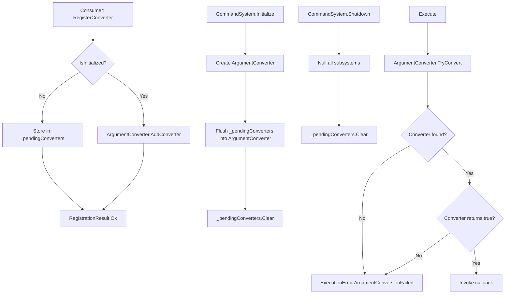

# Custom Type Converters

## Status

Draft

## Summary

Extends the argument-parsing pipeline so consumers can register their own string-to-type converters
for any `System.Type` beyond the four built-in primitives (`int`, `float`, `bool`, `string`).
Custom converters are registered on `CommandSystem` via a new `RegisterConverter` method, integrate
transparently into the existing `Execute()` path, and follow the same lifecycle rules as the rest of
the system (`Initialize()` / `Shutdown()`).

## Requirements Input

- Source: `.github/tasks/custom-type-converters/requirements.md`
- Key requirements carried into design:
  - Public `RegisterConverter(Type, TypeConverterDelegate)` → `RegistrationResult` on `CommandSystem`.
  - Named public delegate `TypeConverterDelegate` matching the existing internal `TryConvertFunc` contract.
  - Custom converter registered for an already-supported type replaces the prior converter (last-write wins).
  - `null` type or `null` delegate → immediate `RegistrationResult.Fail`; no state mutation.
  - Converters registered before `Initialize()` survive `Initialize()`.
  - `Shutdown()` clears all custom converters.
  - Commands with unsupported parameter types continue to be rejected at registration.
  - Failed conversion during `Execute()` → `ExecutionError.ArgumentConversionFailed` (no new error values).
  - No allocations on the hot execute path beyond existing baseline.
  - Registration API must be safe against data-races with concurrent `Execute()`.

## Scope Notes

- In scope:
  - New public delegate `TypeConverterDelegate` in `kmCommands` namespace.
  - New `RegisterConverter(Type, TypeConverterDelegate)` method on `CommandSystem`.
  - `ArgumentConverter` extended to accept externally supplied converter entries.
  - Pre-`Initialize()` converter buffer on `CommandSystem`.
  - `Shutdown()` clearing the custom-converter set.
  - Unit tests in `kmCommands.Tests`.
- Out of scope:
  - Generics, arrays, or collection converters.
  - Per-command converter overrides.
  - Removing a previously registered converter.
  - Async converters.
  - Converter priority beyond last-write-wins.
  - `CommandMetadataSnapshot` / discovery API changes.
  - Unity-specific converters or UI.

## Architecture Overview

The change touches three components:

1. **New public file `TypeConverterDelegate.cs`** — declares the named public delegate.
2. **`CommandSystem`** — adds `RegisterConverter`, pre-init buffer, and wires custom converters into
   `ArgumentConverter` at `Initialize()` and on live registration. Clears the buffer on `Shutdown()`.
3. **`ArgumentConverter`** — gains an `AddConverter` method that inserts or replaces an entry in the
   internal `_converters` dictionary. The rest of the runtime path is unchanged.

No new error enum values are needed. `RegistrationError.NullParameters` (for null `type`) and a new
`RegistrationError.NullConverter` value cover null-input rejection at registration time. The new
`NullConverter` value does not affect existing code because the enum is additive.

> **`RegistrationError.NullConverter`** is the only new enum value introduced. All other enum
> members — including `ExecutionError` — are unchanged.

## Data Flow / Control Flow

### Pre-`Initialize()` registration

```
Consumer: system.RegisterConverter(typeof(Vector3), myDelegate)
  → CommandSystem: IsInitialized == false
      → validate (null checks)
      → store in _pendingConverters Dictionary<Type, TypeConverterDelegate>
      → return RegistrationResult.Ok()
```

### `Initialize()`

```
CommandSystem.Initialize()
  → create _registry, _converter (ArgumentConverter), _executionHandler, _attributeScanner
  → foreach entry in _pendingConverters:
      _converter.AddConverter(entry.Key, entry.Value)   // adapts delegate before adding
  → _pendingConverters.Clear()
  → IsInitialized = true
```

### Post-`Initialize()` registration

```
Consumer: system.RegisterConverter(typeof(Vector3), myDelegate)
  → CommandSystem: IsInitialized == true
      → validate (null checks)
      → _converter.AddConverter(typeof(Vector3), adapted delegate)
      → return RegistrationResult.Ok()
```

### `Execute()` (hot path — unchanged flow)

```
ExecutionHandler.Execute(name, args)
  → ArgumentConverter.TryConvert(targetType, token, out object)
      → _converters.TryGetValue(targetType, out TryConvertFunc fn)
      → fn(token, out result)   ← custom or built-in, same code path
  → on false: return ExecutionResult.Fail(ExecutionError.ArgumentConversionFailed, …)
```

### `Shutdown()`

```
CommandSystem.Shutdown()
  → _registry = null
  → _converter = null          ← drops all converter entries (custom + built-in)
  → _executionHandler = null
  → _attributeScanner = null
  → _pendingConverters.Clear() ← requirement: reverts to built-in-only after shutdown
  → IsInitialized = false
```

## Components and Responsibilities

### `TypeConverterDelegate` (new file `src/TypeConverterDelegate.cs`)

- **Responsibility:** Public named delegate type that consumers use to supply custom converters.  
  Signature mirrors the internal `ArgumentConverter.TryConvertFunc` to allow zero-cost adaptation.
- **Interactions:** Accepted by `CommandSystem.RegisterConverter`; adapted to `TryConvertFunc` before
  storage in `ArgumentConverter`.

### `CommandSystem` (modified)

- **Responsibility:** Owns the pre-init buffer `_pendingConverters`; validates inputs to
  `RegisterConverter`; flushes buffer into `ArgumentConverter` at `Initialize()`; clears buffer at
  `Shutdown()`.
- **New field:** `private Dictionary<Type, TypeConverterDelegate> _pendingConverters`  
  — initialized at declaration time (survives `Initialize()` / `Shutdown()` cycles).
- **New method:** `RegisterConverter(Type, TypeConverterDelegate) → RegistrationResult`

### `ArgumentConverter` (modified)

- **Responsibility:** Stores and executes all converters (built-in + custom). Exposes one new
  internal method `AddConverter(Type, TryConvertFunc)` that inserts or replaces an entry in the
  existing `_converters` dictionary.
- **No changes to `TryConvert` or `IsTypeSupported`** — all callers continue to work identically.

### `RegistrationError` (modified — additive)

- **Responsibility:** Add `NullConverter` enum value for null-delegate rejection.
- Breaking change risk: None — additive enum extension.

## Dependency Evaluation

- New dependencies: **None**
- Rationale: The existing `Dictionary<Type, TryConvertFunc>` mechanism in `ArgumentConverter` is
  already the right abstraction. This feature only extends population of that dictionary.
- Alternatives considered: A separate `ITypeConverter` interface was considered; rejected because
  an interface requires an allocation-bearing wrapper object per registration and adds interface
  dispatch overhead with no benefit over a direct delegate.

## API / Contract Sketch

### `TypeConverterDelegate.cs`

```csharp
// kmCommands (https://github.com/KMiseckas/kmCommands)
// Copyright (c) 2026 Klaudijus Miseckas
// Licensed under the Apache License, Version 2.0
// See LICENSE file in the project root for full license information.

namespace kmCommands
{
    /// <summary>
    /// Represents a method that attempts to convert a string token to an object of a specific type.
    /// </summary>
    /// <param name="input">The raw string token to convert.</param>
    /// <param name="result">
    /// When this method returns <c>true</c>, contains the converted value; otherwise <c>null</c>.
    /// </param>
    /// <returns><c>true</c> if conversion succeeded; <c>false</c> otherwise.</returns>
    public delegate bool TypeConverterDelegate(string input, out object result);
}
```

### `CommandSystem.RegisterConverter` (new method)

```csharp
/// <summary>
/// Registers a custom type converter for the specified type.
/// If a converter for <paramref name="type"/> is already registered (built-in or custom),
/// the new converter replaces it.
/// </summary>
/// <param name="type">
/// The <see cref="System.Type"/> that this converter handles. Must not be <c>null</c>.
/// </param>
/// <param name="converter">
/// The converter delegate. Must not be <c>null</c>.
/// </param>
/// <returns>
/// A <see cref="RegistrationResult"/> indicating success or the specific failure reason.
/// Returns failure with <see cref="RegistrationError.NullParameters"/> when
/// <paramref name="type"/> is <c>null</c>, or <see cref="RegistrationError.NullConverter"/>
/// when <paramref name="converter"/> is <c>null</c>.
/// </returns>
public RegistrationResult RegisterConverter(Type type, TypeConverterDelegate converter)
```

### `RegistrationError` — new value

```csharp
/// <summary>The provided converter delegate was null.</summary>
NullConverter,
```

### `ArgumentConverter.AddConverter` (new internal method)

```csharp
/// <summary>
/// Adds or replaces the converter for the given type.
/// </summary>
internal void AddConverter(Type type, TryConvertFunc converter)
{
    _converters[type] = converter;
}
```

## Implementation Notes

### Delegate adaptation

`TypeConverterDelegate` and `ArgumentConverter.TryConvertFunc` have identical signatures. To avoid
an allocation-bearing lambda wrapper on every `AddConverter` call, adapt them once at registration
time using an explicit cast or `Delegate.CreateDelegate`-style reuse:

```csharp
// Inside CommandSystem — adapts TypeConverterDelegate to internal TryConvertFunc:
private static ArgumentConverter.TryConvertFunc AdaptConverter(TypeConverterDelegate d)
{
    // Both delegates share the same signature; a direct cast is safe and AOT-compatible.
    return (ArgumentConverter.TryConvertFunc)(object)d;
    // If the direct cast is rejected by the runtime, use a thin wrapper (single allocation,
    // occurs only at registration time, not at execute time):
    // return (string input, out object result) => d(input, out result);
}
```

> **Implementation note:** The direct cast `(TryConvertFunc)(object)d` works when both delegate
> types have the same signature in the same assembly. Because `TypeConverterDelegate` is in
> `kmCommands` and `TryConvertFunc` is `internal` in `kmCommands.Core`, and both use identical
> managed signatures, a thin lambda wrapper is the safest, most explicit option. The wrapper is
> allocated once at registration time, not during `Execute()` — this is acceptable.

### Pre-`Initialize()` buffer

`_pendingConverters` is a `Dictionary<Type, TypeConverterDelegate>` field initialized at
declaration (`= new Dictionary<Type, TypeConverterDelegate>()`). It is never set to `null` by
`Initialize()` or `Shutdown()` — only `.Clear()` is called on `Shutdown()`. This ensures
converters registered before `Initialize()` survive the call, and re-registration after
`Shutdown()` and before the next `Initialize()` works correctly.

### Thread-safety scope

The requirements state the design must not create a data-race on the converter store during an
active `Execute()` call. The existing `CommandSystem` XML doc explicitly documents single-threaded
use ("All calls must be made from the same thread"). Therefore:

- No lock is introduced — the caller contract already prohibits concurrent API use.
- The design document acknowledges this explicitly so `taskReviewer` can confirm the requirement
  is satisfied by caller contract rather than by internal synchronization.

### `Shutdown()` change

`Shutdown()` adds one line after the existing null assignments:

```csharp
_pendingConverters.Clear();
```

`_converter = null` already drops the `ArgumentConverter` instance (which owns the runtime
converter dictionary), so no further cleanup is needed for live converters.

### `Register()` interaction

The existing `Register()` method calls `_converter.IsTypeSupported(parameters[i].Type)` to reject
unsupported parameter types. Because `ArgumentConverter.AddConverter` writes into the same
`_converters` dictionary that `IsTypeSupported` reads from, a custom converter registered before
`Register()` is called will correctly make that type "known". No changes to `Register()` are
required.

## Code Examples

### Consumer usage (for test reference)

```csharp
// Custom type
struct Vector2 { public float X; public float Y; }

// Converter: "1.0,2.0" → Vector2
bool TryParseVector2(string input, out object result)
{
    string[] parts = input.Split(',');
    if (parts.Length == 2
        && float.TryParse(parts[0], System.Globalization.NumberStyles.Float,
                          System.Globalization.CultureInfo.InvariantCulture, out float x)
        && float.TryParse(parts[1], System.Globalization.NumberStyles.Float,
                          System.Globalization.CultureInfo.InvariantCulture, out float y))
    {
        result = new Vector2 { X = x, Y = y };
        return true;
    }
    result = null;
    return false;
}

// Registration
RegistrationResult cr = system.RegisterConverter(typeof(Vector2), TryParseVector2);
Assert.IsTrue(cr.Success);

// Command registration now accepts Vector2 parameters
var param = new CommandParameterInfo("pos", typeof(Vector2));
RegistrationResult rr = system.Register("setpos", new[] { param }, args =>
{
    var v = (Vector2)args[0];
    // ...
});
Assert.IsTrue(rr.Success);

// Execution
ExecutionResult er = system.Execute("setpos", new[] { "3.0,4.0" });
Assert.IsTrue(er.Success);
```

### Override built-in converter

```csharp
// Replace int converter with one that also accepts hex
RegistrationResult cr = system.RegisterConverter(typeof(int), (string input, out object result) =>
{
    if (input.StartsWith("0x") &&
        int.TryParse(input.Substring(2),
                     System.Globalization.NumberStyles.HexNumber,
                     System.Globalization.CultureInfo.InvariantCulture, out int hex))
    {
        result = hex;
        return true;
    }
    if (int.TryParse(input, System.Globalization.NumberStyles.Integer,
                     System.Globalization.CultureInfo.InvariantCulture, out int dec))
    {
        result = dec;
        return true;
    }
    result = null;
    return false;
});
Assert.IsTrue(cr.Success);
```

## Diagram



## Testing Strategy

All tests go in the existing `kmCommands.Tests` NUnit project (`net8.0`). A new file
`CustomTypeConverterTests.cs` covers this feature.

### Unit tests required (mapped to acceptance criteria)

| Test | What it verifies |
|---|---|
| `RegisterConverter_CustomType_AllowsCommandWithThatType` | Custom type + command + execute succeeds end-to-end |
| `RegisterConverter_NullType_ReturnsFailure` | Null `type` → `RegistrationError.NullParameters`, no state change |
| `RegisterConverter_NullDelegate_ReturnsFailure` | Null `converter` → `RegistrationError.NullConverter`, no state change |
| `RegisterConverter_OverridesBuiltIn_UsesNewConverter` | Replacing built-in `int` converter changes conversion behavior |
| `RegisterConverter_BeforeInitialize_SurvivesInitialize` | Converter registered pre-`Initialize()` still works post |
| `Shutdown_ClearsCustomConverters` | After `Shutdown()` + `Initialize()`, custom converter from prior session is gone |
| `Register_WithNoConverter_RejectsCommand` | Command with unknown-type parameter → `RegistrationError.UnsupportedParameterType` |
| `Execute_FailingCustomConverter_ReturnsConversionFailed` | Custom converter returning `false` → `ExecutionError.ArgumentConversionFailed` |
| `RegisterConverter_PreInit_MultipleConverters_AllFlushed` | Multiple pre-init converters all survive `Initialize()` |
| `RegisterConverter_PreInit_Override_LastWriteWins` | Duplicate type in pre-init buffer is replaced at flush |
| Existing test suite | No regressions in all 103 existing tests |

## Risks and Tradeoffs

| Risk | Mitigation |
|---|---|
| Direct delegate cast between `TypeConverterDelegate` and `TryConvertFunc` may not compile | Use thin lambda wrapper (one allocation at registration time; zero impact on hot path) |
| Consumer registers a converter that allocates heavily | Out of scope; documented as caller responsibility |
| `_pendingConverters` grows unbounded if consumer calls `RegisterConverter` many times pre-init | Acceptable; registration is a startup-time operation |
| Enum extension (`NullConverter`) breaks switch exhaustiveness in consuming code | Additive only; no existing switch statements in library enumerate `RegistrationError` |

## Open Questions

None — requirements are sufficiently defined.

## Task Planning Handoff

### Suggested implementation slices (commit-aligned)

1. **Add `TypeConverterDelegate` and `RegistrationError.NullConverter`**  
   — New file `src/TypeConverterDelegate.cs`, add `NullConverter` to `RegistrationResult.cs`.  
   — No behavior change; purely additive.

2. **Extend `ArgumentConverter` with `AddConverter`**  
   — Single new internal method on `ArgumentConverter`.  
   — Covered by new unit tests for converter override behavior.

3. **Add `RegisterConverter` to `CommandSystem` with pre-init buffer**  
   — New field `_pendingConverters`, new method `RegisterConverter`, flush in `Initialize()`,
     clear in `Shutdown()`.  
   — Covered by new unit tests for lifecycle, null-input rejection, and pre-init survival.

4. **Unit tests (`CustomTypeConverterTests.cs`)**  
   — All tests from the table above.  
   — Run full test suite; confirm 103 + new tests pass, no regressions.

### Coupling notes

- Slice 2 depends on slice 1 (uses `TryConvertFunc` which is internal; no public type introduced).
- Slice 3 depends on slice 2 (`ArgumentConverter.AddConverter` must exist before `RegisterConverter` calls it).
- Slice 4 can begin test stubs in parallel with slice 2.

### Areas to validate after full integration

- Pre-`Initialize()` registration + flush ordering (verify dict contents after `Initialize()`).
- Override of built-in type does not regress existing command execution.
- `Shutdown()` + re-`Initialize()` cycle with converters registered at both points.

---

## Final Review Contract

### Critical behaviors to verify

1. `RegisterConverter(null, delegate)` returns `RegistrationResult.Fail` with `RegistrationError.NullParameters`; no internal state mutations.
2. `RegisterConverter(type, null)` returns `RegistrationResult.Fail` with `RegistrationError.NullConverter`; no internal state mutations.
3. A converter registered for `typeof(int)` replaces the built-in int converter — subsequent `Execute()` for an int command uses the custom converter.
4. A converter registered before `Initialize()` is active after `Initialize()` and functions correctly during `Execute()`.
5. After `Shutdown()` and re-`Initialize()`, converters registered before `Shutdown()` are not present.
6. `Register()` for a command whose parameter type has a registered custom converter succeeds; without a converter it returns `RegistrationError.UnsupportedParameterType`.
7. `Execute()` with a custom converter that returns `false` returns `ExecutionResult` with `ExecutionError.ArgumentConversionFailed`.
8. No allocations are introduced in `ArgumentConverter.TryConvert` beyond what existed before this feature.

### Design invariants that must hold

- `_converters` in `ArgumentConverter` is the single source of truth for all type support (built-in + custom).
- `_pendingConverters` is never `null`; it is cleared (not replaced) by `Shutdown()`.
- `TypeConverterDelegate` is public and named; no anonymous-method-only usage required by consumers.
- `RegistrationError.NullConverter` is the only new enum value; `ExecutionError` is unchanged.

### Required test evidence for acceptance

- All tests in `CustomTypeConverterTests.cs` pass (covering the 11 cases in the testing table).
- Full `kmCommands.Tests` suite passes with no regressions (103 existing + new tests).

### Known acceptable deviations

- Thread safety is satisfied by caller contract (single-threaded use), not by internal locking. The existing XML doc on `CommandSystem` documents this. No internal `lock` is required.

### Blocking conditions for final approval

- Any regression in existing tests.
- Missing test for null-type or null-delegate rejection.
- Missing test for lifecycle (pre-init survival, shutdown clearing).
- `TypeConverterDelegate` not declared as a named public delegate (anonymous lambda-only API would violate requirement 3).
- Any new allocation introduced in `ArgumentConverter.TryConvert` on the hot path.
