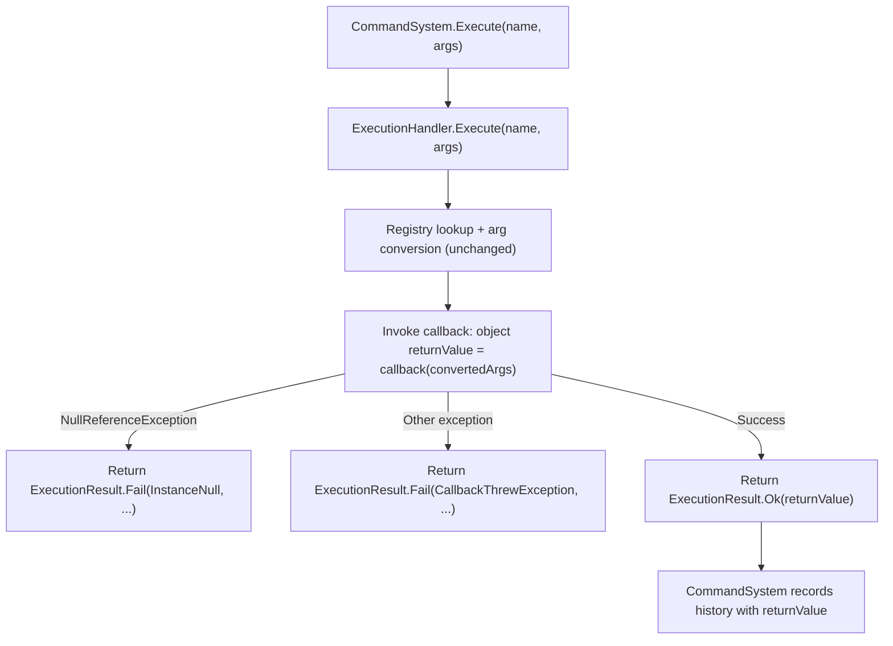
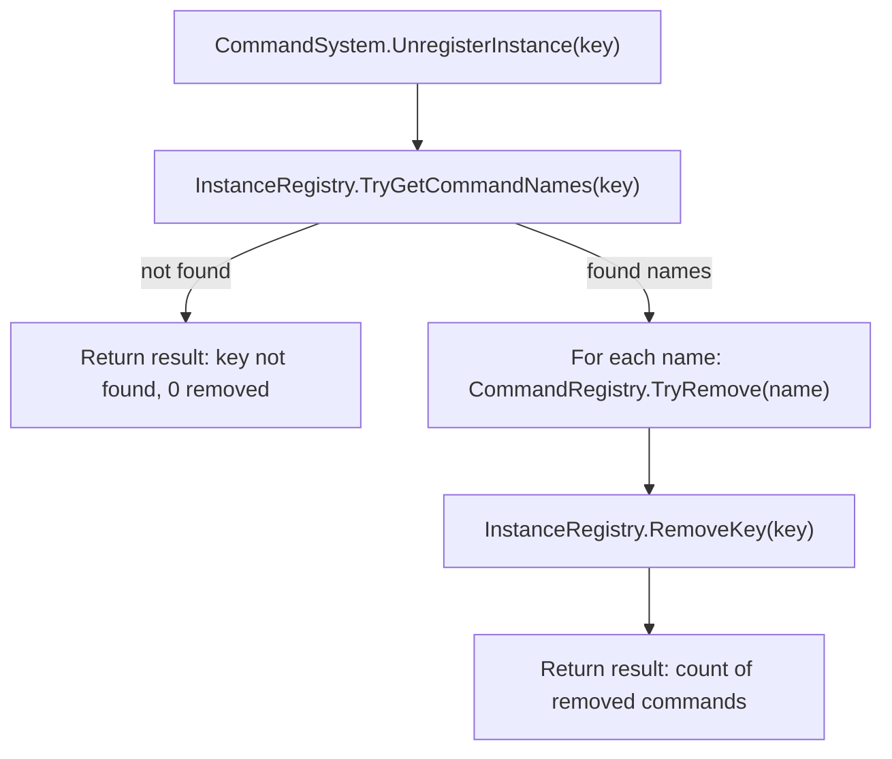
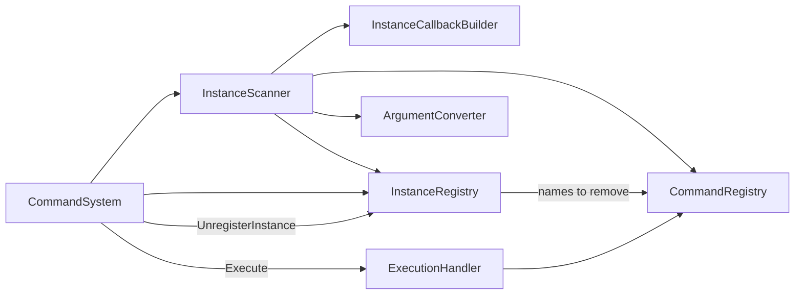

# Instance Command Registration — Design

## Status

Draft

## Summary

This design extends kmCommands with instance-bound command registration. A consumer calls `RegisterInstance(target, "player")` and the library automatically discovers public methods and properties on the target's type, builds AOT-safe callbacks bound to that instance, and registers them under `player.<commandName>` in the existing `CommandRegistry`. A matching `UnregisterInstance("player")` atomically removes all associated commands.

The design also introduces **return value support** system-wide: a new `CommandCallbackWithReturn` delegate replaces the void-only `CommandCallback`, `ExecutionResult` gains a `ReturnValue` property, and `CommandHistoryEntry` captures return values.

## Requirements Input

- Source: `.github/tasks/instance-command-registration/requirements.md`
- Key requirements carried into design: R1–R18 (all)

## Scope Notes

- **In scope:** `RegisterInstance` / `UnregisterInstance` API, `InstanceScanner` internal component, `InstanceScanMode` enum, return value plumbing through `ExecutionResult` and `CommandHistoryEntry`, `InstanceNull` error code, discovery API compatibility, property get/set command generation, opt-out of auto-scan, `[Command]` on instance methods, dot-separator validation.
- **Out of scope:** broadcasting, indexer properties, generic instance methods, ref/out/in parameters, weak references, aliases, thread safety, UI/Unity layer.

## Architecture Overview

```
CommandSystem (public facade)
├── RegisterInstance(target, key, options?, mode?)
│   └── InstanceScanner (new internal)
│       ├── scans target type (declared-only)
│       ├── builds instance callbacks via InstanceCallbackBuilder (new internal)
│       └── registers into CommandRegistry
├── UnregisterInstance(key)
│   └── InstanceRegistry (new internal) → CommandRegistry.TryRemove()
├── Execute(name, args)
│   └── ExecutionHandler (updated: return value capture)
└── existing subsystems (unchanged flow)
```

### New Internal Components

| Component                 | File                                  | Role                                                                                                                            |
| ------------------------- | ------------------------------------- | ------------------------------------------------------------------------------------------------------------------------------- |
| `InstanceScanner`         | `src/Core/InstanceScanner.cs`         | Discovers methods/properties on a type, applies filter rules, calls `InstanceCallbackBuilder`, registers into `CommandRegistry` |
| `InstanceCallbackBuilder` | `src/Core/InstanceCallbackBuilder.cs` | Builds AOT-safe `Func<object[], object>` delegates that close over the instance reference                                       |
| `InstanceRegistry`        | `src/Core/InstanceRegistry.cs`        | Maps `instanceKey → List<string>` (command names); supports atomic bulk removal                                                 |

### Modified Components

| Component              | Change                                                                                                   |
| ---------------------- | -------------------------------------------------------------------------------------------------------- |
| `CommandCallback`      | **Replaced** by `Func<object[], object>` internally; public delegate signature changes (see API section) |
| `CommandDefinition`    | Stores `Func<object[], object>` callback instead of `CommandCallback`                                    |
| `ExecutionHandler`     | Captures return value from callback; catches `NullReferenceException` for `InstanceNull`                 |
| `ExecutionResult`      | New `ReturnValue` property and `HasReturnValue` flag                                                     |
| `ExecutionError`       | New `InstanceNull` enum value                                                                            |
| `CommandHistoryEntry`  | New `ReturnValue` property                                                                               |
| `CommandHistoryBuffer` | `Record` accepts optional return value                                                                   |
| `CommandRegistry`      | New `TryRemove(string name)` method                                                                      |
| `CommandSystem`        | New public `RegisterInstance` / `UnregisterInstance` methods; `Shutdown` clears `InstanceRegistry`       |
| `RegistrationError`    | New enum values: `NullTarget`, `DuplicateInstanceKey`, `InvalidInstanceKey`                              |
| `AttributeScanner`     | Adapted to use new callback type internally                                                              |

## Data Flow / Control Flow

### RegisterInstance Flow

```mermaid
flowchart TD
    A["CommandSystem.RegisterInstance(target, key, options, mode)"] --> B{Validate inputs}
    B -->|null target / empty key / dot in key| C["Return ScanResult with error"]
    B -->|valid| D["InstanceRegistry.TryReserveKey(key)"]
    D -->|duplicate key| E["Return ScanResult with DuplicateInstanceKey"]
    D -->|reserved| F["InstanceScanner.Scan(target, key, options, mode)"]
    F --> G["For each discovered member"]
    G --> H{"Member type?"}
    H -->|Method with [Command]| I["Use attr.Name as commandName"]
    H -->|Public method (auto-scan)| J["Use method.Name as commandName"]
    H -->|Property getter| K["Use get_PropName as commandName"]
    H -->|Property setter| L["Use set_PropName as commandName"]
    I & J & K & L --> M["Build full name: key.commandName"]
    M --> N["InstanceCallbackBuilder.Build(target, member)"]
    N --> O["CommandRegistry.TryRegister(definition)"]
    O --> P["InstanceRegistry.TrackCommand(key, fullName)"]
    P --> Q["Collect ScanEntry"]
    Q --> R["Return aggregated ScanResult"]
```

### Execute Flow (updated)



### UnregisterInstance Flow



## Components and Responsibilities

### InstanceScanner (`src/Core/InstanceScanner.cs`)

- **Responsibility:** Discovers registerable members on a target type and produces `ScanEntry[]`.
- **Interactions:** Reads from `ArgumentConverter.IsTypeSupported`, writes to `CommandRegistry` via `TryRegister`, tracks names in `InstanceRegistry`.
- **Filter rules:**
  - `BindingFlags`: `Public | Instance | DeclaredOnly`
  - Skips: methods with generic parameters, methods with ref/out/in parameters, abstract methods, special-name methods (property accessors handled separately), indexer properties
  - `[Command]` path: Also scans `NonPublic | Instance | DeclaredOnly` for `[Command]`-decorated methods
  - `IsDevOnly` filtering: same logic as `AttributeScanner`
  - `InstanceScanMode.AttributeOnly`: skips auto-scan entirely

### InstanceCallbackBuilder (`src/Core/InstanceCallbackBuilder.cs`)

- **Responsibility:** Produces AOT-safe `Func<object[], object>` delegates that close over the target instance.
- **Interactions:** Called by `InstanceScanner` for each discovered member.
- **Approach:** Uses `Delegate.CreateDelegate` to bind a strongly-typed delegate, then wraps in a lambda that calls `DynamicInvoke` (same pattern as existing `AttributeScanner.BuildCallback`). For property accessors, creates the delegate from the `PropertyInfo.GetGetMethod()` / `GetSetMethod()` MethodInfo.
- **Return value handling:**
  - Non-void methods: delegate returns the method's return value as `object`.
  - Void methods: delegate returns `null`.
  - Property getters: returns the property value.
  - Property setters: returns `null`.

### InstanceRegistry (`src/Core/InstanceRegistry.cs`)

- **Responsibility:** Maintains the `instanceKey → command names` mapping for bulk removal.
- **Interactions:** Written to by `InstanceScanner`, read by `CommandSystem.UnregisterInstance`.
- **Data structure:** `Dictionary<string, List<string>>` (case-insensitive key lookup).
- **Also stores:** `Dictionary<string, object>` mapping key → target reference (strong reference, for lifecycle).

### CommandRegistry — `TryRemove` addition

- **New method:** `internal bool TryRemove(string name)` — removes a single command by name; returns `true` if found and removed.
- **No other changes** to the existing registry behaviour.

## Dependency Evaluation

- **New dependencies:** None
- **Rationale:** All reflection work uses `System.Reflection` (already used by `AttributeScanner`). The `Delegate.CreateDelegate` pattern is proven AOT-safe in the existing codebase.

## API / Contract Sketch

### New Public Types

```csharp
// src/InstanceScanMode.cs
namespace kmCommands
{
    /// <summary>
    /// Controls how RegisterInstance discovers commands on a target type.
    /// </summary>
    public enum InstanceScanMode
    {
        /// <summary>
        /// Auto-scan all public declared instance methods and properties,
        /// plus any [Command]-decorated non-public methods.
        /// </summary>
        Auto = 0,

        /// <summary>
        /// Only discover methods explicitly decorated with [Command].
        /// No auto-scan of public methods/properties.
        /// </summary>
        AttributeOnly = 1
    }
}
```

```csharp
// src/Results/UnregisterResult.cs
namespace kmCommands
{
    /// <summary>
    /// Result of an UnregisterInstance operation.
    /// </summary>
    public readonly struct UnregisterResult
    {
        public bool Success { get; }
        public int RemovedCount { get; }
        public string ErrorMessage { get; }

        private UnregisterResult(bool success, int removedCount, string errorMessage) { ... }

        internal static UnregisterResult Ok(int removedCount) => ...;
        internal static UnregisterResult Fail(string message) => ...;
    }
}
```

### Modified Public Types

```csharp
// CommandCallback.cs — NEW signature (breaking change, acceptable per requirements)
namespace kmCommands
{
    /// <summary>
    /// Delegate invoked when a command is executed.
    /// Return null for void commands, or the command's return value.
    /// </summary>
    public delegate object CommandCallback(object[] args);
}
```

**Migration impact:** Every existing consumer callback that returns `void` must change to return `object` (typically, add `return null;`). This is a one-time migration. The alternative (keeping `void` delegate and adding a separate `Func`-based path) means maintaining two parallel callback types indefinitely. The breaking change is cleaner for long-term API health.

If the breaking change to `CommandCallback` is unacceptable, the fallback approach is:

- Keep `CommandCallback` as `void`-returning.
- Add a new `CommandCallbackWithReturn` delegate: `public delegate object CommandCallbackWithReturn(object[] args);`.
- `CommandDefinition` stores both (one is null). `ExecutionHandler` invokes whichever is set.
- Manual `Register(...)` gains new overloads accepting `CommandCallbackWithReturn`.
- Instance scanner always uses `CommandCallbackWithReturn` internally.

**Design decision: Use the breaking change approach.** The library is pre-1.0 and the migration is mechanical. This avoids permanent dual-delegate complexity.

```csharp
// ExecutionResult.cs — additions
public readonly struct ExecutionResult
{
    // ... existing members unchanged ...

    /// <summary>
    /// The return value produced by the command callback, or null for void commands.
    /// Only meaningful when Success is true.
    /// </summary>
    public object ReturnValue { get; }

    /// <summary>
    /// True when the callback produced a non-null return value.
    /// </summary>
    public bool HasReturnValue { get; }

    // Updated constructor and factories:
    private ExecutionResult(bool success, ExecutionError error, string errorMessage,
                            Exception exception, object returnValue, bool hasReturnValue) { ... }

    internal static ExecutionResult Ok(object returnValue = null)
    {
        return new ExecutionResult(true, ExecutionError.None, null, null,
                                   returnValue, returnValue != null);
    }
    // Fail factories unchanged (returnValue = null, hasReturnValue = false)
}
```

```csharp
// ExecutionError enum — new value
public enum ExecutionError
{
    // ... existing values ...

    /// <summary>
    /// The instance bound to this command is null or has been garbage collected.
    /// Call UnregisterInstance to clean up stale commands.
    /// </summary>
    InstanceNull
}
```

```csharp
// RegistrationError enum — new values
public enum RegistrationError
{
    // ... existing values ...

    /// <summary>The target object passed to RegisterInstance was null.</summary>
    NullTarget,

    /// <summary>An instance with the same key is already registered.</summary>
    DuplicateInstanceKey,

    /// <summary>
    /// The instance key contains invalid characters (e.g. dot separator)
    /// or is null/empty.
    /// </summary>
    InvalidInstanceKey
}
```

```csharp
// CommandHistoryEntry — addition
public readonly struct CommandHistoryEntry
{
    public string CommandName { get; }
    public string[] Args { get; }

    /// <summary>
    /// The return value from the command execution, or null for void commands.
    /// </summary>
    public object ReturnValue { get; }

    internal CommandHistoryEntry(string commandName, string[] args, object returnValue)
    {
        CommandName = commandName;
        Args = args;
        ReturnValue = returnValue;
    }
}
```

### CommandSystem Public API Additions

```csharp
public sealed class CommandSystem
{
    /// <summary>
    /// Registers all discoverable commands on the target instance under the given key.
    /// Uses default ScanOptions and InstanceScanMode.Auto.
    /// </summary>
    public ScanResult RegisterInstance(object target, string instanceKey)
    {
        return RegisterInstance(target, instanceKey, default, InstanceScanMode.Auto);
    }

    /// <summary>
    /// Registers commands on the target instance with explicit scan options and mode.
    /// </summary>
    public ScanResult RegisterInstance(
        object target,
        string instanceKey,
        ScanOptions options,
        InstanceScanMode mode = InstanceScanMode.Auto)
    {
        // validation → InstanceScanner.Scan → return ScanResult
    }

    /// <summary>
    /// Removes all commands registered under the given instance key.
    /// </summary>
    public UnregisterResult UnregisterInstance(string instanceKey)
    {
        // InstanceRegistry lookup → CommandRegistry.TryRemove each → return result
    }
}
```

## Implementation Notes

### CommandCallback Breaking Change Migration

All places that create a `CommandCallback` must return `object`:

1. **`AttributeScanner.BuildCallback`** — currently wraps `Action`/`Action<T...>`. Must instead wrap `Func`/`Func<T..., TReturn>` for non-void methods, or wrap `Action` variants and return `null` for void methods.
   - Zero-param void: `Action del = ...; return args => { del(); return null; };`
   - N-param void: `Delegate d = ...; return args => { d.DynamicInvoke(args); return null; };`
   - N-param non-void: `Delegate d = ...; return args => d.DynamicInvoke(args);`
   - The static scanner can check `method.ReturnType == typeof(void)` to choose the path.

2. **Manual `Register()` callers** — consumer must update callbacks to return `null`. For existing static commands, this is `args => { DoStuff(); return null; }`.

3. **`ExecutionHandler`** — `definition.Callback(convertedArgs)` now returns `object`. Capture it and pass to `ExecutionResult.Ok(returnValue)`.

### InstanceCallbackBuilder Detail

```csharp
internal static class InstanceCallbackBuilder
{
    /// <summary>
    /// Builds a callback for an instance method.
    /// </summary>
    internal static CommandCallback BuildMethodCallback(
        object target, MethodInfo method, ParameterInfo[] parameters)
    {
        bool isVoid = method.ReturnType == typeof(void);

        if (parameters.Length == 0 && isVoid)
        {
            // Fast path: zero-arg void
            Action action = (Action)Delegate.CreateDelegate(typeof(Action), target, method);
            return args => { action(); return null; };
        }

        if (parameters.Length == 0 && !isVoid)
        {
            // Fast path: zero-arg with return
            // Use Func<TReturn> via Delegate.CreateDelegate
            Type funcType = typeof(Func<>).MakeGenericType(method.ReturnType);
            Delegate del = Delegate.CreateDelegate(funcType, target, method);
            return args => del.DynamicInvoke(null);
        }

        // General path: bind to instance
        Type[] paramTypes = new Type[parameters.Length];
        for (int i = 0; i < parameters.Length; i++)
            paramTypes[i] = parameters[i].ParameterType;

        if (isVoid)
        {
            Type actionType = GetActionType(paramTypes);
            Delegate del = Delegate.CreateDelegate(actionType, target, method);
            return args => { del.DynamicInvoke(args); return null; };
        }
        else
        {
            Type funcType = GetFuncType(paramTypes, method.ReturnType);
            Delegate del = Delegate.CreateDelegate(funcType, target, method);
            return args => del.DynamicInvoke(args);
        }
    }

    /// <summary>
    /// Builds a callback for a property getter.
    /// </summary>
    internal static CommandCallback BuildGetterCallback(object target, PropertyInfo property)
    {
        MethodInfo getter = property.GetGetMethod();
        Type funcType = typeof(Func<>).MakeGenericType(property.PropertyType);
        Delegate del = Delegate.CreateDelegate(funcType, target, getter);
        return args => del.DynamicInvoke(null);
    }

    /// <summary>
    /// Builds a callback for a property setter.
    /// </summary>
    internal static CommandCallback BuildSetterCallback(object target, PropertyInfo property)
    {
        MethodInfo setter = property.GetSetMethod();
        Type actionType = typeof(Action<>).MakeGenericType(property.PropertyType);
        Delegate del = Delegate.CreateDelegate(actionType, target, setter);
        return args => { del.DynamicInvoke(args); return null; };
    }
}
```

**AOT safety note:** `Delegate.CreateDelegate(type, target, method)` binds a concrete delegate to a specific target instance at registration time. The resulting delegate is a direct method reference under IL2CPP, not a dynamically generated method. `DynamicInvoke` on a pre-bound concrete delegate is AOT-safe on Unity 2021+ IL2CPP (same pattern as the existing `AttributeScanner`).

### InstanceScanner Detail

```csharp
internal sealed class InstanceScanner
{
    private readonly CommandRegistry _registry;
    private readonly ArgumentConverter _converter;
    private readonly InstanceRegistry _instanceRegistry;

    internal ScanResult Scan(
        object target,
        string instanceKey,
        ScanOptions options,
        InstanceScanMode mode)
    {
        Type type = target.GetType();
        List<ScanEntry> entries = new List<ScanEntry>();

        // 1. [Command]-decorated instance methods (always, regardless of mode)
        ScanAttributeDecoratedMethods(target, type, instanceKey, options, entries);

        // 2. Auto-scan (only in Auto mode)
        if (mode == InstanceScanMode.Auto)
        {
            ScanPublicMethods(target, type, instanceKey, entries);
            ScanPublicProperties(target, type, instanceKey, entries);
        }

        return new ScanResult(entries.ToArray());
    }
}
```

**Method scan filters for auto-scan:**

- `BindingFlags.Public | BindingFlags.Instance | BindingFlags.DeclaredOnly`
- Skip if `method.IsSpecialName` (property accessors, operators)
- Skip if `method.IsAbstract`
- Skip if `method.IsGenericMethod` or `method.IsGenericMethodDefinition`
- Skip if any parameter is `ref`, `out`, `in` (`ParameterType.IsByRef`)
- Skip if any parameter type is not supported by `ArgumentConverter`
- Skip if a `[Command]` attribute exists on the method (already handled in step 1)
- For auto-scanned methods: command name = `method.Name` (original casing)

**Property scan filters for auto-scan:**

- `BindingFlags.Public | BindingFlags.Instance | BindingFlags.DeclaredOnly`
- Skip indexers: `property.GetIndexParameters().Length > 0`
- Getter registered only if `property.CanRead` and `property.GetGetMethod() != null` (public getter)
- Setter registered only if `property.CanWrite` and `property.GetSetMethod() != null` (public setter)
- Setter skipped if property type is not supported by `ArgumentConverter`
- Getter: command name = `"get_" + property.Name`, zero parameters, return type = property type
- Setter: command name = `"set_" + property.Name`, one parameter of property type, void return

**[Command] attribute method scan:**

- `BindingFlags.Public | BindingFlags.NonPublic | BindingFlags.Instance | BindingFlags.DeclaredOnly`
- Only methods with `[Command]` attribute
- Skip static methods (they belong to static scan, not instance)
- `IsDevOnly` check: skip if `attr.IsDevOnly && !options.DevMode`
- `attr.Name` used as command name (not method name)
- Same parameter validation as auto-scan (no ref/out/in, no generics, type support check)
- Non-void return values are captured

### InstanceRegistry Detail

```csharp
internal sealed class InstanceRegistry
{
    // Key → list of full command names registered under that key
    private readonly Dictionary<string, List<string>> _keyToNames =
        new Dictionary<string, List<string>>(StringComparer.OrdinalIgnoreCase);

    // Key → target object reference (strong)
    private readonly Dictionary<string, object> _keyToTarget =
        new Dictionary<string, object>(StringComparer.OrdinalIgnoreCase);

    internal bool TryReserveKey(string key, object target)
    {
        if (_keyToNames.ContainsKey(key)) return false;
        _keyToNames[key] = new List<string>();
        _keyToTarget[key] = target;
        return true;
    }

    internal void TrackCommand(string key, string fullCommandName)
    {
        _keyToNames[key].Add(fullCommandName);
    }

    internal bool TryGetCommandNames(string key, out List<string> names)
    {
        return _keyToNames.TryGetValue(key, out names);
    }

    internal void RemoveKey(string key)
    {
        _keyToNames.Remove(key);
        _keyToTarget.Remove(key);
    }

    internal void Clear()
    {
        _keyToNames.Clear();
        _keyToTarget.Clear();
    }
}
```

### CommandRegistry.TryRemove

```csharp
internal bool TryRemove(string name)
{
    return _commands.Remove(name);
}
```

### Instance Key Validation

Validation at `RegisterInstance` call site:

- Key must not be `null` or empty → `RegistrationError.InvalidInstanceKey`
- Key must not contain `.` → `RegistrationError.InvalidInstanceKey`
- Key is stored and matched case-insensitively (consistent with command name lookup)

### NullReferenceException Handling in ExecutionHandler

The `ExecutionHandler` catch block changes from:

```csharp
catch (Exception ex)
{
    return ExecutionResult.Fail(ExecutionError.CallbackThrewException, ..., ex);
}
```

To:

```csharp
catch (NullReferenceException ex)
{
    return ExecutionResult.Fail(
        ExecutionError.InstanceNull,
        string.Format("Command '{0}' failed: the bound instance is null or destroyed.", commandName),
        ex);
}
catch (Exception ex)
{
    return ExecutionResult.Fail(ExecutionError.CallbackThrewException, ..., ex);
}
```

**Note:** `NullReferenceException` from `DynamicInvoke` will be wrapped in a `TargetInvocationException`. The handler must unwrap: check `ex is TargetInvocationException tie && tie.InnerException is NullReferenceException`, then report `InstanceNull`. The full pattern:

```csharp
catch (TargetInvocationException ex) when (ex.InnerException is NullReferenceException)
{
    return ExecutionResult.Fail(
        ExecutionError.InstanceNull,
        string.Format("Command '{0}' failed: the bound instance is null or destroyed.", commandName),
        ex.InnerException);
}
catch (TargetInvocationException ex)
{
    return ExecutionResult.Fail(
        ExecutionError.CallbackThrewException,
        string.Format("Command '{0}' callback threw an exception: {1}",
            commandName, ex.InnerException != null ? ex.InnerException.Message : ex.Message),
        ex.InnerException ?? ex);
}
catch (Exception ex)
{
    return ExecutionResult.Fail(ExecutionError.CallbackThrewException, ..., ex);
}
```

**C# 8 compatibility note:** `catch ... when` is available since C# 6, so this is safe for `netstandard2.0` / Unity 2021+.

### Shutdown Integration

`CommandSystem.Shutdown()` must also:

```csharp
_instanceRegistry?.Clear();
_instanceRegistry = null;
```

`_instanceRegistry` is constructed in `InitializeCore(...)` alongside other components.

### Auto-Scan Deduplication

If a public method has a `[Command]` attribute, the attribute path handles it. The auto-scan path must skip methods that already have `[Command]` to avoid double-registration. Check: `method.GetCustomAttribute<CommandAttribute>() != null` → skip in auto-scan.

Similarly, if a property's getter/setter method has `[Command]`, auto-scan skips that property accessor.

## Code Examples

### Consumer Usage — Basic

```csharp
// A game class
public class Player
{
    public int Health { get; set; }
    public float Speed { get; private set; }

    public void Heal(int amount) { Health += amount; }
    public void TakeDamage(int amount) { Health -= amount; }

    [Command("player_special", Description = "Secret debug command")]
    private void DebugReset() { Health = 100; Speed = 5f; }
}

// Bootstrap
var cmd = new CommandSystem();
cmd.Initialize();
var player = new Player();
ScanResult result = cmd.RegisterInstance(player, "player");
// Registered commands:
//   player.Heal        (1 param: int amount)
//   player.TakeDamage  (1 param: int amount)
//   player.get_Health   (0 params, returns int)
//   player.set_Health   (1 param: int value)
//   player.get_Speed    (0 params, returns float)  — no set_ (private setter)
//   player.player_special (0 params, [Command] on private method)

// Execute
ExecutionResult execResult = cmd.Execute("player.get_Health", null);
// execResult.Success == true
// execResult.ReturnValue == (int)0  (or whatever Health is)
// execResult.HasReturnValue == true

cmd.Execute("player.set_Health", new[] { "100" });
cmd.Execute("player.Heal", new[] { "25" });

// Teardown
UnregisterResult unregResult = cmd.UnregisterInstance("player");
// unregResult.Success == true, unregResult.RemovedCount == 6
```

### Consumer Usage — AttributeOnly Mode

```csharp
public class Enemy
{
    public int Health { get; set; }

    [Command("attack")]
    public void Attack(int damage) { Health -= damage; }

    public void InternalUpdate() { /* should NOT be a command */ }
}

var enemy = new Enemy();
ScanResult result = cmd.RegisterInstance(enemy, "enemy_1",
    new ScanOptions { DevMode = false },
    InstanceScanMode.AttributeOnly);
// Only registered: enemy_1.attack
// InternalUpdate and Health property NOT registered
```

## Diagram

### Component Relationships



## Testing Strategy

### Unit Tests — New Test File: `InstanceCommandRegistrationTests.cs`

**Registration tests:**

- RegisterInstance with valid target and key → success, expected commands appear in `GetCommandNames()`
- RegisterInstance before Initialize → returns failure with `NotInitialized`
- RegisterInstance with null target → returns failure with `NullTarget`
- RegisterInstance with null/empty key → returns failure with `InvalidInstanceKey`
- RegisterInstance with key containing `.` → returns failure with `InvalidInstanceKey`
- RegisterInstance with duplicate key → returns failure with `DuplicateInstanceKey`
- RegisterInstance respects `ScanOptions.DevMode` for `[Command(IsDevOnly = true)]`
- RegisterInstance with `InstanceScanMode.AttributeOnly` → only `[Command]`-decorated methods registered

**Auto-scan tests:**

- Public instance methods registered as `key.MethodName`
- Public read-write property → both `key.get_PropName` and `key.set_PropName`
- Public read-only property → only `key.get_PropName`
- Public write-only property → only `key.set_PropName`
- Private/protected/internal methods not registered (without `[Command]`)
- Static methods not registered
- Inherited methods from `object` not registered
- Methods with generic parameters skipped with descriptive entry
- Methods with ref/out/in parameters skipped with descriptive entry
- Methods with unsupported parameter types skipped with descriptive entry
- Indexer properties not registered
- Auto-scan does not double-register `[Command]`-decorated methods

**Unregister tests:**

- UnregisterInstance removes all commands for that key
- After unregister, Execute returns `CommandNotFound`
- After unregister, commands absent from `GetCommandNames()` and `GetSnapshot()`
- UnregisterInstance with unknown key → returns graceful not-found result
- UnregisterInstance before Initialize → returns failure

**Execution tests:**

- Execute instance method → success
- Execute property getter → success, ReturnValue populated
- Execute property setter → success
- Execute after instance GC'd → `InstanceNull` error
- Return value captured in `ExecutionResult.ReturnValue`
- `HasReturnValue` is true for non-void, false for void

**History tests:**

- Instance command execution recorded in history
- History entry includes ReturnValue

**Discovery tests:**

- Instance commands appear in `GetCommandNames()`
- Instance commands appear in `TryGetCommandParameters()`
- Instance commands appear in `GetSnapshot()`
- After unregister, commands absent from all discovery APIs

### Existing Test Migration

- All existing tests that create `CommandCallback` lambdas must be updated to return `object` (return `null` for void callbacks). This is a mechanical change.

## Risks and Tradeoffs

1. **`CommandCallback` breaking change:** Every consumer must update callbacks to return `object`. Mitigated: library is pre-1.0, change is mechanical, and the alternative (dual delegate types) adds permanent complexity.

2. **`DynamicInvoke` performance:** Instance callbacks use `DynamicInvoke`, which boxes value types and uses reflection dispatch. Acceptable: command execution is not a per-frame hot path.

3. **`NullReferenceException` false positives:** A `NullReferenceException` inside a callback's own logic (not from a dead instance) would be reported as `InstanceNull`. Mitigated: this only applies to instance-bound commands, and the error message guides the consumer to check instance lifecycle. A static command throwing `NullReferenceException` still gets `CallbackThrewException`.

   **Refined approach:** Only apply the `InstanceNull` detection to commands that were registered via `RegisterInstance`. Add a `bool IsInstanceCommand` flag to `CommandDefinition`. In `ExecutionHandler`, check `definition.IsInstanceCommand` before treating `NullReferenceException` as `InstanceNull`. Static/manual commands always get `CallbackThrewException`.

4. **Strong reference to target:** The library holds a strong reference, preventing GC until `UnregisterInstance` is called. This is by design — consumers manage lifecycle.

5. **`HasReturnValue` semantics:** A callback that explicitly returns `null` will have `HasReturnValue == false`. This is acceptable — `null` return and void return are indistinguishable to the consumer, which is the simplest mental model.

## Open Questions

All open questions from requirements have been resolved in this design:

- **Return value field type:** `object ReturnValue` on `ExecutionResult` (simple boxed value). A `HasReturnValue` bool distinguishes void from non-void.
- **`InstanceNull` error code:** New `ExecutionError.InstanceNull` enum value, applied only to instance-bound commands.
- **`RegisterInstance` result type:** Reuses `ScanResult` — it already carries per-command `ScanEntry` outcomes and fits naturally.

## Task Planning Handoff

### Suggested Implementation Slices

1. **Callback return value plumbing** — Change `CommandCallback` delegate to return `object`. Update `CommandDefinition`, `ExecutionHandler`, `ExecutionResult` (add `ReturnValue`/`HasReturnValue`), `CommandHistoryEntry` (add `ReturnValue`), `CommandHistoryBuffer.Record`. Update `AttributeScanner.BuildCallback` to handle void/non-void. Migrate all existing tests. This slice is independently testable and shippable.

2. **Registry removal support** — Add `CommandRegistry.TryRemove`. Add `InstanceRegistry`. Add `RegistrationError` new enum values. Add `UnregisterResult`. Small, independently testable.

3. **Instance scanner and callback builder** — `InstanceScanner`, `InstanceCallbackBuilder`, `InstanceScanMode` enum. Core scanning logic. Depends on slices 1 and 2.

4. **CommandSystem public API** — `RegisterInstance` overloads, `UnregisterInstance`, `Shutdown` integration, `ExecutionHandler` `InstanceNull` handling. Depends on slice 3.

5. **Full integration tests** — End-to-end tests covering all acceptance criteria.

### Coupling Notes

- Slice 1 (callback return value) is the most cross-cutting change — it touches many files and all existing tests. Do it first; everything else builds on it.
- Slices 2 and 3 are mostly independent of each other but both need slice 1.
- Slice 4 ties everything together.
- Slice 5 validates the full integration.

### Areas to Validate After Full Integration

- All 186+ existing tests still pass after callback delegate change
- Instance commands coexist with static commands in the same registry
- `Shutdown()` properly clears instance registry state
- Multiple instances of the same type with different keys work correctly
- `GetSnapshot()` captures both static and instance commands accurately

## Final Review Contract

### Critical Behaviours to Verify

- [ ] `RegisterInstance` produces the correct set of commands for a type with methods, properties, and `[Command]`-decorated private methods
- [ ] `UnregisterInstance` removes exactly the commands for that key and no others
- [ ] `ExecutionResult.ReturnValue` is populated for non-void commands and `null` for void commands
- [ ] `CommandHistoryEntry.ReturnValue` matches the execution's return value
- [ ] GC'd instance execution returns `ExecutionError.InstanceNull` (not `CallbackThrewException`)
- [ ] Instance key containing `.` is rejected at registration time
- [ ] `InstanceScanMode.AttributeOnly` suppresses auto-scan entirely
- [ ] `IsDevOnly` filtering works on instance `[Command]` methods
- [ ] Auto-scan does not register inherited `object` methods
- [ ] All existing tests pass after `CommandCallback` signature change

### Design Invariants

- Instance commands use the same `CommandRegistry` and `ExecutionHandler` as static commands — no parallel execution path
- `CommandDefinition.IsInstanceCommand` controls which error code applies for `NullReferenceException`
- `InstanceRegistry` is the sole authority on which keys are active and which command names belong to each key
- `CommandCallback` is always `object`-returning after this change — no dual-delegate code paths

### Required Test Evidence

- All existing tests pass (186+)
- New instance registration tests cover all 18 requirements
- Return value tests cover void, non-void, property getter, property setter
- Error path tests for every new `RegistrationError` and `ExecutionError` value

### Known Acceptable Deviations

- `NullReferenceException` from within a callback's own logic (not from a dead instance) on an instance command is reported as `InstanceNull`. Acceptable false positive documented in Risks.

### Blocking Conditions for Final Approval

- Any existing test failing after callback delegate change
- `InstanceNull` error code applied to non-instance commands
- Instance commands not appearing in discovery APIs
- `UnregisterInstance` leaving orphaned commands in the registry
