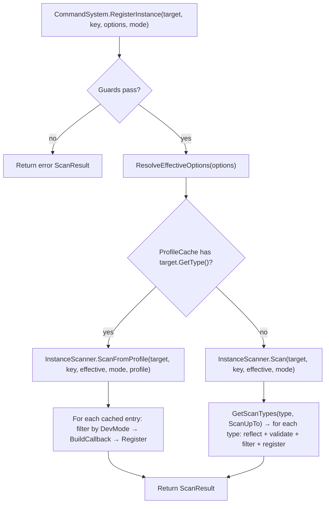
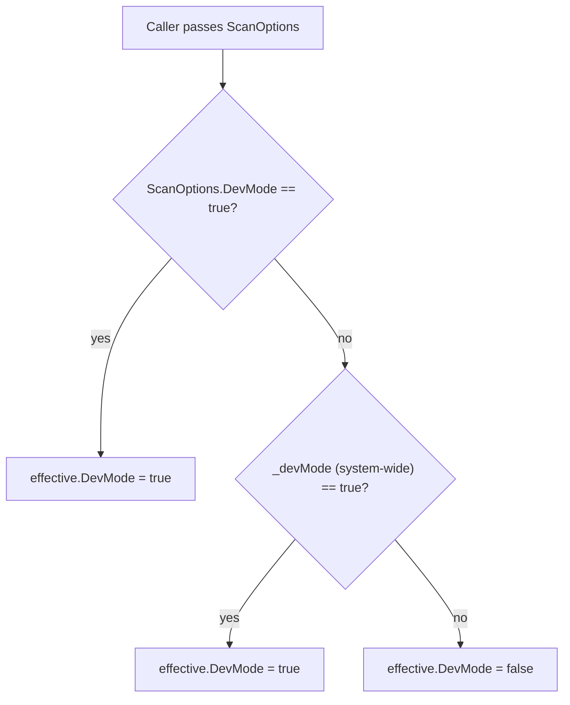
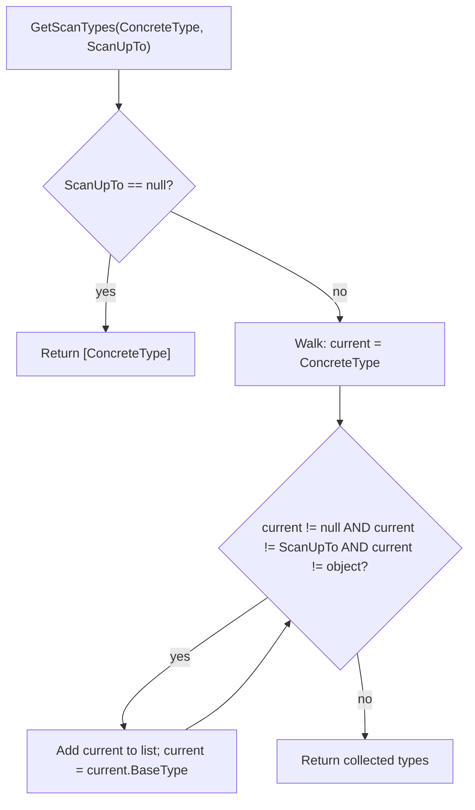

# Instance Command Registration — Improvements

## Status

Draft

## Summary

This design extends the instance command registration feature with seven coordinated changes: (1) auto-scan DevMode safety, (2) `[CommandIgnore]` exclusion attribute, (3) `[CommandHost]` pre-scan attribute with `TypeCommandProfile` caching, (4) `ScanOptions.ScanUpTo` inheritance-chain boundary, (5) system-wide DevMode flag on `Initialize()`, (6) documentation updates, and (7) integration test coverage for the 4-arg `RegisterInstance` overload.

The design prioritizes backward compatibility — every new capability uses opt-in fields or parameters that default to the current behavior.

## Requirements Input

- Source: `.github/tasks/instance-improvements/requirements.md`
- Key requirements carried into design: R1–R11 (all)

## Scope Notes

- **In scope:** Auto-scan DevMode filtering in `InstanceScanner`, `CommandIgnoreAttribute`, `CommandHostAttribute`, `TypeCommandProfile`, `ScanCommandHosts()` API, `ScanOptions.ScanUpTo`, system-wide DevMode on `Initialize()`, documentation updates to `docs/commands.md` and `docs/unity-integration.md`, integration tests for 4-arg `RegisterInstance`.
- **Out of scope:** Changes to `AttributeScanner` (static scan), `DynamicInvoke` allocation changes, `InstanceRegistry` strong-reference → WeakReference, property naming scheme changes, Unity-specific code in `src/`.

---

## Architecture Overview

```
CommandSystem (public facade)
├── Initialize(..., devMode) ─── stores _devMode flag
│
├── ScanCommandHosts(Type[])
│   └── TypeCommandProfileCache (new internal)
│       └── builds TypeCommandProfile per [CommandHost] type
│
├── ScanCommandHosts(Assembly[])
│   └── finds [CommandHost] types → same cache path
│
├── RegisterInstance(target, key, options?, mode?)
│   ├── resolves effective ScanOptions (explicit > system-wide DevMode)
│   ├── checks TypeCommandProfileCache for pre-scanned profile
│   │   ├── hit  → InstanceScanner.ScanFromProfile(target, key, profile, options)
│   │   └── miss → InstanceScanner.Scan(target, key, options, mode) (existing path)
│   └── InstanceScanner applies [CommandIgnore] + DevMode + ScanUpTo rules
│
├── Scan(type/assembly, options?)
│   └── resolves effective ScanOptions (explicit > system-wide DevMode)
│
└── Shutdown() ─── clears _devMode, _profileCache, existing state
```

### New Public Types

| Type                     | File                            | Role                                                          |
| ------------------------ | ------------------------------- | ------------------------------------------------------------- |
| `CommandIgnoreAttribute` | `src/CommandIgnoreAttribute.cs` | Opts a method or property out of instance auto-scan           |
| `CommandHostAttribute`   | `src/CommandHostAttribute.cs`   | Marks a class for startup pre-scanning via `ScanCommandHosts` |

### New Internal Types

| Type                      | File                                  | Role                                                                       |
| ------------------------- | ------------------------------------- | -------------------------------------------------------------------------- |
| `TypeCommandProfile`      | `src/Core/TypeCommandProfile.cs`      | Immutable per-type cache of validated member metadata and parameter arrays |
| `TypeCommandProfileCache` | `src/Core/TypeCommandProfileCache.cs` | Dictionary-backed store mapping `Type` → `TypeCommandProfile`              |

### Modified Types

| Type              | Change                                                                                                                                                                                                                |
| ----------------- | --------------------------------------------------------------------------------------------------------------------------------------------------------------------------------------------------------------------- |
| `ScanOptions`     | New `ScanUpTo` property (`Type`, default `null`)                                                                                                                                                                      |
| `CommandSystem`   | New `_devMode` field; new `_profileCache` field; new `ScanCommandHosts` methods; modified `Initialize()` overloads; `ResolveEffectiveOptions` helper; modified `Scan()`/`RegisterInstance()` to use effective options |
| `InstanceScanner` | DevMode filtering on auto-scan paths; `[CommandIgnore]` checks; `ScanUpTo` inheritance walk; new `ScanFromProfile` path                                                                                               |

---

## Components and Responsibilities

### 1. Auto-Scan DevMode Filtering (R1, R2)

**Location:** `InstanceScanner.ScanPublicMethods` and `InstanceScanner.ScanPublicProperties`

**Current behavior:** Auto-scanned public members (no `[Command]`) are always registered regardless of `ScanOptions.DevMode`.

**New behavior:** Both `ScanPublicMethods` and `ScanPublicProperties` receive the `ScanOptions` parameter (currently they do not). At the top of the auto-scan loop for each member:

- If the member has `[Command]` — already handled in Step 1 (attribute pass), so skip in auto-scan (unchanged).
- If the member has no `[Command]` — this is an implicitly dev-only member. **Skip** it unless `options.DevMode == true`.

This means:

- `[Command]` with `IsDevOnly = false` (default) → always registered (handled in attribute pass, Step 1) ✓
- `[Command(IsDevOnly = true)]` → registered only when `DevMode == true` (handled in attribute pass, Step 1) ✓
- No attribute, auto-scan → registered only when `DevMode == true` (new check in Step 2a/2b) ✓

**Code sketch — `ScanPublicMethods` change:**

```csharp
private void ScanPublicMethods(
    object target,
    Type type,
    string instanceKey,
    ScanOptions options,         // <-- NEW parameter
    List<ScanEntry> entries)
{
    // ... existing flags and GetMethods ...

    for (int i = 0; i < methods.Length; i++)
    {
        MethodInfo method = methods[i];
        if (method.IsSpecialName) continue;
        if (method.IsAbstract) continue;
        if (method.GetCustomAttribute<CommandAttribute>() != null) continue;

        // NEW: [CommandIgnore] check
        if (method.GetCustomAttribute<CommandIgnoreAttribute>() != null) continue;

        // NEW: auto-scanned members are implicitly dev-only
        if (!options.DevMode) continue;

        // ... rest of existing logic unchanged ...
    }
}
```

**Code sketch — `ScanPublicProperties` change:**

```csharp
private void ScanPublicProperties(
    object target,
    Type type,
    string instanceKey,
    ScanOptions options,         // <-- NEW parameter
    List<ScanEntry> entries)
{
    // ... existing flags and GetProperties ...

    for (int i = 0; i < properties.Length; i++)
    {
        PropertyInfo property = properties[i];
        if (property.GetIndexParameters().Length > 0) continue;

        // NEW: [CommandIgnore] check
        if (property.GetCustomAttribute<CommandIgnoreAttribute>() != null) continue;

        // NEW: auto-scanned properties are implicitly dev-only
        if (!options.DevMode) continue;

        // ... rest of existing getter/setter logic unchanged ...
    }
}
```

**Update `Scan` method call sites:**

```csharp
// In InstanceScanner.Scan:
if (mode == InstanceScanMode.Auto)
{
    ScanPublicMethods(target, type, instanceKey, options, entries);    // pass options
    ScanPublicProperties(target, type, instanceKey, options, entries); // pass options
}
```

---

### 2. `CommandIgnoreAttribute` (R3)

**File:** `src/CommandIgnoreAttribute.cs`

```csharp
// kmCommands (https://github.com/KMiseckas/kmCommands)
// Copyright (c) 2026 Klaudijus Miseckas
// Licensed under the Apache License, Version 2.0
// See LICENSE file in the project root for full license information.

using System;

namespace kmCommands
{
    /// <summary>
    /// Prevents a public method or property from being registered as a command
    /// during instance auto-scanning. Has no effect on non-public members.
    /// </summary>
    [AttributeUsage(AttributeTargets.Method | AttributeTargets.Property,
                     Inherited = false, AllowMultiple = false)]
    public sealed class CommandIgnoreAttribute : Attribute { }
}
```

**Integration into `InstanceScanner`:**

- `ScanAttributeDecoratedMethods`: Add a `[CommandIgnore]` check immediately after finding `[Command]`. If the method also has `[CommandIgnore]`, skip it and do not produce a `ScanEntry`. This means `[CommandIgnore]` wins over `[Command]`.
- `ScanPublicMethods`: Add a `[CommandIgnore]` check before the auto-scan DevMode guard (shown in Section 1).
- `ScanPublicProperties`: Add a `[CommandIgnore]` check before the auto-scan DevMode guard (shown in Section 1).

**Precedence rule:** `[CommandIgnore]` always wins. If a member has both `[Command]` and `[CommandIgnore]`, it is skipped entirely. This gives the consumer an explicit escape hatch.

**Code sketch — `ScanAttributeDecoratedMethods` change:**

```csharp
for (int i = 0; i < methods.Length; i++)
{
    MethodInfo method = methods[i];
    CommandAttribute attr = method.GetCustomAttribute<CommandAttribute>();
    if (attr == null) continue;
    if (method.IsStatic) continue;

    // NEW: [CommandIgnore] overrides [Command]
    if (method.GetCustomAttribute<CommandIgnoreAttribute>() != null) continue;

    if (attr.IsDevOnly && !options.DevMode) continue;
    // ... rest unchanged ...
}
```

---

### 3. `CommandHostAttribute` and `TypeCommandProfile` (R4, R5)

#### 3a. `CommandHostAttribute`

**File:** `src/CommandHostAttribute.cs`

```csharp
// kmCommands (https://github.com/KMiseckas/kmCommands)
// Copyright (c) 2026 Klaudijus Miseckas
// Licensed under the Apache License, Version 2.0
// See LICENSE file in the project root for full license information.

using System;

namespace kmCommands
{
    /// <summary>
    /// Marks a class as a command host. Types decorated with this attribute can be
    /// pre-scanned at startup via <see cref="CommandSystem.ScanCommandHosts(Type[])"/>
    /// to cache their member metadata, avoiding repeated reflection at
    /// <see cref="CommandSystem.RegisterInstance(object, string)"/> time.
    /// </summary>
    [AttributeUsage(AttributeTargets.Class, Inherited = false, AllowMultiple = false)]
    public sealed class CommandHostAttribute : Attribute { }
}
```

#### 3b. `TypeCommandProfile`

**File:** `src/Core/TypeCommandProfile.cs`

An immutable snapshot of the validated, scannable members of a type. Built once per type during `ScanCommandHosts()` and reused for every `RegisterInstance()` call for that type.

```csharp
using System;
using System.Reflection;

namespace kmCommands.Core
{
    /// <summary>
    /// Immutable per-type profile of validated command-hosting members.
    /// Stores <see cref="MethodInfo"/>/<see cref="PropertyInfo"/> references and
    /// pre-resolved <see cref="CommandParameterInfo"/> arrays so that
    /// <see cref="InstanceScanner"/> can skip reflection on subsequent registrations.
    /// </summary>
    internal sealed class TypeCommandProfile
    {
        internal MethodEntry[] AttributeMethods { get; }
        internal MethodEntry[] AutoScanMethods { get; }
        internal PropertyEntry[] AutoScanProperties { get; }

        internal TypeCommandProfile(
            MethodEntry[] attributeMethods,
            MethodEntry[] autoScanMethods,
            PropertyEntry[] autoScanProperties)
        {
            AttributeMethods = attributeMethods;
            AutoScanMethods = autoScanMethods;
            AutoScanProperties = autoScanProperties;
        }

        /// <summary>
        /// A [Command]-decorated instance method with its pre-validated metadata.
        /// </summary>
        internal readonly struct MethodEntry
        {
            internal MethodInfo Method { get; }
            internal ParameterInfo[] ReflectedParams { get; }
            internal CommandParameterInfo[] Parameters { get; }
            internal string CommandName { get; }
            internal string Description { get; }
            internal bool IsDevOnly { get; }

            internal MethodEntry(
                MethodInfo method,
                ParameterInfo[] reflectedParams,
                CommandParameterInfo[] parameters,
                string commandName,
                string description,
                bool isDevOnly)
            {
                Method = method;
                ReflectedParams = reflectedParams;
                Parameters = parameters;
                CommandName = commandName;
                Description = description;
                IsDevOnly = isDevOnly;
            }
        }

        /// <summary>
        /// An auto-scannable property with pre-validated metadata.
        /// </summary>
        internal readonly struct PropertyEntry
        {
            internal PropertyInfo Property { get; }
            internal bool CanRead { get; }
            internal bool CanWrite { get; }
            internal bool SetterTypeSupported { get; }

            internal PropertyEntry(
                PropertyInfo property,
                bool canRead,
                bool canWrite,
                bool setterTypeSupported)
            {
                Property = property;
                CanRead = canRead;
                CanWrite = canWrite;
                SetterTypeSupported = setterTypeSupported;
            }
        }
    }
}
```

**Key invariants:**

- `MethodEntry.Parameters` is the fully-validated `CommandParameterInfo[]` array — at registration time, `InstanceScanner` reuses it without re-running type-support checks.
- `MethodEntry.ReflectedParams` stores the `ParameterInfo[]` needed by `InstanceCallbackBuilder.BuildMethodCallback` for delegate creation.
- `PropertyEntry.SetterTypeSupported` caches the `_converter.IsTypeSupported(property.PropertyType)` check.

#### 3c. `TypeCommandProfileCache`

**File:** `src/Core/TypeCommandProfileCache.cs`

```csharp
using System;
using System.Collections.Generic;

namespace kmCommands.Core
{
    /// <summary>
    /// Maps <see cref="Type"/> to <see cref="TypeCommandProfile"/> for types that have been
    /// pre-scanned via <see cref="CommandSystem.ScanCommandHosts"/>.
    /// </summary>
    internal sealed class TypeCommandProfileCache
    {
        private readonly Dictionary<Type, TypeCommandProfile> _cache
            = new Dictionary<Type, TypeCommandProfile>();

        internal bool TryGet(Type type, out TypeCommandProfile profile)
        {
            return _cache.TryGetValue(type, out profile);
        }

        internal void Add(Type type, TypeCommandProfile profile)
        {
            _cache[type] = profile;
        }

        internal void Clear()
        {
            _cache.Clear();
        }
    }
}
```

#### 3d. Profile Building in `InstanceScanner`

Add a new internal method to `InstanceScanner` that builds a `TypeCommandProfile` for a given type. This method performs the same reflection, validation, and type-support checks as the current `Scan()` method, but stops before delegate creation — it captures the metadata only.

```csharp
/// <summary>
/// Builds a <see cref="TypeCommandProfile"/> for the given type by reflecting on its members,
/// validating parameters, and caching results. Does NOT create delegates or register commands.
/// </summary>
internal TypeCommandProfile BuildProfile(Type type, ScanOptions options)
{
    // Step 1: [Command]-decorated methods
    List<TypeCommandProfile.MethodEntry> attrMethods = BuildAttributeMethodEntries(type);

    // Step 2: Public methods (auto-scan candidates)
    List<TypeCommandProfile.MethodEntry> autoMethods = BuildAutoScanMethodEntries(type);

    // Step 3: Public properties (auto-scan candidates)
    List<TypeCommandProfile.PropertyEntry> autoProps = BuildAutoScanPropertyEntries(type);

    return new TypeCommandProfile(
        attrMethods.ToArray(),
        autoMethods.ToArray(),
        autoProps.ToArray());
}
```

The `ScanUpTo` option applies during profile building when the profile is built at `ScanCommandHosts()` time. If `ScanUpTo` is `null`, `DeclaredOnly` behavior is used (current default). If `ScanUpTo` is set, the profile builder walks the inheritance chain.

**Important:** The profile is built with ScanOptions available at `ScanCommandHosts()` time. The `ScanUpTo` for pre-scanned types is locked at profile-build time. The `DevMode` filtering happens at `RegisterInstance()` time (not at profile-build time), because DevMode changes which subset of the cached entries are actually registered.

#### 3e. `ScanFromProfile` in `InstanceScanner`

```csharp
/// <summary>
/// Registers commands for the target using a pre-built profile, skipping all member
/// discovery reflection. Only <see cref="Delegate.CreateDelegate"/> occurs per instance.
/// </summary>
internal ScanResult ScanFromProfile(
    object target,
    string instanceKey,
    ScanOptions options,
    InstanceScanMode mode,
    TypeCommandProfile profile)
{
    List<ScanEntry> entries = new List<ScanEntry>();

    // Step 1: Attribute-decorated methods from profile
    for (int i = 0; i < profile.AttributeMethods.Length; i++)
    {
        TypeCommandProfile.MethodEntry me = profile.AttributeMethods[i];
        if (me.IsDevOnly && !options.DevMode) continue;

        string fullName = string.Format("{0}.{1}", instanceKey, me.CommandName);
        CommandCallback callback = InstanceCallbackBuilder.BuildMethodCallback(
            target, me.Method, me.ReflectedParams);
        CommandDefinition def = new CommandDefinition(
            fullName, me.Parameters, callback, me.Description, isInstanceCommand: true);

        if (!_registry.TryRegister(def))
        {
            entries.Add(new ScanEntry(fullName, RegistrationResult.Fail(
                RegistrationError.DuplicateCommandName,
                string.Format("A command named '{0}' is already registered.", fullName))));
            continue;
        }
        _instanceRegistry.TrackCommand(instanceKey, fullName);
        entries.Add(new ScanEntry(fullName, RegistrationResult.Ok()));
    }

    // Step 2: Auto-scan from profile (only in Auto mode)
    if (mode == InstanceScanMode.Auto)
    {
        // Methods
        for (int i = 0; i < profile.AutoScanMethods.Length; i++)
        {
            TypeCommandProfile.MethodEntry me = profile.AutoScanMethods[i];
            if (!options.DevMode) continue; // implicitly dev-only

            string fullName = string.Format("{0}.{1}", instanceKey, me.CommandName);
            CommandCallback callback = InstanceCallbackBuilder.BuildMethodCallback(
                target, me.Method, me.ReflectedParams);
            CommandDefinition def = new CommandDefinition(
                fullName, me.Parameters, callback, null, isInstanceCommand: true);

            if (!_registry.TryRegister(def))
            {
                entries.Add(new ScanEntry(fullName, RegistrationResult.Fail(
                    RegistrationError.DuplicateCommandName,
                    string.Format("A command named '{0}' is already registered.", fullName))));
                continue;
            }
            _instanceRegistry.TrackCommand(instanceKey, fullName);
            entries.Add(new ScanEntry(fullName, RegistrationResult.Ok()));
        }

        // Properties
        for (int i = 0; i < profile.AutoScanProperties.Length; i++)
        {
            TypeCommandProfile.PropertyEntry pe = profile.AutoScanProperties[i];
            if (!options.DevMode) continue; // implicitly dev-only

            if (pe.CanRead)
            {
                string getterName = string.Format("{0}.get_{1}", instanceKey, pe.Property.Name);
                CommandCallback cb = InstanceCallbackBuilder.BuildGetterCallback(target, pe.Property);
                CommandDefinition def = new CommandDefinition(
                    getterName, Array.Empty<CommandParameterInfo>(), cb, null, isInstanceCommand: true);
                if (_registry.TryRegister(def))
                {
                    _instanceRegistry.TrackCommand(instanceKey, getterName);
                    entries.Add(new ScanEntry(getterName, RegistrationResult.Ok()));
                }
                else
                {
                    entries.Add(new ScanEntry(getterName, RegistrationResult.Fail(
                        RegistrationError.DuplicateCommandName,
                        string.Format("A command named '{0}' is already registered.", getterName))));
                }
            }

            if (pe.CanWrite && pe.SetterTypeSupported)
            {
                string setterName = string.Format("{0}.set_{1}", instanceKey, pe.Property.Name);
                CommandParameterInfo[] setterParams = new[]
                {
                    new CommandParameterInfo("value", pe.Property.PropertyType)
                };
                CommandCallback cb = InstanceCallbackBuilder.BuildSetterCallback(target, pe.Property);
                CommandDefinition def = new CommandDefinition(
                    setterName, setterParams, cb, null, isInstanceCommand: true);
                if (_registry.TryRegister(def))
                {
                    _instanceRegistry.TrackCommand(instanceKey, setterName);
                    entries.Add(new ScanEntry(setterName, RegistrationResult.Ok()));
                }
                else
                {
                    entries.Add(new ScanEntry(setterName, RegistrationResult.Fail(
                        RegistrationError.DuplicateCommandName,
                        string.Format("A command named '{0}' is already registered.", setterName))));
                }
            }
        }
    }

    return new ScanResult(entries.ToArray());
}
```

#### 3f. `CommandSystem.ScanCommandHosts` API

```csharp
/// <summary>
/// Pre-scans the given types for command-hosting metadata and caches per-type profiles.
/// Only types decorated with <see cref="CommandHostAttribute"/> are processed;
/// non-decorated types are silently skipped.
/// Must be called after <see cref="Initialize"/>.
/// </summary>
public ScanResult ScanCommandHosts(Type[] types)
{
    return ScanCommandHosts(types, default);
}

/// <summary>
/// Pre-scans the given types for command-hosting metadata and caches per-type profiles.
/// </summary>
public ScanResult ScanCommandHosts(Type[] types, ScanOptions options)
{
    if (!IsInitialized)
    {
        return ScanResult.SystemFailure(
            RegistrationError.NotInitialized,
            "CommandSystem has not been initialized. Call Initialize() first.");
    }

    ScanOptions effective = ResolveEffectiveOptions(options);
    List<ScanEntry> entries = new List<ScanEntry>();

    if (types == null) return new ScanResult(Array.Empty<ScanEntry>());

    for (int i = 0; i < types.Length; i++)
    {
        Type type = types[i];
        if (type == null) continue;
        if (type.GetCustomAttribute<CommandHostAttribute>() == null) continue;

        TypeCommandProfile profile = _instanceScanner.BuildProfile(type, effective);
        _profileCache.Add(type, profile);
    }

    return new ScanResult(entries.ToArray());
}

/// <summary>
/// Pre-scans all <see cref="CommandHostAttribute"/>-decorated types in the given assemblies.
/// </summary>
public ScanResult ScanCommandHosts(Assembly[] assemblies)
{
    return ScanCommandHosts(assemblies, default);
}

/// <summary>
/// Pre-scans all <see cref="CommandHostAttribute"/>-decorated types in the given assemblies.
/// </summary>
public ScanResult ScanCommandHosts(Assembly[] assemblies, ScanOptions options)
{
    if (!IsInitialized)
    {
        return ScanResult.SystemFailure(
            RegistrationError.NotInitialized,
            "CommandSystem has not been initialized. Call Initialize() first.");
    }

    if (assemblies == null) return new ScanResult(Array.Empty<ScanEntry>());

    List<Type> hostTypes = new List<Type>();
    for (int i = 0; i < assemblies.Length; i++)
    {
        if (assemblies[i] == null) continue;
        Type[] asmTypes;
        try { asmTypes = assemblies[i].GetTypes(); }
        catch (ReflectionTypeLoadException ex) { asmTypes = ex.Types ?? Array.Empty<Type>(); }

        for (int j = 0; j < asmTypes.Length; j++)
        {
            if (asmTypes[j] == null) continue;
            if (asmTypes[j].GetCustomAttribute<CommandHostAttribute>() != null)
                hostTypes.Add(asmTypes[j]);
        }
    }

    return ScanCommandHosts(hostTypes.ToArray(), options);
}
```

#### 3g. `CommandSystem.RegisterInstance` Integration

Update the 4-arg `RegisterInstance` to check the profile cache:

```csharp
public ScanResult RegisterInstance(
    object target,
    string instanceKey,
    ScanOptions options,
    InstanceScanMode mode = InstanceScanMode.Auto)
{
    // ... existing guards (not initialized, null target, key validation, duplicate key) ...

    ScanOptions effective = ResolveEffectiveOptions(options);

    if (_profileCache.TryGet(target.GetType(), out TypeCommandProfile profile))
    {
        return _instanceScanner.ScanFromProfile(target, instanceKey, effective, mode, profile);
    }

    return _instanceScanner.Scan(target, instanceKey, effective, mode);
}
```

---

### 4. `ScanOptions.ScanUpTo` (R6, R7)

**File:** `src/ScanOptions.cs`

```csharp
public struct ScanOptions
{
    /// <summary>
    /// When <c>true</c>, commands decorated with <c>IsDevOnly = true</c> are included,
    /// and auto-scanned public members are also included.
    /// When <c>false</c> (default), <c>IsDevOnly</c> commands and auto-scanned members are skipped.
    /// </summary>
    public bool DevMode { get; set; }

    /// <summary>
    /// When non-null, <see cref="CommandSystem.RegisterInstance"/> walks the inheritance chain
    /// from the concrete type up to (but not including) this boundary type, accumulating
    /// discoverable members from each level.
    /// When <c>null</c> (default), only members declared directly on the target type are
    /// discovered (<c>BindingFlags.DeclaredOnly</c> behavior).
    /// </summary>
    /// <remarks>
    /// Typical Unity usage: set to <c>typeof(MonoBehaviour)</c> so intermediate user-defined
    /// base classes are scanned while the MonoBehaviour API surface is excluded.
    /// </remarks>
    public Type ScanUpTo { get; set; }
}
```

**Integration into `InstanceScanner`:**

Currently, the `Scan` method gets members with `BindingFlags.DeclaredOnly` on `target.GetType()`. With `ScanUpTo`, the scanner must iterate through multiple types in the hierarchy.

**Design choice:** Extract a helper method `GetScanTypes(Type concreteType, Type scanUpTo)` that returns the list of types to scan:

```csharp
/// <summary>
/// Returns the ordered list of types to scan for members.
/// When <paramref name="scanUpTo"/> is null, returns only <paramref name="concreteType"/>.
/// Otherwise, walks from <paramref name="concreteType"/> up the chain, stopping before
/// <paramref name="scanUpTo"/> (exclusive).
/// </summary>
private static Type[] GetScanTypes(Type concreteType, Type scanUpTo)
{
    if (scanUpTo == null)
    {
        return new[] { concreteType };
    }

    List<Type> types = new List<Type>();
    Type current = concreteType;
    while (current != null && current != scanUpTo && current != typeof(object))
    {
        types.Add(current);
        current = current.BaseType;
    }

    return types.ToArray();
}
```

The `Scan` method then becomes:

```csharp
internal ScanResult Scan(
    object target,
    string instanceKey,
    ScanOptions options,
    InstanceScanMode mode)
{
    Type concreteType = target.GetType();
    Type[] scanTypes = GetScanTypes(concreteType, options.ScanUpTo);
    List<ScanEntry> entries = new List<ScanEntry>();

    for (int t = 0; t < scanTypes.Length; t++)
    {
        Type type = scanTypes[t];

        // Step 1: [Command]-decorated methods at this level
        ScanAttributeDecoratedMethods(target, type, instanceKey, options, entries);

        // Step 2: Auto-scan at this level
        if (mode == InstanceScanMode.Auto)
        {
            ScanPublicMethods(target, type, instanceKey, options, entries);
            ScanPublicProperties(target, type, instanceKey, options, entries);
        }
    }

    return new ScanResult(entries.ToArray());
}
```

`BindingFlags.DeclaredOnly` is already used in all three scan methods, so each level only discovers its own members — no duplicates from the hierarchy walk.

**Edge cases:**

- If `ScanUpTo` is a type not in the hierarchy, the walk proceeds all the way to `object` (stopped by `current != typeof(object)`). This is safe — it just means all user types in the chain are scanned.
- If `ScanUpTo` equals the concrete type, the returned list is empty — no members scanned. This is a degenerate case but harmless.

**Profile building also respects `ScanUpTo`:** The `BuildProfile` method uses the same `GetScanTypes` helper. The `ScanUpTo` is captured at profile-build time.

---

### 5. System-Wide DevMode Flag (R8, R9)

**Location:** `CommandSystem`

Add a private field and resolution logic:

```csharp
private bool _devMode;  // system-wide default, set via Initialize()
```

**Modified `Initialize()` overloads** — each gains an optional `bool devMode = false` parameter:

```csharp
public void Initialize(bool devMode = false)
{
    if (IsInitialized) return;
    _devMode = devMode;
    InitializeCore(DefaultHistoryCapacity);
}

public void Initialize(int historyCapacity, bool devMode = false)
{
    if (IsInitialized) return;
    _devMode = devMode;
    InitializeCore(historyCapacity);
}

public ScanResult Initialize(
    Type[] types,
    ScanOptions options = default,
    int historyCapacity = DefaultHistoryCapacity,
    bool devMode = false)
{
    if (IsInitialized) return ScanResult.AlreadyInitialized();
    _devMode = devMode;
    InitializeCore(historyCapacity);
    return RunInitTimeScans(types, null, ResolveEffectiveOptions(options));
}

// ... same pattern for Assembly[] and Type[]+Assembly[] overloads
```

**`ResolveEffectiveOptions` helper:**

The resolution rule: If the caller provided an explicit `ScanOptions` with `DevMode = true`, that wins. If the caller passed `default` (`DevMode = false`), the system-wide flag is used as the default. However, we need to distinguish between "caller explicitly passed `DevMode = false`" and "caller used `default`". Since `ScanOptions` is a struct and `DevMode = false` is the zero-value, there is no way to distinguish these cases.

**Decision:** The system-wide DevMode is an OR-override. If _either_ the system-wide flag _or_ the caller's `ScanOptions.DevMode` is `true`, DevMode is active. This is simpler and matches the common pattern: once you initialize in DevMode, everything is dev-mode unless you go out of your way to construct `ScanOptions { DevMode = false }` and pass it explicitly.

Wait — this doesn't match R9 ("An explicit ScanOptions supplied by the caller takes precedence over the system-wide default"). R9 implies that if the caller explicitly sets `DevMode = false` on a ScanOptions, it should override the system-wide `true`.

**Problem:** With a `bool` struct field, `false` is indistinguishable from "not set".

**Resolution:** Use the OR semantic in practice, but document it clearly. The practical behavior is:

- System-wide DevMode is a **floor**: setting it to `true` makes DevMode `true` everywhere by default.
- A caller can still pass `new ScanOptions { DevMode = false }` but since the system-wide flag was meant to eliminate the need for per-call options, the OR behavior is the most intuitive: if the system is in DevMode, everything sees DevMode.

**Alternative considered:** Make `ScanOptions.DevMode` a `bool?` — but this changes the public API for existing consumers and is heavier.

**Final decision:** OR semantic. The system-wide `_devMode` flag means "enable DevMode for all operations". Per-call `ScanOptions.DevMode = true` also enables DevMode for that specific call. To disable DevMode for a specific call when system-wide is on, the consumer must not initialize with `devMode: true` — the system-wide flag is a blanket setting.

```csharp
private ScanOptions ResolveEffectiveOptions(ScanOptions callerOptions)
{
    if (_devMode && !callerOptions.DevMode)
    {
        callerOptions.DevMode = true;
    }
    return callerOptions;
}
```

**`Shutdown()` clears the flag:**

```csharp
public void Shutdown()
{
    // ... existing cleanup ...
    _devMode = false;
}
```

**Apply `ResolveEffectiveOptions` at call sites:**

- `CommandSystem.Scan(Type, ScanOptions)`
- `CommandSystem.Scan(Assembly, ScanOptions)`
- `CommandSystem.RegisterInstance(..., ScanOptions, ...)`
- `CommandSystem.ScanCommandHosts(..., ScanOptions)`
- `RunInitTimeScans(...)` — already called with resolved options from Initialize

---

### 6. Documentation Updates (R10)

#### `docs/commands.md`

Add a new section **"Instance Command DevMode Safety"** covering:

1. **Auto-scanned members are dev-only by default.** When `RegisterInstance` is called in `InstanceScanMode.Auto`, public members without a `[Command]` attribute are only registered when `DevMode` is on. This prevents accidental exposure of internal APIs in release builds.

2. **`[Command]` is the release-safe opt-in.** Placing `[Command("name")]` on an instance method registers it regardless of DevMode (unless `IsDevOnly = true`).

3. **Property naming convention.** Auto-scanned properties produce `instanceKey.get_PropertyName` and `instanceKey.set_PropertyName` commands. This follows C# accessor naming.

4. **`[CommandIgnore]` attribute.** Place on a public method or property to exclude it from all scan modes.

Add a new section **"Performance Notes"** (or append to existing):

5. **DynamicInvoke allocation cost.** Instance command callbacks with 1+ parameters use `Delegate.DynamicInvoke`, which boxes value-type arguments and allocates an internal array on each call. This is acceptable for user-triggered commands but is a known allocation hotspot if commands are invoked at high frequency.

Add a new section **"Instance Lifecycle"** (or append to existing):

6. **Strong reference warning.** `RegisterInstance` stores a strong reference to the target object. If `UnregisterInstance` is never called (e.g., `OnDestroy` is missing), the object will not be garbage-collected. The `InstanceNull` execution error signals that a bound target has been collected or destroyed, but it is a symptom — not a substitute for proper cleanup via `UnregisterInstance`.

#### `docs/unity-integration.md`

Add or update a section **"DevMode Configuration"**:

7. **System-wide DevMode flag.** Pass `devMode: true` to `Initialize()` to enable dev-only commands and auto-scanned members for all subsequent operations.

8. **Recommended Unity pattern:**

```csharp
bool isDev = false;
#if UNITY_EDITOR || DEVELOPMENT_BUILD
isDev = true;
#endif
commandSystem.Initialize(devMode: isDev);
```

---

### 7. Integration Tests (R11)

**File:** `tests/kmCommands.Tests/InstanceCommandRegistrationTests.cs`

Add the following tests to the existing test class:

```csharp
// ── 4-Arg RegisterInstance integration tests ──────────────────────────

[Test]
public void RegisterInstance_4Arg_DevModeOff_SkipsAutoScannedMembers()
{
    var target = new DevOnlyTarget();
    ScanResult result = _system.RegisterInstance(
        target, "dev", new ScanOptions { DevMode = false }, InstanceScanMode.Auto);

    // Auto-scanned RegularMethod should be excluded (implicitly dev-only)
    string[] names = _system.GetCommandNames();
    Assert.That(names, Has.No.Member("dev.RegularMethod"));
}

[Test]
public void RegisterInstance_4Arg_DevModeOn_IncludesAutoScannedMembers()
{
    var target = new DevOnlyTarget();
    ScanResult result = _system.RegisterInstance(
        target, "dev", new ScanOptions { DevMode = true }, InstanceScanMode.Auto);

    string[] names = _system.GetCommandNames();
    Assert.That(names, Has.Member("dev.RegularMethod"));
}

[Test]
public void RegisterInstance_4Arg_DevModeOff_RegistersExplicitCommandAttribute()
{
    var target = new ExplicitCommandTarget();
    ScanResult result = _system.RegisterInstance(
        target, "exp", new ScanOptions { DevMode = false }, InstanceScanMode.Auto);

    string[] names = _system.GetCommandNames();
    Assert.That(names, Has.Member("exp.explicit_cmd"));
}

[Test]
public void RegisterInstance_4Arg_AttributeOnlyMode_DevModeOff()
{
    var target = new DevOnlyTarget();
    ScanResult result = _system.RegisterInstance(
        target, "dev", new ScanOptions { DevMode = false }, InstanceScanMode.AttributeOnly);

    string[] names = _system.GetCommandNames();
    // dev_cmd is [Command(IsDevOnly=true)] → skipped
    Assert.That(names, Has.No.Member("dev.dev_cmd"));
    // RegularMethod has no attribute → not discovered in AttributeOnly mode
    Assert.That(names, Has.No.Member("dev.RegularMethod"));
}

[Test]
public void RegisterInstance_4Arg_AttributeOnlyMode_DevModeOn()
{
    var target = new DevOnlyTarget();
    ScanResult result = _system.RegisterInstance(
        target, "dev", new ScanOptions { DevMode = true }, InstanceScanMode.AttributeOnly);

    string[] names = _system.GetCommandNames();
    // dev_cmd is [Command(IsDevOnly=true)] with DevMode on → included
    Assert.That(names, Has.Member("dev.dev_cmd"));
    // RegularMethod has no attribute → still not in AttributeOnly
    Assert.That(names, Has.No.Member("dev.RegularMethod"));
}
```

Additional target class needed for the explicit-command test:

```csharp
private class ExplicitCommandTarget
{
    [Command("explicit_cmd")]
    public void ExplicitMethod() { }
    public void PublicAutoMethod() { }
}
```

---

## Data Flow / Control Flow

### RegisterInstance with Pre-Scan Cache



### DevMode Resolution



### ScanUpTo Hierarchy Walk



---

## Dependency Evaluation

- **New dependencies:** None
- **Rationale:** All changes are simple attribute definitions, dictionary caches, and control-flow modifications. No external library is needed.

---

## Implementation Notes

1. **`ScanOptions` is a mutable struct** — when adding `ScanUpTo`, keep it as a settable property to match the existing `DevMode` pattern. The struct is small and always passed by value.

2. **`GetScanTypes` allocates a `Type[]`** — this is acceptable because `RegisterInstance()` is not a hot path. The allocation happens once per registration call.

3. **Profile cache uses `Dictionary<Type, TypeCommandProfile>`** — `Type` uses reference equality, which is correct here. Each runtime type has a single `Type` object.

4. **`[CommandIgnore]` on a `[Command]`-decorated member** — `[CommandIgnore]` wins. This avoids ambiguity and gives the consumer a definitive escape hatch.

5. **`ScanCommandHosts` returns `ScanResult`** — for consistency with other scan APIs, even though the result currently carries no per-command entries (profiles are cached, not registered). This keeps the return type uniform and allows future extension (e.g., reporting validation failures per cached member).

6. **Thread safety is unchanged** — `CommandSystem` is documented as not thread-safe. The new `_profileCache` and `_devMode` fields follow the same single-thread assumption.

7. **`BuildProfile` should validate members using the same rules as `Scan`** — ref/out params, generic methods, unsupported param types all cause the member to be excluded from the profile (not cached as an error entry). The profile contains only members that _can_ be registered.

8. **`ScanUpTo` in `BuildProfile`** — When `ScanCommandHosts` is called, the options (including `ScanUpTo`) are used to determine which inheritance levels to include. The resulting profile captures all discovered members across those levels.

9. **Existing `InstanceScanner.Scan` signature change** — `ScanPublicMethods` and `ScanPublicProperties` gain a `ScanOptions` parameter. This is an internal change with no public API impact.

10. **`CommandAttribute` target change** — `CommandAttribute` currently has `AttributeTargets.Method`. It does NOT need to change for this work — instance methods already use it. `CommandIgnoreAttribute` targets `Method | Property` separately.

---

## Risks and Tradeoffs

1. **DevMode OR semantic** — If the system-wide flag is `true`, there is no per-call way to turn DevMode off. This is a conscious simplification. The alternative (`bool?` on `ScanOptions.DevMode`) was rejected to avoid changing an established public API type.

2. **Profile cache does not capture ScanUpTo at per-call time** — The profile is built with the `ScanUpTo` value from `ScanCommandHosts()` time. If a consumer calls `ScanCommandHosts()` with one `ScanUpTo` and then calls `RegisterInstance()` with a different `ScanUpTo`, the profile's cached members (from the first `ScanUpTo`) are used. This is acceptable: pre-scanning is an optimization with a locked-in configuration. Document this behavior.

3. **`[CommandIgnore]` adds a reflection call per member** — `GetCustomAttribute<CommandIgnoreAttribute>()` is called during scanning. Scanning is not a hot path, so this cost is negligible.

4. **Backward compatibility** — All new parameters have defaults that preserve current behavior (`devMode = false`, `ScanUpTo = null`, no `[CommandIgnore]` present). Existing code compiles and behaves identically.

---

## Open Questions

- None. All behavioral decisions have been resolved in this design.

---

## Testing Strategy

### Unit Tests

| Area                     | File                      | Tests                                                                                                                                                                                 |
| ------------------------ | ------------------------- | ------------------------------------------------------------------------------------------------------------------------------------------------------------------------------------- |
| Auto-scan DevMode filter | `InstanceScannerTests.cs` | Auto-scanned methods skipped when DevMode off; included when DevMode on; `[Command]` without `IsDevOnly` always included                                                              |
| `[CommandIgnore]`        | `InstanceScannerTests.cs` | Ignored method skipped in auto-scan; ignored method skipped in attribute scan; ignored property skipped                                                                               |
| `ScanUpTo`               | `InstanceScannerTests.cs` | Multi-level hierarchy with ScanUpTo boundary; ScanUpTo null = DeclaredOnly; ScanUpTo not in chain = scan all                                                                          |
| `TypeCommandProfile`     | `InstanceScannerTests.cs` | `BuildProfile` produces correct entries; `ScanFromProfile` registers correct commands; profile reuse skips GetMethods/GetProperties                                                   |
| System-wide DevMode      | `CommandSystemTests.cs`   | Initialize(devMode: true) affects Scan(); Initialize(devMode: true) affects RegisterInstance(); explicit ScanOptions.DevMode = true overrides system false; Shutdown clears \_devMode |

### Integration Tests

| Area                                | File                                  | Tests                                                                                                                                                     |
| ----------------------------------- | ------------------------------------- | --------------------------------------------------------------------------------------------------------------------------------------------------------- |
| 4-arg RegisterInstance              | `InstanceCommandRegistrationTests.cs` | DevMode off skips auto-scan; DevMode on includes auto-scan; [Command] always registered; AttributeOnly mode filters correctly; both DevMode states tested |
| ScanCommandHosts + RegisterInstance | `InstanceCommandRegistrationTests.cs` | Pre-scan then register produces correct commands; non-[CommandHost] types silently skipped                                                                |

### Manual Verification

- Build the test project and confirm all 272+ existing tests still pass.
- Confirm no public API breaks by checking that all existing test files compile without changes.

---

## Task Planning Handoff

### Suggested Implementation Slices

1. **Slice A — Auto-scan DevMode + `[CommandIgnore]`:** Create `CommandIgnoreAttribute`. Modify `InstanceScanner.ScanPublicMethods`, `ScanPublicProperties`, and `ScanAttributeDecoratedMethods` to add DevMode filtering on auto-scan paths and `[CommandIgnore]` checks. Add unit tests.

2. **Slice B — `ScanOptions.ScanUpTo`:** Add `ScanUpTo` property to `ScanOptions`. Add `GetScanTypes` helper and update `InstanceScanner.Scan` to loop over types. Add unit tests with multi-level hierarchy.

3. **Slice C — System-wide DevMode:** Add `_devMode` field and `ResolveEffectiveOptions` to `CommandSystem`. Update all `Initialize()` overloads. Update `Scan()`, `RegisterInstance()`, `Shutdown()`. Add unit tests.

4. **Slice D — `[CommandHost]` + `TypeCommandProfile`:** Create `CommandHostAttribute`, `TypeCommandProfile`, `TypeCommandProfileCache`. Add `BuildProfile` and `ScanFromProfile` to `InstanceScanner`. Add `ScanCommandHosts` to `CommandSystem`. Update `RegisterInstance` to check cache. Add unit/integration tests.

5. **Slice E — Integration tests for 4-arg RegisterInstance:** Add integration tests in `InstanceCommandRegistrationTests`.

6. **Slice F — Documentation updates:** Update `docs/commands.md` and `docs/unity-integration.md`.

### Coupling Notes

- Slice A is a prerequisite for Slice C (DevMode filtering logic must exist before system-wide flag can meaningfully affect it) and Slice D (profile-based scan reuses the same filtering).
- Slice B is independent of A and C; can be done in parallel.
- Slice D depends on A (profile-based scan applies the same DevMode and `[CommandIgnore]` rules).
- Slice E depends on A and C (tests verify DevMode filtering end-to-end).
- Slice F can be done at any time but best done last to document final behavior.

### Areas That Should Be Validated After Full Integration

- All 272+ existing tests pass without modification.
- New tests cover all acceptance criteria from requirements.
- `ScanCommandHosts` → `RegisterInstance` round-trip produces identical command sets to direct `RegisterInstance`.
- System-wide DevMode flag correctly propagates to all scan paths.

---

## Final Review Contract

### Critical Behaviors to Verify

1. `RegisterInstance(target, key)` with default `ScanOptions` (DevMode off) does NOT register auto-scanned public members.
2. `RegisterInstance(target, key, new ScanOptions { DevMode = true })` DOES register auto-scanned public members.
3. `[Command("name")]` without `IsDevOnly` always registers regardless of DevMode.
4. `[Command("name", IsDevOnly = true)]` only registers when DevMode is on.
5. `[CommandIgnore]` on a method with `[Command]` prevents registration.
6. `[CommandIgnore]` on a public method prevents auto-scan registration.
7. `[CommandIgnore]` on a public property prevents getter/setter registration.
8. `ScanUpTo` set to a mid-hierarchy type includes intermediate base class members.
9. `ScanUpTo = null` preserves DeclaredOnly behavior.
10. `Initialize(devMode: true)` causes DevMode to be active for all subsequent Scan/RegisterInstance calls.
11. `Shutdown()` clears the DevMode flag.
12. `ScanCommandHosts(types)` caches profiles; subsequent `RegisterInstance` for those types skips `GetMethods`/`GetProperties`.
13. `ScanCommandHosts` silently skips types without `[CommandHost]`.
14. Integration tests for 4-arg `RegisterInstance` cover both DevMode states and both scan modes.

### Design Invariants

- `ScanOptions` remains a value type with all-zero default = current behavior unchanged.
- No new public enum values on `RegistrationError` or `ExecutionError`.
- No new public dependencies.
- All new attributes follow existing `Inherited = false, AllowMultiple = false` pattern.
- `TypeCommandProfile` is immutable after construction.
- Profile cache is cleared on `Shutdown()`.

### Required Test Evidence

- All existing 272+ tests pass.
- New unit tests for each of: DevMode auto-scan filter, `[CommandIgnore]`, `ScanUpTo`, `BuildProfile`/`ScanFromProfile`, system-wide DevMode.
- New integration tests for 4-arg `RegisterInstance` (minimum 5 tests).
- New integration tests for `ScanCommandHosts` + `RegisterInstance` round-trip.

### Known Acceptable Deviations

- DevMode uses OR semantic: system-wide `true` cannot be overridden per-call. Documented in design and docs.
- Profile `ScanUpTo` is locked at `ScanCommandHosts()` time, not at `RegisterInstance()` time. Documented.

### Blocking Conditions

- Any existing test fails after the changes.
- Auto-scanned members appear in a `RegisterInstance` call with DevMode off.
- `[CommandIgnore]` does not prevent registration.
- `ScanUpTo` walk includes the boundary type's own members.
- `Initialize(devMode: true)` does not propagate to `RegisterInstance` default options.
