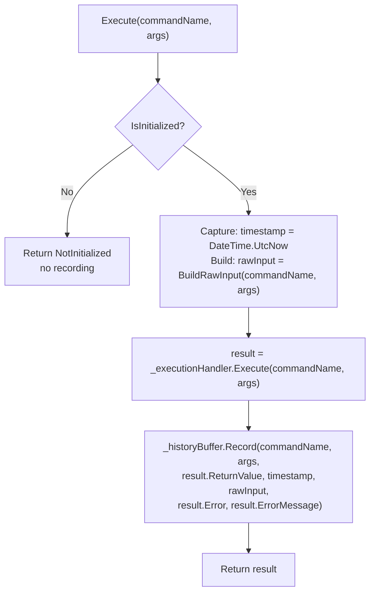

# Rich History Entries

## Status

Draft

## Feature

`rich-history-entries`

## Branch

`feat_rich-history-entries`

## Overview

`CommandHistoryEntry` currently records only the command name, a snapshot of argument tokens, and the callback return value for **successful** executions. This feature extends the struct with four new fields — a UTC timestamp, a raw input snapshot (`string[]`), a result status (`ExecutionError`), and an error detail string — and changes the recording policy so that **all** executions that pass the `IsInitialized` guard are recorded, including failures. The changes touch three files: `CommandHistoryEntry.cs`, `CommandHistoryBuffer.cs`, and `CommandSystem.cs`. The public history API (`GetHistory`, `HistoryCount`, `ClearHistory`) is unchanged.

## Requirements Input

- Source: `.github/tasks/rich-history-entries/requirements.md`
- Key requirements carried into design:
  - FR-1: `Timestamp` — UTC `DateTime` at recording time.
  - FR-2: `RawInput` — input tokens as passed to `Execute()` before any processing.
  - FR-3: `Status` — `ExecutionError.None` on success; specific error on failure.
  - FR-4: `ErrorDetail` — `null` on success; `ErrorMessage` from `ExecutionResult` on failure.
  - FR-5: `CommandHistoryEntry` remains a `readonly struct` with an `internal` constructor.
  - FR-7: Record all failures except `NotInitialized`.
  - FR-8: `CommandHistoryBuffer.Record()` accepts the four new fields.
  - FR-10: `Args` snapshot isolation behaviour is unchanged.

## Scope Notes

- In scope:
  - `CommandHistoryEntry` — four new properties and extended constructor.
  - `CommandHistoryBuffer.Record()` — four new parameters.
  - `CommandSystem.Execute()` — recording policy changed to unconditional (post-`IsInitialized` guard); timestamp captured once at top of method; `rawInput` array built once.
  - Test updates in `CommandHistoryTests.cs` — existing tests whose assertions directly contradict the new failure-recording policy must be updated; new tests for all four new fields.
- Out of scope:
  - `IHistoryWriter` / persistence.
  - Filtering or querying history.
  - Changes to `GetHistory()`, `HistoryCount`, or `ClearHistory()` signatures.
  - History capacity or eviction algorithm.
  - Serialisation of `CommandHistoryEntry`.
  - Command chaining.

## Open Question Resolutions

### OQ-1 — `RawInput` representation

**Resolution: Option B — `string[] RawInput`.**

`RawInput` is a `string[]` with `commandName` at index 0 and the caller's `args` at indices 1..n.  
Rationale: The existing args copy already happens inside `CommandHistoryBuffer.Record()` for the `Args` field. Building `rawInput` as a `string[]` in `Execute()` requires one new array allocation (size `1 + args.Length`), consistent with the existing args-copy allocation. No extra `string.Join` allocation is needed. The resulting array is more faithful to the raw call signature and is trivially iterable without splitting.

Behaviour contract:

- If `args` is `null` or empty, `RawInput` is `new string[] { name }` (length 1).
- Mutating the caller's `args` array after `Execute()` returns does not affect `RawInput` (the snapshot is a new array).
- `RawInput` is never `null`.

### OQ-2 — Record failed executions?

**Resolution: YES — record all executions that pass the `IsInitialized` guard.**

All failure modes after that guard (`CommandNotFound`, `NullOrEmptyCommandName`, `ArgumentCountMismatch`, `ArgumentConversionFailed`, `CallbackThrewException`, `InstanceNull`) are recorded. A single unified ring buffer is used; no separate error buffer.  
Rationale: Consumers benefit from a full picture of what was submitted, including bad inputs. The `Status` field lets consumers filter or display entries selectively. A unified buffer is simpler to reason about and consistent with the existing capacity/eviction model.

**Compatibility impact:** Two existing tests assert that failed executions do **not** increment `HistoryCount`. These assertions directly contradict the resolved policy and must be updated (see Testing Strategy). This is explicitly a **behavioural breaking change** and must appear in release notes.

### OQ-3 — `NotInitialized` recording

**Resolution: Never recorded.**

The `_historyBuffer` field is `null` when not initialized. The early-return guard in `Execute()` for `NotInitialized` exits before any recording code runs. No special handling is required; the null buffer is the natural guard.

## Architecture

Three files changed. No new types are introduced.

```
src/CommandHistoryEntry.cs         ← Extended struct (4 new properties + constructor params)
src/Core/CommandHistoryBuffer.cs   ← Record() gains 4 new parameters
src/CommandSystem.cs               ← Execute() records unconditionally; captures timestamp + rawInput
```

`CommandHistoryEntry` is a leaf value type — changing its constructor does not require changes to any other public API. The only callers of the `internal` constructor are `CommandHistoryBuffer.Record()` and test helpers that construct entries directly (test helpers must be updated).

## Data Flow / Control Flow



## Components and Responsibilities

### `CommandHistoryEntry` (public `readonly struct`)

- Responsibility: Immutable record of one execution event, carrying all context needed for display, filtering, and debugging.
- Change: Four new `private readonly` fields; four new get-only properties; internal constructor extended with four new parameters.

### `CommandHistoryBuffer` (internal `sealed class`)

- Responsibility: Fixed-capacity ring buffer; creates and stores `CommandHistoryEntry` values.
- Change: `Record()` accepts four new parameters; passes them through to the `CommandHistoryEntry` constructor after copying `args` as before. The `rawInput` array is stored directly (already an isolated snapshot built by the caller).

### `CommandSystem.Execute()` (public)

- Responsibility: Entry point; orchestrates execution and recording.
- Change: Capture `timestamp` once at the top of the method; build `rawInput` once before calling the execution handler; move `Record()` call out of the `if (result.Success)` block to run unconditionally (after the `IsInitialized` guard).

## Dependency Evaluation

- New dependencies: None.
- Rationale: All required types (`System.DateTime`, `ExecutionError`) are already in scope. No third-party library is needed.

## API / Contract Sketch

### `CommandHistoryEntry` — new properties

```csharp
/// <summary>
/// UTC time at which this entry was recorded.
/// </summary>
public DateTime Timestamp { get; }

/// <summary>
/// Snapshot of the raw input tokens as passed to <see cref="CommandSystem.Execute"/>,
/// before any processing. Index 0 is always the command name. Indices 1..n are the
/// argument tokens. Never <c>null</c>; length is always at least 1.
/// </summary>
public string[] RawInput { get; }

/// <summary>
/// The execution outcome. <see cref="ExecutionError.None"/> for successful executions;
/// the specific error value for failures.
/// </summary>
public ExecutionError Status { get; }

/// <summary>
/// Human-readable error detail, or <c>null</c> for successful executions.
/// Matches <see cref="ExecutionResult.ErrorMessage"/> for failure entries.
/// </summary>
public string ErrorDetail { get; }
```

### `CommandHistoryBuffer.Record()` — updated signature

```csharp
internal void Record(
    string commandName,
    string[] args,
    object returnValue,
    DateTime timestamp,
    string[] rawInput,
    ExecutionError status,
    string errorDetail)
```

## Implementation Plan

### Step 1 — Extend `CommandHistoryEntry`

Add four new `private readonly` fields and corresponding get-only properties. Extend the `internal` constructor with four new parameters. Parameter order matches field declaration order (existing first, new appended).

```csharp
public readonly struct CommandHistoryEntry
{
    private readonly string _commandName;
    private readonly string[] _args;
    private readonly object _returnValue;
    private readonly DateTime _timestamp;
    private readonly string[] _rawInput;
    private readonly ExecutionError _status;
    private readonly string _errorDetail;

    public string CommandName  => _commandName;
    public string[] Args       => _args;
    public object ReturnValue  => _returnValue;
    public DateTime Timestamp  => _timestamp;
    public string[] RawInput   => _rawInput;
    public ExecutionError Status   => _status;
    public string ErrorDetail  => _errorDetail;

    internal CommandHistoryEntry(
        string commandName,
        string[] args,
        object returnValue,
        DateTime timestamp,
        string[] rawInput,
        ExecutionError status,
        string errorDetail)
    {
        _commandName  = commandName;
        _args         = args;
        _returnValue  = returnValue;
        _timestamp    = timestamp;
        _rawInput     = rawInput;
        _status       = status;
        _errorDetail  = errorDetail;
    }
}
```

> Note: The existing auto-property pattern (`public string CommandName { get; }`) can be replaced with explicit backing fields, or left as auto-properties where compatible. Use explicit backing fields for all seven to keep field declaration and initialisation clearly co-located.

### Step 2 — Extend `CommandHistoryBuffer.Record()`

Add four new parameters. Pass `rawInput` directly to the constructor (already isolated). Continue copying `args` as before for the `Args` field.

```csharp
internal void Record(
    string commandName,
    string[] args,
    object returnValue,
    DateTime timestamp,
    string[] rawInput,
    ExecutionError status,
    string errorDetail)
{
    string[] argsCopy = CopyArgs(args);
    CommandHistoryEntry entry = new CommandHistoryEntry(
        commandName, argsCopy, returnValue,
        timestamp, rawInput, status, errorDetail);

    if (_count < _capacity)
    {
        _buffer[(_head + _count) % _capacity] = entry;
        _count++;
    }
    else
    {
        _buffer[_head] = entry;
        _head = (_head + 1) % _capacity;
    }
}
```

### Step 3 — Update `CommandSystem.Execute()`

Capture `DateTime.UtcNow` once at the top of `Execute()`. Build the `rawInput` snapshot once. Move the `Record()` call out of the success-only block so it runs for all outcomes that pass the `IsInitialized` guard.

```csharp
public ExecutionResult Execute(string commandName, string[] args)
{
    if (!IsInitialized)
    {
        return ExecutionResult.Fail(
            ExecutionError.NotInitialized,
            "CommandSystem has not been initialized. Call Initialize() first.",
            null);
    }

    DateTime timestamp = DateTime.UtcNow;
    string[] rawInput = BuildRawInput(commandName, args);

    ExecutionResult result = _executionHandler.Execute(commandName, args);

    _historyBuffer.Record(
        commandName,
        args,
        result.ReturnValue,
        timestamp,
        rawInput,
        result.Error,
        result.ErrorMessage);

    return result;
}
```

### Step 4 — Add `BuildRawInput` helper to `CommandSystem`

A private static helper that builds the isolated raw input snapshot. Kept as a named helper rather than inlined to keep `Execute()` readable.

```csharp
private static string[] BuildRawInput(string commandName, string[] args)
{
    if (args == null || args.Length == 0)
    {
        return new string[] { commandName };
    }

    string[] raw = new string[1 + args.Length];
    raw[0] = commandName;
    for (int i = 0; i < args.Length; i++)
    {
        raw[i + 1] = args[i];
    }
    return raw;
}
```

## Internal Method Signatures

| Location                      | Old signature                                            | New signature                                                                                        |
| ----------------------------- | -------------------------------------------------------- | ---------------------------------------------------------------------------------------------------- |
| `CommandHistoryBuffer.Record` | `void Record(string, string[], object)`                  | `void Record(string, string[], object, DateTime, string[], ExecutionError, string)`                  |
| `CommandHistoryEntry..ctor`   | `internal CommandHistoryEntry(string, string[], object)` | `internal CommandHistoryEntry(string, string[], object, DateTime, string[], ExecutionError, string)` |

## `Execute()` Call Sites

There is one call site to `_historyBuffer.Record()` in `CommandSystem.Execute()`.

**Before:**

```csharp
ExecutionResult result = _executionHandler.Execute(commandName, args);

if (result.Success)
{
    _historyBuffer.Record(commandName, args, result.ReturnValue);
}

return result;
```

**After:**

```csharp
DateTime timestamp = DateTime.UtcNow;
string[] rawInput = BuildRawInput(commandName, args);

ExecutionResult result = _executionHandler.Execute(commandName, args);

_historyBuffer.Record(
    commandName,
    args,
    result.ReturnValue,
    timestamp,
    rawInput,
    result.Error,
    result.ErrorMessage);

return result;
```

The `if (result.Success)` guard is removed. The recording now runs for all outcomes. `result.ReturnValue` is `null` for failure entries (as returned by `ExecutionResult.Fail`); this is correct and consistent with the `CommandHistoryEntry` contract.

## AOT / IL2CPP Safety Notes

- `System.DateTime` is a value type (`struct`) — no boxing, no reflection, no JIT-specific behaviour. `DateTime.UtcNow` is a simple property read. Safe.
- `ExecutionError` is an `enum` (value type). Storing and copying it on the struct is safe.
- `string errorDetail` is a reference type already used elsewhere in the project. Storing `null` in a `readonly struct` field is valid in C# and IL2CPP.
- No new generic type instantiations are introduced.
- No `dynamic`, `Emit`, or `Activator.CreateInstance` usage.
- `BuildRawInput` uses a simple `for` loop with array indexing — no LINQ, no closures.
- All patterns are compatible with C# 8 and `netstandard2.0`.

## Allocation Analysis

| Path                          | Before                             | After                                                              |
| ----------------------------- | ---------------------------------- | ------------------------------------------------------------------ |
| Successful `Execute()`        | 1 array (`argsCopy` in `Record()`) | 2 arrays (`rawInput` in `BuildRawInput`, `argsCopy` in `Record()`) |
| Failed `Execute()`            | 0 allocations (not recorded)       | 2 arrays (same as above)                                           |
| `NotInitialized` early return | 0 allocations                      | 0 allocations (unchanged)                                          |

The one additional allocation per `Execute()` call is the `rawInput` `string[]` (size `1 + args.Length`). This is unavoidable given the requirement that `RawInput` is never null and carries an isolated snapshot. `DateTime.UtcNow` is a value-type read — no allocation.

## Testing Strategy

### Tests to update in `CommandHistoryTests.cs`

Two existing tests directly contradict the new failure-recording policy and **must have their assertions updated**:

1. `Execute_FailedCommand_DoesNotIncrementHistoryCount` — assert `HistoryCount == 1` (was 0); also assert `Status == ExecutionError.CommandNotFound`.
2. `Execute_ArgumentConversionFailed_DoesNotIncrementHistoryCount` — assert `HistoryCount == 1` (was 0); also assert `Status == ExecutionError.ArgumentConversionFailed`.

Rename these tests to reflect the new behaviour (e.g. `Execute_FailedCommand_RecordsFailureEntry`).

### New tests to add in `CommandHistoryTests.cs`

**Timestamp:**

- After a successful `Execute()`, `Timestamp.Kind == DateTimeKind.Utc`.
- After a successful `Execute()`, `Timestamp` is within 1 second of `DateTime.UtcNow`.
- After a failed `Execute()`, `Timestamp` is a valid UTC `DateTime`.

**Status:**

- After a successful `Execute()`, `Status == ExecutionError.None`.
- After a failed `Execute()` with `CommandNotFound`, `Status == ExecutionError.CommandNotFound`.
- After a failed `Execute()` with `ArgumentConversionFailed`, `Status == ExecutionError.ArgumentConversionFailed`.
- After a failed `Execute()` with `ArgumentCountMismatch`, `Status == ExecutionError.ArgumentCountMismatch`.

**ErrorDetail:**

- After a successful `Execute()`, `ErrorDetail == null`.
- After a failed `Execute()`, `ErrorDetail` matches the `ErrorMessage` from the returned `ExecutionResult`.

**RawInput:**

- Zero-arg call: `RawInput.Length == 1` and `RawInput[0] == commandName`.
- Multi-arg call: `RawInput.Length == 1 + args.Length`; `RawInput[0] == commandName`; subsequent elements match `args`.
- Null `args`: `RawInput.Length == 1`; `RawInput[0] == commandName`.
- Mutating caller's `args` after `Execute()` does not affect `RawInput` (isolation).

**Failure recording does not affect success `Args` isolation:**

- Confirm the existing `Execute_MutatingArgsAfterExecute_DoesNotAffectStoredEntry` test still passes without modification.

**NotInitialized does not record:**

- Calling `Execute()` on an uninitialized system still returns `HistoryCount == 0` (and does not throw).

## Risks and Tradeoffs

| Risk                                                                 | Mitigation                                                                                                                                                                                    |
| -------------------------------------------------------------------- | --------------------------------------------------------------------------------------------------------------------------------------------------------------------------------------------- |
| Behavioural breaking change: failed executions now appear in history | Document clearly in release notes; the `Status` field lets consumers filter.                                                                                                                  |
| Two existing tests assert the old behaviour                          | Assertions must be updated; test names should be renamed to reflect new intent.                                                                                                               |
| Extra allocation per `Execute()` call                                | One new `string[]` per call; unavoidable given snapshot isolation requirement; allocation is small and bounded by `args.Length`.                                                              |
| `RawInput` redundancy with `Args`                                    | Accepted tradeoff: `RawInput` carries the command name at index 0, making it self-contained for display without re-joining. `Args` retains its existing semantics for parameter-level access. |

## Open Questions

No unresolved open questions remain. OQ-1, OQ-2, and OQ-3 are all resolved in this document.

## Task Planning Handoff

Suggested implementation slices (each maps to one commit):

1. **Extend `CommandHistoryEntry`** — add four fields, extend constructor, update XML docs.
2. **Extend `CommandHistoryBuffer.Record()`** — four new parameters, pass through to constructor.
3. **Update `CommandSystem.Execute()`** — add `BuildRawInput`, capture timestamp, unconditional recording.
4. **Update and add tests** — update two existing tests; add all new tests listed in Testing Strategy.

Coupling notes:

- Slices 1, 2, and 3 must land in order (each depends on the previous).
- Slice 4 can be developed alongside/after Slice 3.
- No other source files require changes.

Areas to validate after full integration:

- Capacity / eviction still works correctly when failure entries fill the ring buffer.
- `DateTime.UtcNow` test assertions are tolerant (use `Is.GreaterThanOrEqualTo` with a small epsilon, not equality).
- `ReturnValue` is `null` in failure entries (no contamination from prior executions).

---

## Review Contract

A reviewer running a final pass must verify:

### Critical behaviours to verify

1. `CommandHistoryEntry` compiles as a `readonly struct` with exactly seven `private readonly` fields and seven get-only properties.
2. The `internal` constructor has exactly seven parameters in the order: `commandName`, `args`, `returnValue`, `timestamp`, `rawInput`, `status`, `errorDetail`.
3. `CommandHistoryBuffer.Record()` still calls `CopyArgs(args)` for the `Args` field; `rawInput` is stored directly (not re-copied).
4. In `CommandSystem.Execute()`, `DateTime.UtcNow` is captured **before** `_executionHandler.Execute()` is called.
5. `BuildRawInput(commandName, null)` → `string[]` of length 1 containing only the command name.
6. The `if (result.Success)` guard around `_historyBuffer.Record()` is removed; recording is unconditional.
7. The `NotInitialized` early-return path exits before `BuildRawInput` and `DateTime.UtcNow` are evaluated.
8. `ReturnValue` stored in a failure entry is `null` (not a stale value from a previous execution).

### Design invariants that must hold

- `RawInput` is never `null` in any recorded entry.
- `Status == ExecutionError.None` if and only if the entry was recorded for a successful execution.
- `ErrorDetail == null` if and only if `Status == ExecutionError.None`.
- `Args` snapshot isolation is maintained (mutation of caller's array after `Execute()` never affects stored `Args`).
- `RawInput` snapshot isolation is maintained (mutation of caller's array after `Execute()` never affects stored `RawInput`).
- `NotInitialized` is never recorded.

### Required test evidence for acceptance

- All tests in `CommandHistoryTests.cs` pass (including updated tests).
- New tests cover `Timestamp`, `Status`, `ErrorDetail`, `RawInput` for both success and failure paths.
- `RawInput` mutation isolation test passes.
- Capacity/eviction tests pass with the new 7-parameter `Record()` signature.

### Acceptable deviations

- The exact XML doc wording may differ from the snippets in this document.
- The `BuildRawInput` helper may be inlined into `Execute()` if the reviewer judges it clearer; correctness of behaviour must not change.

### Blocking conditions for final approval

- Any recording of `NotInitialized` entries.
- `RawInput` or `Args` snapshot that shares the caller's array reference.
- `Status` field left uninitialised (default `0 = None`) on failure entries.
- `DateTime.UtcNow` captured after `_executionHandler.Execute()` completes (ordering violation).
- Compilation error in `CommandHistoryEntry` as a `readonly struct`.
- Failing tests that were passing before (regression).
